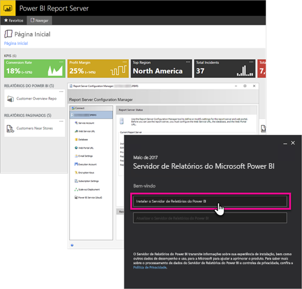

# Visão geral do administrador, Servidor de Relatórios do Power BI
Este artigo é a visão geral da administração do Servidor de Relatórios do Power BI, um local para armazenar e gerenciar seus relatórios móveis, paginados e do Power BI. Este artigo apresenta conceitos de planejamento, de implantação e de gerenciamento do Servidor de Relatórios do Power BI, com links para obter mais informações.

## Instalação e migração
Será necessário instalar o Servidor de Relatórios do Power BI para começar a usá-lo. Temos artigos que explicam como realizar essa tarefa.

Antes de começar a instalar, atualizar ou migrar para o Servidor de Relatórios do Power BI, examine os [requisitos de sistema](system-requirements.md) do servidor de relatório.

### Instalando
Se estiver implantando um novo Servidor de Relatórios do Power BI, use o documento a seguir para ajudá-lo. 

[Instalar o Servidor de Relatório do Power BI](install-report-server.md)

### Migração
Não há uma atualização in-loco para o SQL Server Reporting Services. Se tiver uma instância existente do SQL Server Reporting Services que deseja tornar um Servidor de Relatórios do Power BI, você precisará migrá-la. Também há outros motivos pelos quais pode ser conveniente realizar uma migração. Examine o documento de migração para obter mais detalhes.

[Migrar a instalação do servidor de relatório](migrate-report-server.md)

## Configurando o servidor de relatório
Você tem muitas opções para configurar o servidor de relatório. Você usará o SSL? Você está configurando um servidor de email? Você deseja integrar-se ao serviço do Power BI para fixar visualizações?

A maior parte da sua configuração ocorrerá dentro do Gerenciador de Configurações do Servidor de Relatório. Confira a documentação do [gerenciador de configurações](https://docs.microsoft.com/sql/reporting-services/install-windows/reporting-services-configuration-manager-native-mode) para obter mais detalhes.

## Segurança
Segurança e proteção são importantes para toda organização. É possível saber mais sobre autenticação, autorização, funções e permissões na documentação de [segurança](https://docs.microsoft.com/sql/reporting-services/security/reporting-services-security-and-protection).

## Próximas etapas
[Instalar o Servidor de Relatório do Power BI](install-report-server.md)  
[Encontrar a chave do produto (Product Key) do servidor de relatórios](find-product-key.md)  
[Instalar o Power BI Desktop otimizado para o Servidor de Relatório do Power BI](install-powerbi-desktop.md)  
[Baixar o Construtor de Relatórios](https://www.microsoft.com/download/details.aspx?id=53613)  
[Baixar o SSDT (SQL Server Data Tools)](http://go.microsoft.com/fwlink/?LinkID=616714)

Mais perguntas? [Experimente perguntar à Comunidade do Power BI](https://community.powerbi.com/)

