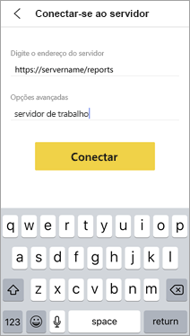
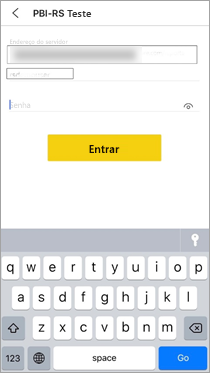

# Configurar o acesso do aplicativo móvel do Power BI iOS a um servidor de relatório remotamente

Neste artigo, você aprenderá a usar a ferramenta MDM da sua organização para configurar o acesso de aplicativo móvel do Power BI iOS a um servidor de relatório. Para configurar o acesso, os administradores de TI criam uma política de configuração do aplicativo com as informações necessárias a serem enviadas por push ao aplicativo. 

 Com a conexão do servidor de relatório já configurada, os usuários do aplicativo móvel do Power BI iOS podem se conectar com o servidor de relatório da organização mais facilmente. 

## Criar a política de configuração do aplicativo na ferramenta MDM 

Como administrador, veja as etapas a serem seguidas no Microsoft Intune para criar a política de configuração do aplicativo. As etapas e a experiência de criação da política de configuração de aplicativo podem ser diferentes em outras ferramentas MDM. 

1. Conecte a ferramenta MDM. 
2. Crie e nomeie uma nova política de configuração do aplicativo. 
3. Escolha os usuários para os quais essa política de configuração de aplicativo será distribuída. 
4. Crie pares chave-valor. 

A tabela a seguir indica os pares.

|Key  |Tipo  |Descrição  |
|---------|---------|---------|
| com.microsoft.powerbi.mobile.ServerURL | Cadeia de caracteres | URL do Servidor de Relatório   Deve começar com http/https |
| com.microsoft.powerbi.mobile.ServerUsername | Cadeia de caracteres | [opcional]   O nome de usuário a ser usado para conectar o servidor.   Se não existir, o aplicativo solicitará ao usuário que digite o nome de usuário para a conexão.| 
| com.microsoft.powerbi.mobile.ServerDisplayName | Cadeia de caracteres | [opcional]   O valor padrão é "Servidor de relatório"   Um nome amigável usado no aplicativo para representar o servidor | 
| com.microsoft.powerbi.mobile.OverrideServerDetails | Booliano | O valor padrão é True  Quando definido como "True", substituirá qualquer definição do Servidor de Relatório que já estiver no dispositivo móvel. Os servidores existentes que já estão configurados serão excluídos.   Substituir a definição para True também evita que o usuário remova essa configuração.   Se definido como "False", adicionará os valores enviados por push, mantendo as configurações atuais.   Se a mesma URL do servidor já estiver configurada no aplicativo móvel, o aplicativo deixará essa configuração como está. O aplicativo não solicita ao usuário para se autenticar novamente no mesmo servidor. |

Veja um exemplo de definição de política de configuração usando o Intune.

## Conexão dos usuários finais com um servidor de relatório

 Digamos que você publica a política de configuração de aplicativo de uma lista de distribuição. Quando os usuários e dispositivos dessa lista de distribuição iniciarem o aplicativo móvel do iOS, eles terão a seguinte experiência. 

1. Uma mensagem informará que o aplicativo móvel está configurado com um servidor de relatório. Toque em **Entrar**.

    

2.  Na página **Conectar-se ao servidor**, os detalhes do servidor de relatório já estão preenchidos. Eles tocam em **Conectar**.

    

3. Eles digitam uma senha para autenticar e, em seguida, tocam em **Entrar**. 

    

Agora, é possível exibir e interagir com as KPIs e os relatórios do Power BI armazenados no servidor de relatório.

## Próximas etapas

- [Habilitar acesso remoto ao Power BI Mobile com o Proxy de Aplicativo do Azure AD](https://docs.microsoft.com/azure/active-directory/manage-apps/application-proxy-integrate-with-power-bi)
- [Visão geral do administrador](admin-handbook-overview.md)  
- [Instalar o Servidor de Relatório do Power BI](install-report-server.md)  

Mais perguntas? [Experimente perguntar à Comunidade do Power BI](https://community.powerbi.com/)

