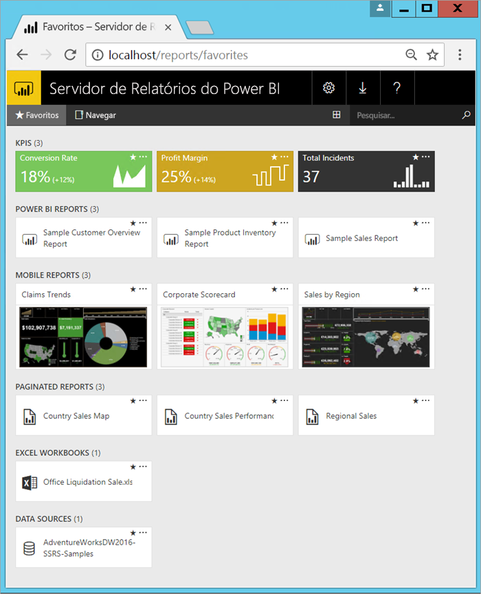

# O que é o Servidor de Relatórios do Power BI?

O Servidor de Relatórios do Power BI é um servidor de relatório local com um portal da Web no qual você pode exibir e gerenciar relatórios e KPIs. Com ele, vêm as ferramentas para criar relatórios do Power BI, relatórios paginados, relatórios móveis e KPIs. Seus usuários podem acessar esses relatórios de maneiras diferentes: exibindo-os em um navegador da Web ou dispositivo móvel, ou como um email em sua caixa de entrada.

## Comparando o Servidor de Relatórios do Power BI 
O Servidor de Relatórios do Power BI é semelhante ao SQL Server Reporting Services e ao serviço do Power BI online, mas de maneiras diferentes. Como o serviço do Power BI, Power BI Report Server hospeda relatórios do Power BI (. PBIX) arquivos do Excel e relatórios paginados (. LINGUAGEM RDL). Como o Reporting Services, o servidor de relatório do Power BI está no local. Recursos do Power BI Report Server são um superconjunto do Reporting Services: tudo o que você pode fazer no Reporting Services, você pode fazer com o servidor de relatório do Power BI, juntamente com o suporte para relatórios do Power BI. Confira [Comparando o Servidor de Relatórios do Power BI e o serviço do Power BI](compare-report-server-service.md) para obter detalhes.

## Licenciando o Servidor de Relatórios do Power BI
O Servidor de Relatórios do Power BI está disponível por meio de duas licenças diferentes: [Power BI Premium](../service-premium-what-is.md) e [SQL Server Enterprise Edition](https://www.microsoft.com/sql-server/sql-server-2017-editions) com Software Assurance. Com uma licença do Power BI Premium, você pode criar uma implantação híbrida combinando recursos locais e na nuvem.  

> [!NOTE]
> Para o Power BI Premium, o Servidor de Relatórios do Power BI só está incluído com os SKUs P. Ele não está incluído com SKUs EM.

## Portal da Web
O ponto de entrada do Servidor de Relatórios do Power BI é um portal da Web seguro que pode ser exibido em qualquer navegador moderno. Aqui, você acessa todos os seus relatórios e KPIs. O conteúdo no portal da Web é organizado em uma hierarquia de pastas tradicional. Em suas pastas, o conteúdo é agrupado por tipo: relatórios do Power BI, relatórios móveis, relatórios paginados, KPIs e pastas de trabalho do Excel. Conjuntos de dados compartilhados e fontes de dados compartilhadas estão nas próprias pastas para uso como blocos de construção para seus relatórios. Você marca favoritos para exibi-los em uma única pasta. E cria KPIs diretamente no portal da Web. 

Dependendo de suas permissões, você poderá gerenciar o conteúdo no portal da Web. É possível agendar o processamento de relatórios, acessar relatórios sob demanda e assinar relatórios publicados. Também é possível aplicar sua própria [identidade visual](https://docs.microsoft.com/sql/reporting-services/branding-the-web-portal) personalizada ao seu portal da Web. 

Mais informações sobre o [portal da Web do Servidor de Relatórios do Power BI](https://docs.microsoft.com/sql/reporting-services/web-portal-ssrs-native-mode).

## Relatórios do Power BI
Você cria relatórios do Power BI (.PBIX) com a versão do Power BI Desktop otimizada para o servidor de relatórios. Em seguida, você os publica e exibe no portal da Web em seu próprio ambiente.

Um relatório do Power BI é uma exibição de um modelo de dados em várias perspectivas, com visualizações que representam diferentes descobertas e insights obtidos por meio desse modelo de dados.  Um relatório pode ter uma única visualização ou páginas repletas de visualizações. Dependendo de sua função, você pode ler e explorar relatórios ou pode criá-los para outras pessoas.

Leia sobre [instalando o Microsoft Power BI Desktop](install-powerbi-desktop.md).

## Relatórios paginados
Relatórios paginados (.RDL) são relatórios com estilo de documento com visualizações, em que tabelas são expandidas horizontal e verticalmente para exibir todos os dados, continuando de página a página conforme necessário. Eles são ótimos para gerar documentos com layout fixo e pixels perfeitos otimizados para impressão, tais como arquivos PDF e Word. 

Você pode criar usando os relatórios paginados [construtor de relatórios](https://docs.microsoft.com/sql/reporting-services/report-builder/report-builder-in-sql-server-2016) ou o Designer de relatórios no [SQL Server Data Tools (SSDT)](https://docs.microsoft.com/sql/reporting-services/tools/reporting-services-in-sql-server-data-tools-ssdt).

## Relatórios móveis do Reporting Services
Relatórios móveis se conectam a dados locais e têm um layout dinâmico que se adapta a diferentes dispositivos e às diferentes maneiras como você os armazena. Você os cria com o Publicador de Relatórios Móveis do SQL Server.

Mais informações sobre os [Relatórios móveis do Reporting Services](https://docs.microsoft.com/sql/reporting-services/mobile-reports/create-mobile-reports-with-sql-server-mobile-report-publisher). 

## Recursos de programação do Servidor de Relatório
Aproveite os recursos de programação do Servidor de Relatórios do Power BI para poder estender e personalizar seus relatórios com APIs para integrar ou estender dados e processamento de relatórios em aplicativos personalizados.

Mais [documentação do desenvolvedor do Servidor de Relatório](https://docs.microsoft.com/sql/reporting-services/reporting-services-developer-documentation).

## Próximas etapas
[Instalar o Servidor de Relatório do Power BI](install-report-server.md)  
[Baixar o Construtor de Relatórios](https://www.microsoft.com/download/details.aspx?id=53613)  

Mais perguntas? [Experimente perguntar à Comunidade do Power BI](https://community.powerbi.com/)

