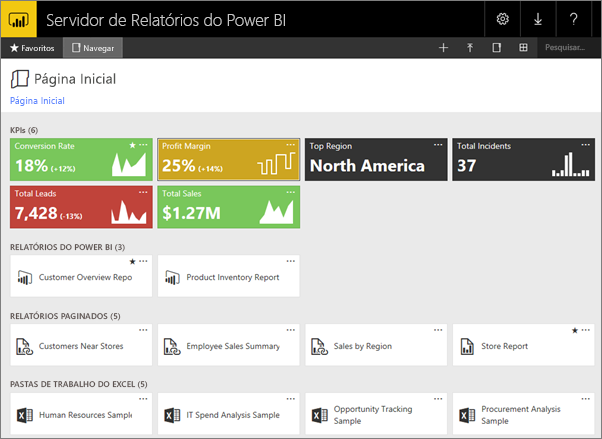
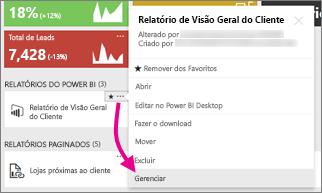
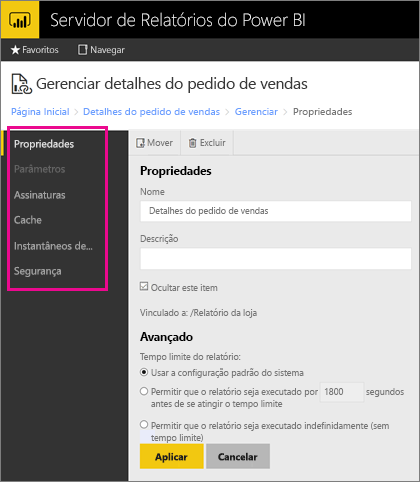

# Gerenciar conteúdo no portal da Web 
O portal da Web do Servidor de Relatório do Power BI é um local para exibir, armazenar e gerenciar seus relatórios paginados, móveis e do Power BI e KPIs.

É possível exibir o portal da Web em qualquer navegador moderno. No portal da Web, os KPIs e os relatórios são organizados em pastas e é possível marcá-los como favoritos. Também é possível armazenar as pastas de trabalho do Excel lá. No portal da Web, é possível iniciar as ferramentas necessárias para criar relatórios:

* **Relatórios do Power BI** criados com o Power BI Desktop: exiba-os no portal da Web e os aplicativos móveis do Power BI.
* **Relatórios paginados** criados no Construtor de Relatórios: documentos com aparência moderna e layout fixo otimizados para impressão.
* **KPIs** criados diretamente no portal da Web.

No portal da web, é possível procurar as pastas do servidor de relatório ou pesquisar relatórios específicos. É possível exibir um relatório, suas propriedades gerais e cópias antigas do relatório capturadas no histórico de relatórios. Dependendo de suas permissões, talvez você também possa assinar relatórios para entrega em sua caixa de entrada de email ou em uma pasta compartilhada no sistema de arquivos.

## Permissões e funções de portal da Web
O aplicativo do portal da Web é executado em um navegador. Quando você inicia o portal da Web, as páginas, links e opções exibidas variam de acordo com as permissões que você tem no servidor de relatório. Se você tiver sido atribuído a uma função com permissões completas, você terá acesso ao conjunto completo de páginas e menus de aplicativo para gerenciar um servidor de relatório. Se você tiver sido atribuído a uma função com permissões para exibir e executar relatórios, você só verá os menus e páginas necessários para esses atividades. É possível ter diferentes atribuições de função para diferentes servidores de relatório ou até mesmo para os vários relatórios e pastas em um único servidor de relatório.

## Iniciar o portal da Web
1. Abra seu navegador da Web.
   
    Veja esta lista de [navegadores e versões com suporte](browser-support.md).
2. Na barra de endereços, digite a URL do portal da Web.
   
    Por padrão, a URL é <em>https://[ComputerName]/reports</em>.
   
    O servidor de relatório pode ser configurado para usar uma porta específica. Por exemplo, <em>https://[ComputerName]:80/reports</em> ou <em>https://[ComputerName]:8080/reports</em>
   
    Você verá que o portal da Web agrupa itens nestas categorias:
   
   * KPIs
   * Relatórios móveis
   * Relatórios paginados
   * Relatórios do Power BI Desktop
   * Pastas de trabalho do Excel
   * Conjuntos de Dados
   * Fontes de dados
   * Recursos

## Gerenciar itens no portal da Web
O Servidor de Relatório do Power BI oferece controle detalhado dos itens que você armazena no portal da Web. Por exemplo, é possível configurar as assinaturas, cache, instantâneos e segurança em relatórios paginados individuais.

1. Selecione **Mais opções** (...) no canto superior direito de um item e, em seguida, selecione **Gerenciar**.
   
    
2. Escolha a propriedade ou outro recurso que você deseja definir.
   
    
3. Selecione **Aplicar**.

Leia mais sobre como [trabalhar com assinaturas no portal da Web](https://docs.microsoft.com/sql/reporting-services/working-with-subscriptions-web-portal).

## Próximas etapas
[O que é o Servidor de Relatórios do Power BI?](get-started.md)

Mais perguntas? [Experimente perguntar à Comunidade do Power BI](https://community.powerbi.com/)

