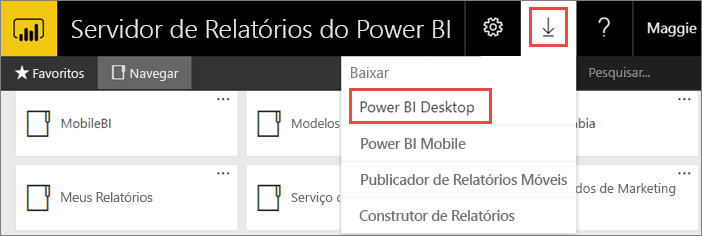
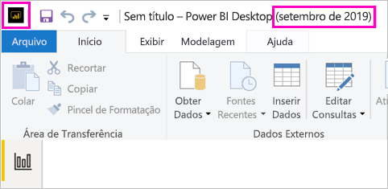
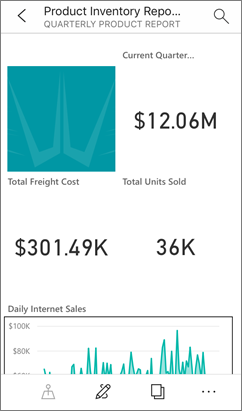

# Instalar o Power BI Desktop otimizado para o Servidor de Relatório do Power BI

Para criar relatórios do Power BI para o Servidor de Relatórios do Power BI, você precisará baixar e instalar a versão do Power BI Desktop otimizada para o Servidor de Relatórios do Power BI. Essa versão é diferente do Power BI Desktop usado com o serviço do Power BI. Por exemplo, a versão do Power BI Desktop para o serviço do Power BI inclui a versão prévia dos recursos que não estão na versão do Servidor de Relatórios do Power BI até que estejam em disponibilidade geral. Usar essa versão garante que o servidor de relatórios pode interagir com uma versão conhecida dos relatórios e do modelo. 

A boa notícia é que você pode instalar o Power BI Desktop e o Power BI Desktop otimizado para o Servidor de Relatórios do Power BI lado a lado no mesmo computador.

## Baixar e instalar o Power BI Desktop

A maneira mais fácil de ter certeza que você tem a versão mais recente do Power BI Desktop otimizado para o Servidor de Relatórios do Power BI é iniciar a partir do portal da Web do seu servidor de relatórios.

1. No portal da Web do servidor de relatórios, selecione a seta **Baixar** > **Power BI Desktop**.

    

    Ou vá para a home page do [Servidor de Relatórios do Power BI](https://powerbi.microsoft.com/report-server/) e selecione **Opções de download avançadas**.

2. Na página Centro de Download, selecione um idioma e, em seguida, selecione **Baixar**.

3. Dependendo do seu computador, selecione: 

    - **PBIDesktopRS.msi** (a versão de 32 bits) ou
    - **PBIDesktopRS_x64.msi** (a versão de 64 bits).

1. Depois de baixar o instalador, execute o Assistente de Instalação do Power BI Desktop (Setembro de 2019).

2. No final da instalação, selecione **Iniciar o Power BI Desktop**.

    Ele é iniciado automaticamente e você está pronto para começar.

## Verifique se você está usando a versão correta
É fácil verificar se você está usando o Power BI Desktop correto: Observe a tela de inicialização ou a barra de título no Power BI Desktop. Você saberá que tem a versão correta porque **Power BI Desktop (Setembro de 2019)** consta na barra de título. Além disso, as cores de logotipo do Power BI estão invertidas; amarelo em preto, em vez do preto em amarelo.

A versão do Power BI Desktop para o serviço do Power BI não tem o mês nem o ano na barra de título.

## Associação de extensão de arquivo
Se você instalar o Power BI Desktop e o Power BI Desktop otimizado para o Servidor de Relatórios do Power BI no mesmo computador, a instalação mais recente do Power BI Desktop terá a associação de arquivo com o arquivo .pbix. Assim, quando você clicar duas vezes em um arquivo .pbix, ele iniciará o Power BI Desktop instalado mais recentemente.

Se você tiver o Power BI Desktop e, em seguida, instalar o Power BI Desktop otimizado para o Servidor de Relatórios do Power BI, todos os arquivos .pbix serão abertos no Power BI Desktop otimizado para o Servidor de Relatórios do Power BI por padrão. Se, em vez disso, você preferir que o Power BI Desktop seja o padrão para iniciar ao abrir um arquivo .pbix, reinstale o [Power BI Desktop da Microsoft Store](https://aka.ms/pbidesktopstore).

Sempre é possível abrir a versão do Power BI Desktop que você deseja usar primeiro. E, em seguida, abra o arquivo no Power BI Desktop.

Editar um relatório do Power BI no Servidor de Relatórios do Power BI ou criar um novo relatório do Power BI no portal da Web sempre abre a versão correta do Power BI Desktop.

## Considerações e limitações

Os relatórios do Power BI no Servidor de Relatórios do Microsoft Power BI e no serviço do Power BI (https://app.powerbi.com), assim como nos aplicativos móveis do Power BI) agem praticamente da mesma maneira, mas alguns recursos são diferentes.

### Como selecionar um idioma

Para o Power BI Desktop otimizado para o Servidor de Relatórios do Power BI, selecione o idioma ao instalar o aplicativo. Você não poderá alterá-lo depois, mas poderá instalar uma versão em outro idioma.

### Relatar visuais em um navegador

Os relatórios do Servidor de Relatórios do Power BI dão suporte a quase todas as visualizações, inclusive visuais do Power BI. Os relatórios do Servidor de Relatório do Power BI não dão suporte a:

* Visuais do R
* Mapas ArcGIS
* Trilhas
* Recursos de visualização do Power BI Desktop

### Relatórios nos aplicativos móveis do Power BI

Os relatórios do Servidor de Relatório do Power BI dão suporte a toda a funcionalidade básica nos [aplicativos móveis do Power BI](../consumer/mobile/mobile-apps-for-mobile-devices.md), incluindo:

* [Layout de relatório de telefone](../desktop-create-phone-report.md): é possível otimizar um relatório para os aplicativos móveis do Power BI. Em seu telefone celular, os relatórios otimizados têm um ícone especial chamado  e um layout.
  
    

Os relatórios do Servidor de Relatório do Power BI não dão suporte a estes recursos nos aplicativos móveis do Power BI:

* Visuais do R
* Mapas ArcGIS
* Visuais do Power BI
* Trilhas
* Filtragem geográfica ou códigos de barra

### Segurança personalizada

O Power BI Desktop otimizado para o Servidor de Relatórios do Power BI não dá suporte à segurança personalizada. Se o seu Servidor de Relatórios do Power BI estiver configurado com uma extensão de segurança personalizada, você não poderá salvar um relatório do Power BI por meio do Power BI Desktop (otimizado para o Servidor de Relatórios do Power BI) na instância do Servidor de Relatórios do Power BI. Você precisa salvar o arquivo de relatório .pbix do Power BI Desktop e carregá-lo no site do portal do Servidor de Relatórios do Power BI.

## Power BI Desktop para versões anteriores do Servidor de Relatórios do Power BI

Se seu servidor de relatório é de uma versão anterior, você precisa da versão correspondente do Power BI Desktop. Este é o link para baixar uma versão anterior.

- Microsoft Power BI Desktop ([otimizado para o Servidor de Relatórios do Power BI – setembro de 2019](https://go.microsoft.com/fwlink/?linkid=2103723))

## Próximas etapas

Agora que o Power BI Desktop foi instalado, é possível começar a criar relatórios do Power BI.

[Criar um relatório do Power BI para o Servidor de Relatórios do Power BI](quickstart-create-powerbi-report.md)  
[O que é o Servidor de Relatórios do Power BI?](get-started.md)

Mais perguntas? [Experimente perguntar à Comunidade do Power BI](https://community.powerbi.com/)
