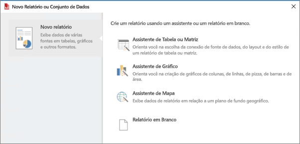

# Instalar o Report Builder: Servidor de Relatórios do Power BI

O Report Builder é um aplicativo autônomo, instalado no computador por você ou um administrador. Instale-o por meio do Centro de Download da Microsoft ou do Servidor de Relatórios do Power BI.  

Procurando ajuda com a instalação do Report Builder para o serviço do Power BI? Confira [Power BI Report Builder](../paginated-reports/report-builder-power-bi.md).
  
Um administrador normalmente instala e configura o Servidor de Relatórios do Power BI, concede permissão para baixar o Report Builder no portal da Web e gerencia pastas e permissões para relatórios e conjuntos de dados compartilhados salvos no servidor de relatório. Para obter mais informações sobre a administração do Servidor de Relatórios do Power BI, confira a [Visão geral do administrador, Servidor de Relatórios do Power BI](admin-handbook-overview.md).  
  
## Requisitos do sistema
  
 Confira a seção **Requisitos do Sistema** da [página de download do Report Builder](https://go.microsoft.com/fwlink/?LinkID=734968) no Centro de Download da Microsoft.
 
## Instalar o Report Builder por meio de um portal da Web
  
Instale o Report Builder por meio de um portal da Web do Servidor de Relatórios do Power BI. Talvez você já tenha instalado o Construtor de Relatórios para criar relatórios para um servidor SSRS. É possível usar a mesma versão ou o Construtor de Relatórios para criar relatórios para o Servidor de Relatório do Power BI. Se você ainda não o tiver instalado, o processo será fácil.

1. No portal da Web do Servidor de Relatórios do Power BI, selecione **Novo** > **Relatório Paginado**.
   
    
   
    Se você ainda não tiver o Report Builder instalado, o Assistente do Report Builder da Microsoft será iniciado.  
  
3.  Aceite os termos do contrato de licença > **Avançar**.  
 
5.  Selecione **Instalar** para concluir a instalação do Report Builder.  

2. Após o Construtor de Relatórios ser instalado, ele é aberto na tela **Novo Relatório ou Conjunto de Dados**.
   
    
 

##   Instalar o Report Builder por meio do Centro de Download  
  
1.  Na [página do Report Builder do Centro de Download da Microsoft](https://go.microsoft.com/fwlink/?LinkID=734968), selecione **Download**.  
  
2.  Depois que o download do Report Builder for concluído, selecione **Executar**.  
  
     O Assistente do Report Builder da Microsoft será iniciado.  
  
3.  Aceite os termos do contrato de licença > **Avançar**.  
 
5.  Selecione **Instalar** para concluir a instalação do Report Builder.  
 

## Próximas etapas

[O que é o Servidor de Relatórios do Power BI?](get-started.md)
