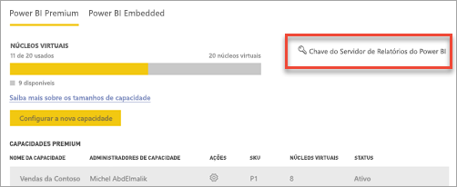
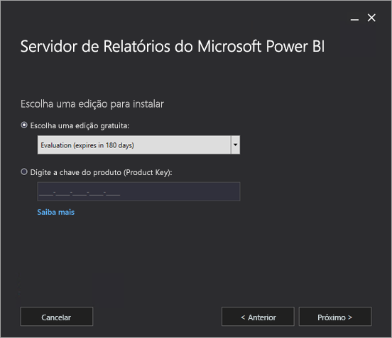
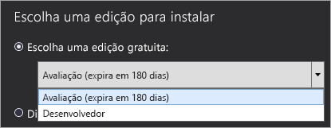
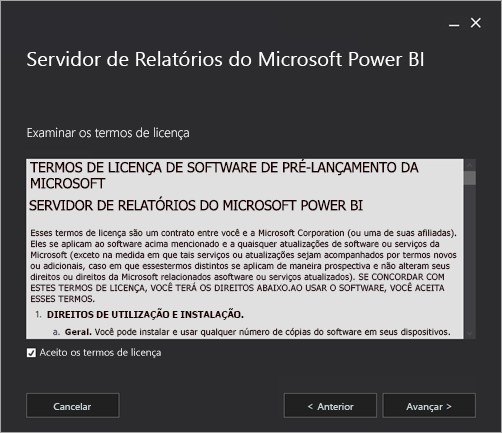
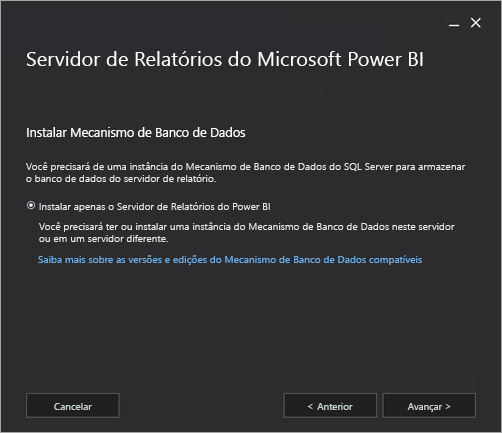
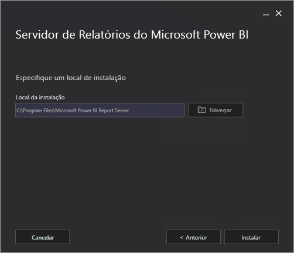
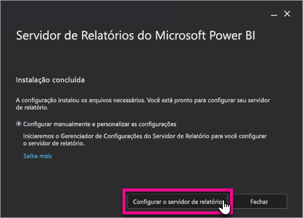
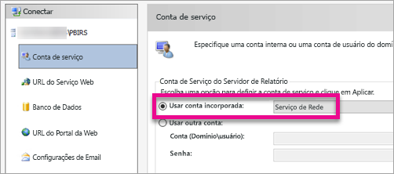
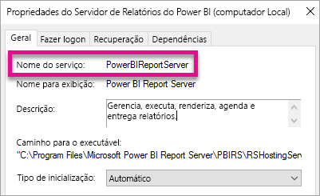

# Instalar o Servidor de Relatório do Power BI

Saiba como instalar o Servidor de Relatório do Power BI.

 **Baixe** 

Para baixar o Servidor de Relatório do Power BI, acesse [Relatórios locais com o Servidor de Relatórios do Power BI](https://powerbi.microsoft.com/report-server/) e selecione **Baixar avaliação gratuita**. 

## Antes de começar

Antes de instalar o Servidor de Relatórios do Power BI, é recomendável que você examine os [Requisitos de hardware e de software para a instalação do Servidor de Relatórios do Power BI](system-requirements.md).

 > [!IMPORTANT]
 > Embora você possa instalar o Servidor de Relatórios do Microsoft Power BI em um ambiente que tenha um RODC (Controlador de domínio somente leitura), o Servidor de Relatórios do Microsoft Power BI precisa acessar um Controlador de Domínio Leitura-Gravação para funcionar adequadamente. Se o Servidor de Relatórios do Power BI só tiver acesso a um RODC, talvez ocorram erros ao tentar administrar o serviço.

### Chave do produto (Product Key) do Servidor de Relatório do Power BI

#### Power BI Premium

Se você adquiriu o Power BI Premium, dentro da guia **Configurações Premium** do portal do administrador do Power BI, você terá acesso à sua chave do produto (Product Key) do Servidor de Relatórios do Microsoft Power BI. Isso está disponível somente para os administradores globais ou usuários atribuídos à função de administrador de serviços do Power BI.

Quando você seleciona **Chave do Servidor de Relatórios do Microsoft Power BI**, é exibida uma caixa de diálogo que contém a chave do produto (Product Key). É possível copiá-la e usá-la com a instalação.

 do Servidor de Relatórios do Power BI")

#### SQL Server Enterprise SA (Software Assurance)

Se você tiver um contrato do SQL Server Enterprise SA, você poderá obter a chave do produto (Product Key) no [Centro de Serviços de Licenciamento por Volume](https://www.microsoft.com/Licensing/servicecenter/).

## Instalar seu servidor de relatório

A instalação do Servidor de Relatórios do Power BI é muito simples. Há apenas algumas etapas para instalar os arquivos.

Não é necessário que um servidor do Mecanismo de Banco de Dados do SQL Server esteja disponível no momento da instalação. Será necessário configurar o Reporting Services após a instalação.

1. Encontrar o local do PowerBIReportServer.exe e inicie o instalador.

2. Selecione **Instalar o Servidor de Relatório do Power BI**.

    
3. Escolha uma edição a ser instalada e, em seguida, selecione **Avançar**.

    

    É possível escolher Evaluation ou Developer Edition na lista suspensa.

    

    Caso contrário, é possível inserir uma chave do produto (Product Key) para o servidor que você obteve do serviço do Power BI ou do Centro de Serviços de Licenciamento por Volume. Para obter mais informações sobre como obter a sua chave do produto (Product Key), consulte a seção [Antes de começar](#before-you-begin).
4. Leia e concorde com os termos e condições e, em seguida, selecione **Avançar**.

    
5. É necessário ter um Mecanismo de Banco de Dados disponível para armazenar o banco de dados do servidor de relatório. Selecione **Avançar** para instalar somente o servidor de relatório.

    
6. Especifique o local de instalação do servidor de relatório. Selecione **Instalar** para continuar.

    

    O caminho padrão é C:\Arquivos de Programas\Servidor de Relatório do Microsoft Power BI.

7. Após uma instalação bem-sucedida, selecione **Configurar o Servidor de Relatório** para iniciar o Gerenciador de Configurações do Reporting Services.

    

## Configurando o servidor de relatório

Depois de selecionar **Configurar o servidor de relatório** na instalação, será exibido o Gerenciador de Configurações do Reporting Services. Para obter mais informações, consulte [Gerenciador de Configurações do Reporting Services](https://docs.microsoft.com/sql/reporting-services/install-windows/reporting-services-configuration-manager-native-mode).

É necessário [criar um banco de dados do servidor de relatório](https://docs.microsoft.com/sql/reporting-services/install-windows/ssrs-report-server-create-a-report-server-database) para concluir a configuração inicial do Reporting Services. É necessário ter um servidor de Banco de Dados SQL Server para concluir esta etapa.

### Criando um banco de dados em um servidor diferente

Se você estiver criando o banco de dados do servidor de relatório em um servidor de banco de dados em um computador diferente, será necessário alterar a conta de serviço do servidor de relatório para uma credencial reconhecida no servidor de banco de dados. 

Por padrão, o servidor de relatório usa a conta de serviço virtual. Se você tentar criar um banco de dados em um servidor diferente, talvez você receba o seguinte erro na etapa Aplicar direitos de conexão.

`System.Data.SqlClient.SqlException (0x80131904): Windows NT user or group '(null)' not found. Check the name again.`

Para resolver o erro, é possível alterar a conta de serviço para o Serviço de rede ou para uma conta de domínio. Alterar a conta de serviço para o Serviço de rede aplica direitos no contexto da conta de computador para o servidor de relatório.

Para obter mais informações, consulte [Configurar a conta de serviço do Servidor de Relatório](https://docs.microsoft.com/sql/reporting-services/install-windows/configure-the-report-server-service-account-ssrs-configuration-manager).

## Serviço Windows

Um serviço Windows é criado como parte da instalação. Ele é exibido como **Servidor de Relatório do Power BI**. O nome do serviço é **PowerBIReportServer**.

## Reservas de URL padrão

As reservas de URL são compostas por um prefixo, nome de host, porta e diretório virtual:

| Parte | Descrição |
| --- | --- |
| Prefixo |O prefixo padrão é HTTP. Se você tiver instalado anteriormente um certificado de protocolo SSL, a instalação tentará criar reservas de URL que usem o prefixo HTTPS. |
| Nome do host |O nome do host padrão é um curinga forte (+). Especifica que o servidor de relatório aceita qualquer solicitação HTTP na porta designada para qualquer nome de host resolvido para o computador, incluindo `http://<computername>/reportserver`, `http://localhost/reportserver` ou `http://<IPAddress>/reportserver.` |
| Porta |A porta padrão é 80. Se você usar uma porta diferente da porta 80, será necessário adicioná-la explicitamente à URL ao abrir o portal da Web em uma janela do navegador. |
| Diretório virtual |Por padrão, os diretórios virtuais são criados no formato de ReportServer para o serviço Web do Servidor de Relatório e Reports para o portal da Web. Para o serviço Web do Servidor de Relatório, o diretório virtual padrão é **reportserver**. Para o portal da Web, o diretório virtual padrão é **relatórios**. |

Um exemplo de cadeia de caracteres de URL completa pode ser o seguinte:

* `http://+:80/reportserver`, fornece acesso ao servidor de relatório.
* `http://+:80/reports`, fornece acesso ao portal da Web.

## Firewall

Se você estiver acessando o servidor de relatório em um computador remoto, certifique-se de ter configurado regras de firewall se houver um firewall.

É necessário abrir a porta TCP que foi configurada para a URL do serviço Web e para a URL do portal da Web. Por padrão, elas são configuradas na porta TCP 80.

## Configuração adicional

* Para configurar a integração com o serviço do Power BI para que você possa fixar itens de relatório em um dashboard do Power BI, consulte [Integrate with the Power BI service (Integrar-se ao serviço do Power BI)](https://docs.microsoft.com/sql/reporting-services/install-windows/power-bi-report-server-integration-configuration-manager).
* Para configurar o email para o processamento de assinaturas, consulte [E-Mail settings (Configurações de email)](https://docs.microsoft.com/sql/reporting-services/install-windows/e-mail-settings-reporting-services-native-mode-configuration-manager) e [E-Mail delivery in a report server (Entrega de email em um servidor de relatório)](https://docs.microsoft.com/sql/reporting-services/subscriptions/e-mail-delivery-in-reporting-services).
* Para configurar o portal da Web para que você possa acessá-lo em um computador do relatório para exibir e gerenciar relatórios, consulte [Configurar um firewall para acesso ao servidor de relatório](https://docs.microsoft.com/sql/reporting-services/report-server/configure-a-firewall-for-report-server-access) e [Configurar um servidor de relatório para administração remota](https://docs.microsoft.com/sql/reporting-services/report-server/configure-a-report-server-for-remote-administration).

## Próximas etapas

[Visão geral do administrador](admin-handbook-overview.md)  
[Como encontrar a chave do produto (Product Key) do servidor de relatório](find-product-key.md)  
[Instalar o Power BI Desktop otimizado para o Servidor de Relatório do Power BI](install-powerbi-desktop.md)  
[Verificar a instalação do Reporting Services](https://docs.microsoft.com/sql/reporting-services/install-windows/verify-a-reporting-services-installation)  
[Configurar a conta de serviço do Servidor de Relatório](https://docs.microsoft.com/sql/reporting-services/install-windows/configure-the-report-server-service-account-ssrs-configuration-manager)  
[Configurar URLs do Servidor de Relatório](https://docs.microsoft.com/sql/reporting-services/install-windows/configure-report-server-urls-ssrs-configuration-manager)  
[Configurar uma conexão de banco de dados do Servidor de Relatório](https://docs.microsoft.com/sql/reporting-services/install-windows/configure-a-report-server-database-connection-ssrs-configuration-manager)  
[Inicializar um Servidor de Relatório](https://docs.microsoft.com/sql/reporting-services/install-windows/ssrs-encryption-keys-initialize-a-report-server)  
[Configurar conexões SSL em um servidor de relatório](https://docs.microsoft.com/sql/reporting-services/security/configure-ssl-connections-on-a-native-mode-report-server)  
[Configurar permissões e contas de serviço Windows](https://docs.microsoft.com/sql/database-engine/configure-windows/configure-windows-service-accounts-and-permissions)  
[Suporte do navegador para o Servidor de Relatório do Power BI](browser-support.md)

Mais perguntas? [Experimente perguntar à Comunidade do Power BI](https://community.powerbi.com/)