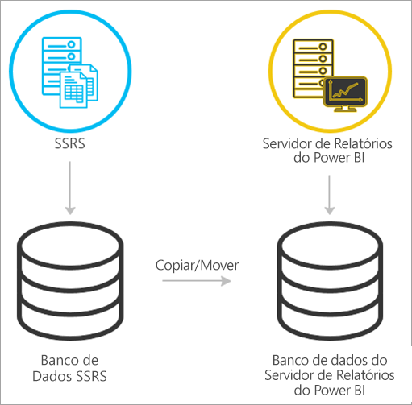
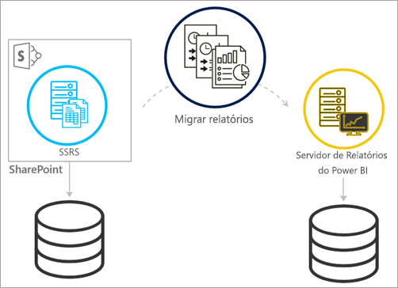
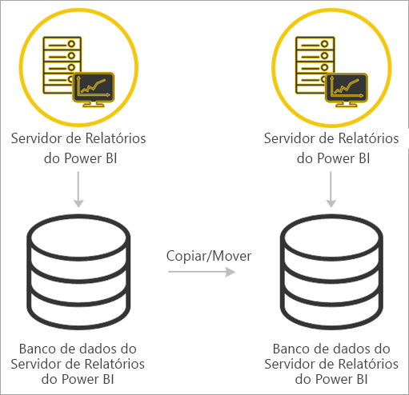

# <a name="migrate-a-report-server-installation"></a>Migrar a instalação do servidor de relatório

Saiba como migrar sua instância do SSRS (SQL Server Reporting Services) existente para uma instância do Servidor de Relatórios do Power BI.

A migração é definida como a movimentação de arquivos de dados do aplicativo para uma nova instância do Servidor de Relatório do Power BI. A seguir estão as razões comuns por que você pode migrar sua instalação:

* Você deseja mover do SQL Server Reporting Services para o Servidor de Relatórios do Power BI
  
  > [!NOTE]
  > Não há uma atualização em vigor do SQL Server Reporting Services para o Servidor de Relatório do Power BI. Uma migração é necessária.

* Você tem uma implantação em grande escala ou requisitos de atualização
* Você está alterando o hardware ou a topologia da sua instalação
* Você encontra um problema que impede a atualização

## <a name="migrating-to-power-bi-report-server-from-ssrs-native-mode"></a>Migrando para o Servidor de Relatório do Power BI do SSRS (modo nativo)

A migração de uma instância do SSRS (modo nativo) para o Servidor de Relatório do Power BI é composta por algumas etapas.



> [!NOTE]
> Há suporte para migração no SQL Server 2008 Reporting Services e posterior.

* Banco de dados de backup, aplicativo e arquivos de configuração
* Faça backup da chave de criptografia
* Clone o banco de dados do servidor de relatório que está hospedando seus relatórios
* Instale o Servidor de Relatório do Power BI. Se você está usando o mesmo hardware, pode instalar o Servidor de Relatórios do Power BI no mesmo servidor que a instância do SSRS. Para obter mais informações sobre como instalar o Servidor de Relatório do Power BI, consulte [Install Power BI Report Server (Instalar o Servidor de Relatório do Power BI)](install-report-server.md).

> [!NOTE]
> O nome de instância do Servidor de Relatório do Power BI será *PBIRS*.

* Configure o servidor de relatório usando o Gerenciador de Configurações do Servidor de Relatório e conecte-se ao banco de dados clonado.
* Execute qualquer limpeza necessária para a instância do SSRS (modo nativo)

## <a name="migration-to-power-bi-report-server-from-ssrs-sharepoint-integrated-mode"></a>Migração para o Servidor de Relatório do Power BI do SSRS (modo integrado do SharePoint)

A migração de um SSRS (modo integrado do SharePoint) para o Servidor de Relatório do Power BI não é tão simples quanto o modo nativo. Embora essas etapas deem alguma orientação, talvez você tenha outros arquivos e ativos dentro do SharePoint que precisem ser gerenciados fora delas.



É necessário migrar o conteúdo específico do servidor de relatório do SharePoint para o Servidor de Relatórios do Power BI. Você precisa já ter instalado o Servidor de Relatórios do Power BI em algum lugar em seu ambiente. Para obter mais informações sobre como instalar o Servidor de Relatório do Power BI, consulte [Install Power BI Report Server (Instalar o Servidor de Relatório do Power BI)](install-report-server.md).

Se você desejar copiar o conteúdo do servidor de relatório de seu ambiente do SharePoint para o Servidor de Relatórios do Power BI, será necessário usar ferramentas como **rs.exe** para copiar o conteúdo. Veja abaixo uma amostra do que seria o script para copiar o conteúdo do servidor de relatório do SharePoint para o Servidor de Relatório do Power BI.

> [!NOTE]
> A amostra de script deve funcionar com o SharePoint 2010 e posterior e com o SQL Server 2008 Reporting Services e posterior.

### <a name="sample-script"></a>Amostra de script

```
Sample Script
rs.exe
-i ssrs_migration.rss -e Mgmt2010
-s https://SourceServer/_vti_bin/reportserver
-v st="sites/bi" -v f="Shared Documents“
-u Domain\User1 -p Password
-v ts=https://TargetServer/reportserver
-v tu="Domain\User" -v tp="Password"
```

## <a name="migrating-from-one-power-bi-report-server-to-another"></a>Migrando de um Servidor de Relatórios do Power BI para outro

Migrar de um Servidor de Relatórios do Power BI é o mesmo processo que migrar do SSRS (modo nativo).



* Banco de dados de backup, aplicativo e arquivos de configuração
* Faça backup da chave de criptografia
* Clone o banco de dados do servidor de relatório que está hospedando seus relatórios
* Instale o Servidor de Relatório do Power BI. *Não* é possível instalar o Servidor de Relatórios do Power BI no mesmo servidor do qual você está migrando. Para obter mais informações sobre como instalar o Servidor de Relatório do Power BI, consulte [Install Power BI Report Server (Instalar o Servidor de Relatório do Power BI)](install-report-server.md).

> [!NOTE]
> O nome de instância do Servidor de Relatório do Power BI será *PBIRS*.

* Configure o servidor de relatório usando o Gerenciador de Configurações do Servidor de Relatório e conecte-se ao banco de dados clonado.
* Realize qualquer limpeza necessária na instalação do Servidor de Relatório do Power BI antiga.

## <a name="next-steps"></a>Próximas etapas

[Visão geral do administrador](admin-handbook-overview.md)  
[Instalar o Servidor de Relatório do Power BI](install-report-server.md)  
[Script com o utilitário rs.exe e o serviço Web](https://docs.microsoft.com/sql/reporting-services/tools/script-with-the-rs-exe-utility-and-the-web-service)

Mais perguntas? [Experimente perguntar à Comunidade do Power BI](https://community.powerbi.com/)