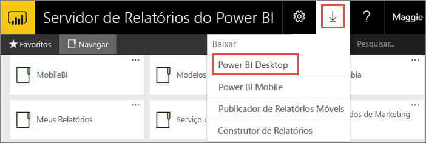
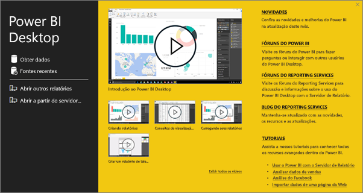
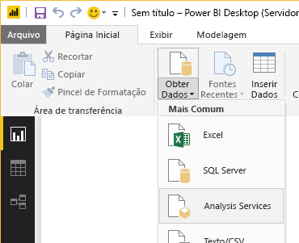
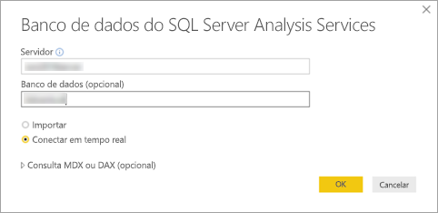
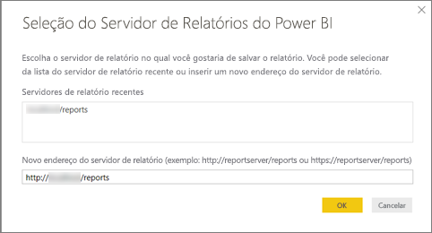
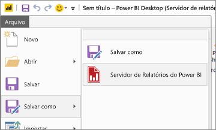

# Criar um relatório do Power BI para o Servidor de Relatórios do Power BI
É possível armazenar e gerenciar relatórios do Power BI localmente no portal da Web do Servidor de Relatórios do Power BI, do mesmo modo que você pode armazenar relatórios do Power BI na nuvem no serviço do Power BI (https://powerbi.com). Você cria e edita relatórios no Power BI Desktop e, em seguida, publica-os no portal da Web. Em seguida, os leitores de relatório em sua organização poderão exibi-los em um navegador ou em um aplicativo móvel do Power BI em um dispositivo móvel.

Aqui estão quatro etapas rápidas para começar.

## Etapa 1: Instalar o Power BI Desktop otimizado para o Servidor de Relatório do Power BI

Se você já tiver criado relatórios do Power BI no Power BI Desktop, então você está quase pronto para criar relatórios do Power BI para o Servidor de Relatórios do Power BI. É recomendável instalar a versão do Power BI Desktop otimizado para o Servidor de Relatório do Power BI para saber que o servidor e o aplicativo estão sempre em sincronia. É possível ter ambas as versões do Power BI Desktop no mesmo computador.

1. No portal da Web do servidor de relatórios, selecione a seta **Baixar** > **Power BI Desktop**.

    

    Ou acesse diretamente o [Microsoft Power BI Desktop](https://www.microsoft.com/download/details.aspx?id=57271) (Otimizado para o Servidor de Relatórios do Microsoft Power BI – agosto de 2018) no Centro de Download da Microsoft.

2. Na página do Centro de Download, selecione **Baixar**.

3. Dependendo do seu computador, selecione:

    - **PBIDesktopRS.msi** (a versão de 32 bits) ou

    - **PBIDesktopRS_x64.msi** (a versão de 64 bits).

4. Depois de baixar o instalador, execute o Assistente de Instalação do Power BI Desktop (agosto de 2018).

2. No final da instalação, marque **Iniciar o Power BI Desktop agora**.
   
    Ele é iniciado automaticamente e você está pronto para começar. Você pode saber que tem a versão correta, porque "Power BI Desktop (Agosto de 2018)" consta na barra de título.

    

3. Se você não estiver familiarizado com o Power BI Desktop, considere assistir aos vídeos na tela de boas-vindas.
   
    

## Etapa 2: Selecionar uma fonte de dados
Você pode conectar-se a uma variedade de fontes de dados. Leia mais sobre como [se conectar a fontes de dados](connect-data-sources.md).

1. Na tela de boas-vindas, selecione **Obter dados**.
   
    Na guia **Início**, selecione **Obter dados**.
2. Selecione a fonte de dados, neste exemplo, **Analysis Services**.
   
    
3. Preencha **Servidor** e, opcionalmente, **Banco de dados**. Certifique-se de que **Conectar em tempo real** está selecionado > **OK**.
   
    
4. Escolha o servidor de relatório em que você salvará seus relatórios.
   
    

## Etapa 3: Projetar seu relatório
Essa é a parte divertida: você pode criar visuais que ilustram os seus dados.

Por exemplo, é possível criar um gráfico de funil de clientes e agrupar valores por renda anual.

1. Em **Visualizações**, selecione **Gráfico de funil**.
2. Arraste o campo a ser contado para o vão **Valores**. Se não for um campo numérico, o Power BI Desktop o torna automaticamente uma *Contagem* do valor.
3. Arraste o campo ao grupo para o vão **Grupo**.

Ler mais sobre como [projetar um relatório do Power BI](../desktop-report-view.md).

## Etapa 4: Salvar o seu relatório no servidor de relatórios
Quando seu relatório estiver pronto, salve-o no Servidor de Relatórios do Power BI que você escolheu na etapa 2.

1. No menu **Arquivo**, selecione **Salvar como** > **Servidor de Relatório do Power BI**.
   
    
2. Agora é possível exibi-lo no portal da Web.
   
    

## Próximas etapas
### Power BI Desktop
Há muitos recursos excelentes para criar relatórios no Power BI Desktop. Esse link é um bom ponto de partida.

* [Introdução ao Power BI Desktop](../desktop-getting-started.md)
* Aprendizagem guiada: [Introdução ao Power BI Desktop](../guided-learning/gettingdata.yml?tutorial-step=2)

### Servidor de Relatórios do Power BI
* [Instalar o Power BI Desktop otimizado para o Servidor de Relatório do Power BI](install-powerbi-desktop.md)  
* [O que é o Servidor de Relatórios do Power BI?](get-started.md)  

Mais perguntas? [Experimente perguntar à Comunidade do Power BI](https://community.powerbi.com/)
