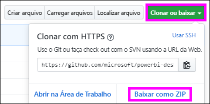
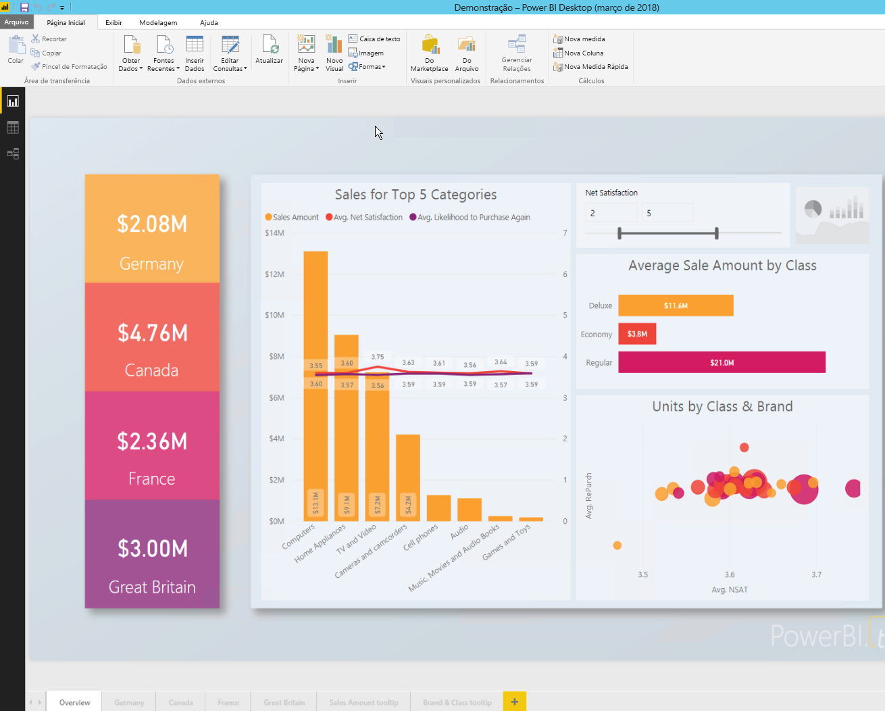
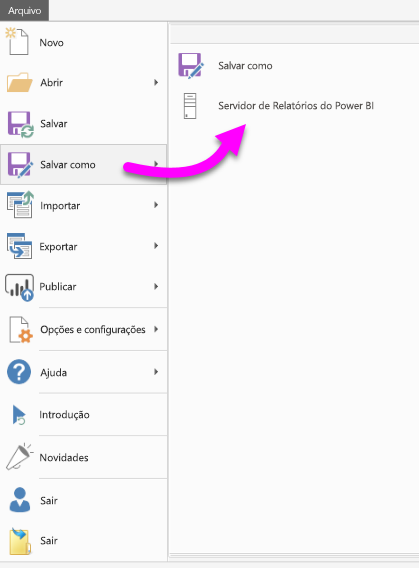
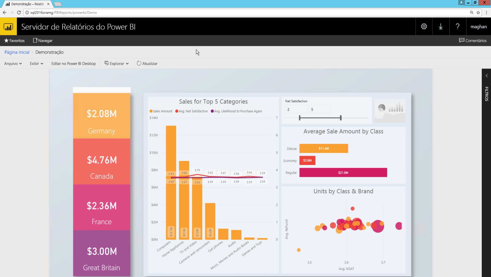
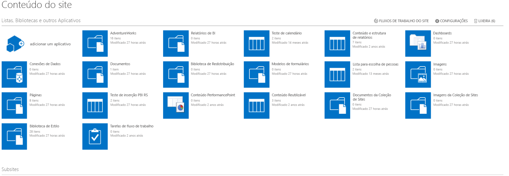
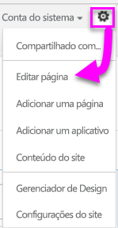
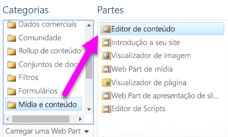
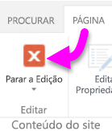

# <a name="quickstart-embed-a-power-bi-report-server-report-using-an-iframe-in-sharepoint-server"></a>Início Rápido: inserir um relatório do Servidor de Relatórios do Power BI usando um iFrame no SharePoint Server

Neste início rápido, você aprenderá a inserir um relatório do Servidor de Relatórios do Power BI usando um iFrame em uma página do SharePoint. Se você estiver trabalhando com o SharePoint Online, o Servidor de Relatórios do Power BI precisará estar acessível publicamente. No SharePoint Online, o Web Part do Power BI que funciona com o serviço do Power BI não funciona com o Servidor de Relatórios do Power BI. 


## <a name="prerequisites"></a>Pré-requisitos
* Você precisará ter o [Servidor de Relatórios do Power BI](https://powerbi.microsoft.com/en-us/report-server/) instalado e configurado.
* Você precisará ter o [Power BI Desktop otimizado para o Servidor de Relatórios do Power BI](install-powerbi-desktop.md) instalado.
* Você precisará ter um ambiente do [SharePoint](https://docs.microsoft.com/sharepoint/install/install) instalado e configurado.

## <a name="creating-the-power-bi-report-server-report-url"></a>Criando a URL de relatório do Servidor de Relatórios do Power BI

1. Baixe o exemplo do GitHub – [Blog Demo](https://github.com/Microsoft/powerbi-desktop-samples).

    

2. Abra o arquivo PBIX de exemplo do GitHub no **Power BI Desktop otimizado para o Servidor de Relatórios do Power BI**.

    

3. Salve o relatório no **Servidor de Relatórios do Power BI**. 

    

4. Exiba o relatório no **Portal da Web**.

    

### <a name="capturing-the-url-parameter"></a>Capturando o parâmetro de URL

Quando tiver sua URL, você poderá criar um iFrame em uma página do SharePoint para hospedar o relatório. Para qualquer URL de relatório do Servidor de Relatórios do Power BI, você pode adicionar um parâmetro querystring de `?rs:embed=true` para inserir o relatório em um iFrame. 

   Por exemplo:
    ``` 
    http://myserver/reports/powerbi/Sales?rs:embed=true
    ```
## <a name="embedding-a-power-bi-report-server-report-in-a-sharepoint-iframe"></a>Inserindo um relatório do Servidor de Relatórios do Power BI em um iFrame no SharePoint

1. Navegue até a página **Conteúdo do Site** no SharePoint.

    

2. Escolha a página em que deseja adicionar seu relatório.

    

3. Selecione a engrenagem no canto superior direito e selecione **Editar Página**.

    

4. Selecione **Adicionar Web Part**.

    

5. Em **Categorias**, selecione **Mídia e Conteúdo**, em **Partes**, selecione **Editor de Conteúdo** e, em seguida, selecione **Adicionar**.

     

6. Selecione **Clique aqui para adicionar novo conteúdo**.

    

7. Na faixa de opções, selecione a guia **Formatar Texto** e selecione **Editar Fonte**.

     

8. Na janela Editar Fonte, cole o código do iFrame e selecione OK.

    

     Por exemplo:
     ```
     <iframe width="800" height="600" src="http://myserver/reports/powerbi/Sales?rs:embed=true" frameborder="0" allowFullScreen="true"></iframe>
     ```

9. Na faixa de opções, selecione a guia **Página** e selecione **Parar a Edição**.

    

10. Agora, você deve ver o relatório na página.

    

## <a name="next-steps"></a>Próximas etapas

[Início Rápido: criar um relatório do Power BI para o Servidor de Relatórios do Power BI](quickstart-create-powerbi-report.md)  
[Início Rápido: criar um relatório paginado para o Servidor de Relatórios do Power BI](quickstart-create-paginated-report.md)  

Mais perguntas? [Experimente perguntar à Comunidade do Power BI](https://community.powerbi.com/) 