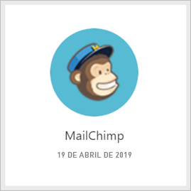
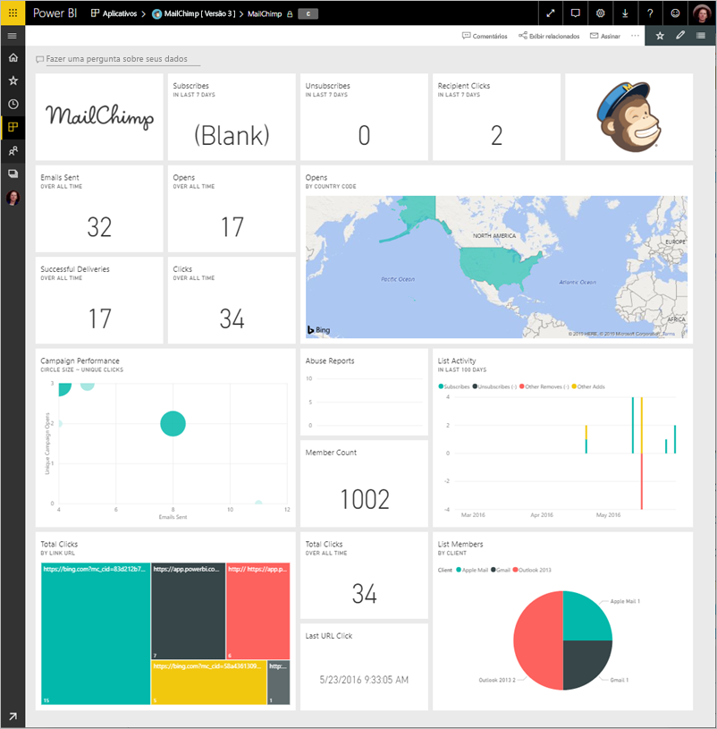
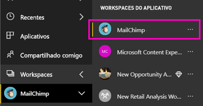
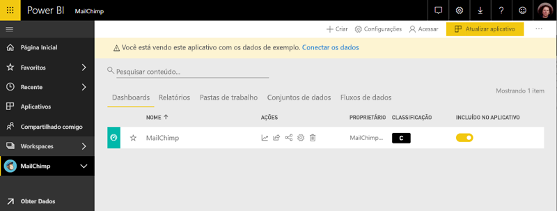

# Conectar-se ao MailChimp com o Power BI
Este artigo explica a efetuar pull de seus dados de sua conta do MailChimp com um aplicativo de modelo do Power BI. O aplicativo de modelo gera um espaço de trabalho com um dashboard, um conjunto de relatórios e um conjunto de dados para permitir que você explore seus dados do MailChimp. Use a análise dos [painéis do MailChimp](https://powerbi.microsoft.com/integrations/mailchimp) para identificar rapidamente as tendências existentes em suas campanhas, seus relatórios e seus assinantes individuais. Os dados são atualizados diariamente, garantindo que os dados que você está monitorando seja atualizados.

Depois de instalar o aplicativo de modelo, você pode alterar o painel e relatório. Em seguida, você pode distribuí-lo como um aplicativo para seus colegas em sua organização.

Conectar-se para o [MailChimp modelo aplicativo](https://app.powerbi.com/getdata/services/mailchimp) para o Power BI.

## Como se conectar

[!INCLUDE [powerbi-service-apps-get-more-apps](./includes/powerbi-service-apps-get-more-apps.md)]

3. Selecione **MailChimp** \> **obtê-lo agora**.
4. Na **instalar este aplicativo do Power BI?** selecionar **instalar**.
4. No **aplicativos** painel, selecione o **MailChimp** lado a lado.

    

6. Na **começar com seu novo aplicativo**, selecione **Conecte dados**.

    

1. Para o Método de Autenticação, selecione **oAuth2** \> **Entrar**.
   
    Quando solicitado, insira suas credenciais do MailChimp e siga o processo de autenticação.
   
    Na primeira vez que você se conectar, o Power BI solicitará a você o acesso somente leitura à sua conta. Selecione **Permitir** para iniciar o processo de importação. Ele pode levar alguns minutos, dependendo do volume de dados em sua conta.
   
    

5. Depois que o Power BI importar os dados, abre o painel do MailChimp.
   
    

## Modificar e distribuir seu aplicativo

Você instalou o aplicativo de modelo do MailChimp. Isso significa que você também criou o espaço de trabalho de aplicativo do MailChimp. No espaço de trabalho, você pode alterar o relatório e painel de controle e, em seguida, distribuí-lo como um *aplicativo* para seus colegas em sua organização. 

1. Para exibir todo o conteúdo do seu novo espaço de trabalho de MailChimp, na barra de navegação à esquerda, selecione **espaços de trabalho** > **MailChimp**. 

    

    Essa exibição é a lista de conteúdo para o espaço de trabalho. No canto superior direito, você verá **atualizar aplicativo**. Quando você estiver pronto para distribuir seu aplicativo para seus colegas, que é onde você começará.

    

2. Selecione **relatórios** e **conjuntos de dados** para ver os outros elementos no espaço de trabalho. 

    Leia sobre [distribuindo aplicativos](service-create-distribute-apps.md) para seus colegas.

## Próximas etapas

* [Criar novos espaços de trabalho no Power BI](service-create-the-new-workspaces.md)
* [Instalar e usar aplicativos no Power BI](consumer/end-user-apps.md)
* [Aplicativos do Power BI para serviços externos](service-connect-to-services.md)
* Dúvidas? [Experimente perguntar à Comunidade do Power BI](http://community.powerbi.com/)

