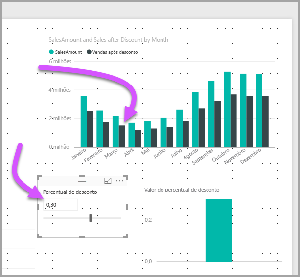

# Criar e usar um parâmetro de hipóteses para visualizar variáveis no Power BI Desktop

Começando com o lançamento de agosto de 2018 do *Power BI Desktop*, você pode criar variáveis *what-if* para seus relatórios, interagir com a variável como uma segmentação e visualizar e quantificar diferentes valores de chave em seus relatórios.

O parâmetro *what-if* está na guia **Modelagem** do Power BI Desktop. Quando você selecioná-lo, será exibida uma caixa de diálogo na qual o parâmetro pode ser configurado.

## Como criar um parâmetro what-if

Para criar um parâmetro what-if, selecione **Novo Parâmetro** na guia **Modelagem** no Power BI Desktop. Na imagem a seguir, criamos um parâmetro chamado *Percentual de desconto* e definimos seu tipo de dados como **Número decimal**. O valor **Mínimo** é de zero. O **Máximo** é de 0,50 (50 por cento). Também definimos o **Incremento** como 0,05 ou 5%. Esse é o nível de ajuste que o parâmetro fará ao interagir com um relatório.

> [!NOTE]
> Para números decimais, preceda o valor por um zero, como em 0,50, e não ,50. Caso contrário, o número não será validado e o botão **OK** não será selecionável.
> 
> 

Para sua conveniência, a caixa de seleção **Adicionar segmentação a esta página** coloca automaticamente uma segmentação com o parâmetro what-if na página de relatório atual.

Além de criar o parâmetro, a criação de um parâmetro what-if também cria uma medida, que pode ser usada para visualizar o valor atual do parâmetro what-if.

É importante e útil observar que, depois de criar um parâmetro what-if, o parâmetro e a medida se tornam parte do modelo. Portanto, eles estão disponíveis em todo o relatório e podem ser usados em outras páginas do relatório. E, como fazem parte do modelo, você pode excluir a segmentação da página do relatório. Se você quiser voltar, bastará pegar o parâmetro what-if da lista **Campos** e arrastá-lo para a tela e, em seguida, alterar o visual para uma segmentação de itens.

## Usando um parâmetro what-if

Vamos criar um exemplo simples do uso de um parâmetro what-if. Criamos o parâmetro what-if na seção anterior. Agora, vamos colocá-lo para usar criando uma medida cujo valor se ajusta ao controle deslizante.

A nova medida simplesmente será o valor total de vendas, com a taxa de desconto aplicada. Você pode criar medidas complexas e interessantes, que permitem aos consumidores dos relatórios visualizar a variável do parâmetro what-if. Por exemplo, você poderá criar um relatório que permitirá ao pessoal de vendas ver suas remunerações se eles cumprirem determinadas metas ou percentuais de vendas ou ver o efeito do aumento das vendas em descontos maiores.

Insira a fórmula de medida na barra de fórmulas e dê a ela o nome *Vendas após Desconto*.

Em seguida, criamos um visual de coluna com **OrderDate** no eixo e **SalesAmount** e a medida recém-criada **Vendas após o Desconto** como os valores.

Depois, conforme movemos o controle deslizante, vemos que a coluna **Vendas após o Desconto** reflete o valor de vendas com desconto.

E isso é tudo para ele. Você pode usar os parâmetros what-if em todos os tipos de situações. Esses parâmetros permitem que os consumidores de relatórios interajam com diferentes cenários criados em seus relatórios.
