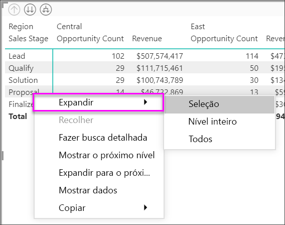
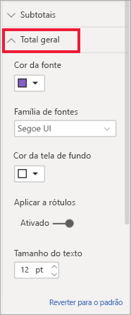
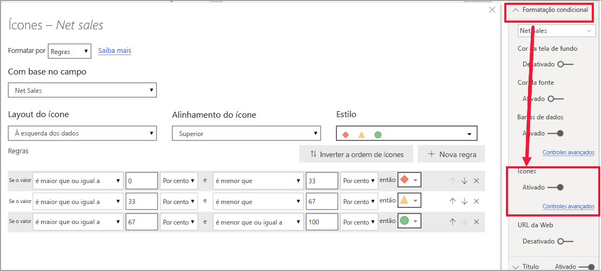
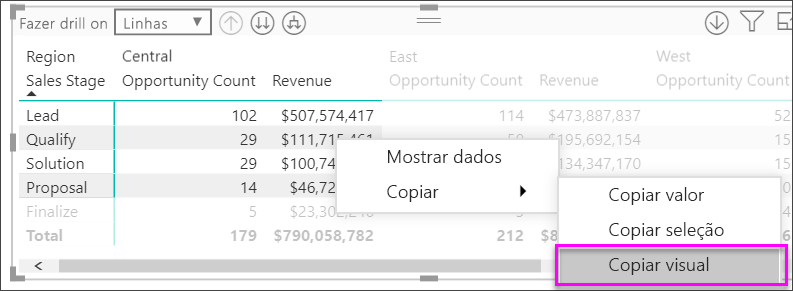
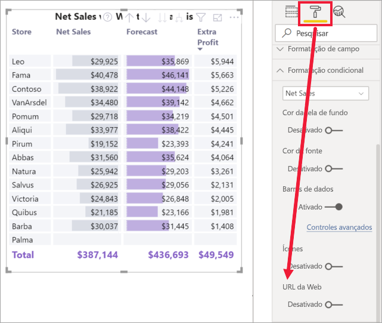
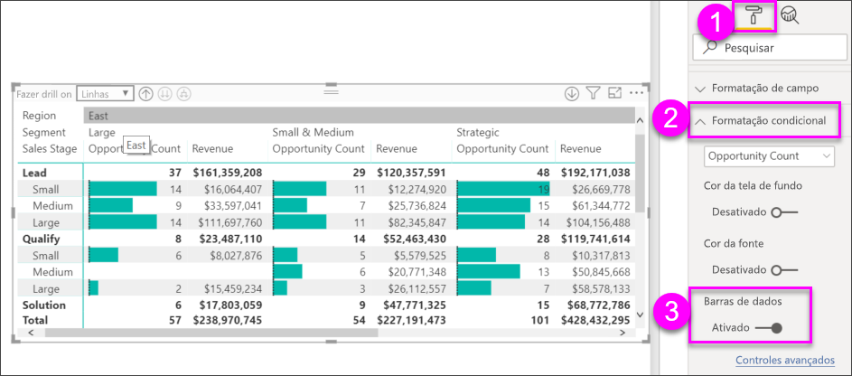

# Criar visualizações de matriz no Power BI

[!INCLUDE [power-bi-visuals-desktop-banner](../includes/power-bi-visuals-desktop-banner.md)]

O visual de matriz é semelhante a uma tabela.  Uma tabela dá suporte a duas dimensões e os dados são simples, o que significa que os valores duplicados são exibidos e não agregados. Uma matriz facilita significativamente a exibição dos dados entre várias dimensões – ela dá suporte a um layout em níveis. A matriz agrega automaticamente os dados e permite fazer drill down. 

Você pode criar visuais de matriz em relatórios do **Power BI Desktop** e fazer o realce cruzado de elementos na matriz com outros visuais na página desse relatório. Por exemplo, é possível selecionar linhas, colunas e até mesmo células individuais e fazer o realce cruzado. Além disso, células individuais e seleções de várias célula podem ser copiadas e coladas em outros aplicativos. 

Há muitos recursos associados à matriz e vamos abordá-los nas próximas seções deste artigo.

## Noções básicas sobre como o Power BI calcula totais

Antes de aprender a usar o elemento visual de matriz, é importante saber como o Power BI calcula valores totais e subtotais em tabelas e matrizes. Para linhas de totais e subtotais, o Power BI avalia a medida sobre todas as linhas nos dados subjacentes – não se trata de uma simples adição dos valores nas linhas visíveis ou exibidas. Isso significa que você pode acabar com valores diferentes na linha de total do que o esperado.

Dê uma olhada nos seguintes visuais de matriz. 

Neste exemplo, cada linha no visual de matriz na extrema direita está mostrando a *quantidade* de cada combinação de vendedor/data. No entanto, como um vendedor aparece em várias datas, os números podem aparecer mais de uma vez. Assim, o total preciso dos dados subjacentes e uma simples adição de valores visíveis não são iguais. Este é um padrão comum quando o valor que você está somando está no lado 'um' de uma relação de um para muitos.

Ao examinar totais e subtotais, lembre-se de que esses valores são baseados nos dados subjacentes. Eles não se baseiam exclusivamente nos valores visíveis.

## Expandir e recolher cabeçalhos de linha
Há duas maneiras de expandir os cabeçalhos de linha. A primeira é por meio do menu de clique com o botão direito do mouse. Você verá opções para expandir o cabeçalho da linha específica que você selecionou, o nível inteiro ou todo o conteúdo até o último nível da hierarquia. As opções de recolha dos cabeçalhos são semelhantes.

Você também pode adicionar botões +/- aos cabeçalhos de linha por meio do painel de formatação no cartão **Cabeçalhos de linha**. Por padrão, os ícones corresponderão à formatação do cabeçalho da linha, mas você poderá personalizar as cores e os tamanhos dos ícones separadamente, se desejar.

Depois que os ícones são ativados, eles funcionam de maneira semelhante aos ícones da Tabela Dinâmica no Excel.

O estado de expansão da matriz será salvo com o seu relatório. Uma matriz pode ser fixada a um painel expandido ou recolhido. Quando esse bloco do painel é selecionado e o relatório é aberto, o estado de expansão ainda pode ser alterado no relatório. 

> [!NOTE]
> Se você estiver criando um relatório sobre um modelo multidimensional do Analysis Services, haverá algumas considerações especiais para expandir/recolher se o modelo usar o recurso de membro padrão. Para obter mais informações, confira [Trabalhar com modelos multidimensionais no Power BI](../desktop-default-member-multidimensional-models.md)

## Como usar drill down com o visual de matriz
Com o visual de matriz, é possível realizar todos os tipos de atividade de drill down interessantes que antes não estavam disponíveis. Isso inclui a capacidade de fazer drill down usando linhas, colunas e até mesmo células e seções individuais. Vamos dar uma olhada em como cada uma delas funciona.

### Drill down nos cabeçalhos de linha

No painel Visualizações, ao adicionar vários campos à seção **Linhas** do espaço **Campos**, você habilita o drill down nas linhas do visual de matriz. Isso é semelhante à criação de uma hierarquia, o que permite fazer drill down (e, em seguida, drill up) nessa hierarquia e analisar os dados em cada nível.

Na imagem a seguir, a seção **Linhas** contém *Estágio da venda* e *Tamanho da oportunidade*, criando um agrupamento (ou uma hierarquia) nas linhas que podemos detalhar.

Quando o visual tiver algum agrupamento criado na seção **Linhas**, o próprio visual exibirá os ícones *analisar* e *expandir* no canto superior esquerdo do visual.

Semelhante ao comportamento de analisar e expandir nos outros visuais, selecionar esses botões permite fazer drill down (ou drill up) na hierarquia. Nesse caso, podemos fazer drill down de *Estágio da venda* para *Tamanho da oportunidade*, conforme mostra a imagem a seguir, em que o ícone de fazer drill down de um nível (a forquilha) foi selecionado.

Além de usar esses ícones, você pode selecionar qualquer um desses cabeçalhos de linha e fazer drill down escolhendo no menu que é exibido.

Observe que há algumas opções no menu que aparece, que geram resultados diferentes:

Selecionar **Fazer Drill Down** expande a matriz no nível *dessa* linha, *excluindo* todos os outros cabeçalhos de linha, exceto o cabeçalho de linha que foi selecionado. Na imagem a seguir **Proposta** > **Fazer Drill Down** foi selecionado. Observe que as outras linhas de nível superior não aparecem mais na matriz. Essa maneira de analisar é um recurso útil que fica ainda mais interessante quando chegamos à seção de realce cruzado.

Selecione o ícone **Fazer drill up** para voltar à exibição de nível superior anterior. Se, em seguida, você selecionar **Proposta** > **Mostrar o Próximo Nível**, será exibida uma listagem em ordem crescente de todos os itens do próximo nível (nesse caso, o campo *Tamanho da oportunidade*), sem a categorização de hierarquia de nível superior.

Selecione o ícone **Fazer drill up** no canto superior esquerdo para que a matriz mostre todas as categorias de nível superior. Em seguida, selecione **Proposta** > **Expandir para o próximo nível** para ver todos os valores de ambos os níveis da hierarquia – *Estágio da venda* e *Tamanho da oportunidade*.

Você também pode usar o item de menu **Expandir** para controlar ainda mais a exibição.  Por exemplo, selecione **Proposta** > **Expandir** > **Seleção**. O Power BI exibe uma linha de total para cada *Estágio da venda* e todas as opões de *Tamanho da oportunidade* para *Proposta*.

### Drill down nos cabeçalhos de coluna
Semelhante à capacidade de fazer drill down em linhas, também é possível fazer drill down em colunas. Na imagem a seguir, há dois campos no espaço do campo **Colunas**, criando uma hierarquia semelhante à que já usamos para as linhas anteriormente neste artigo. No espaço do campo **Colunas**, temos *Região* e *Segmento*. Assim que o segundo campo foi adicionado a **Colunas**, um novo menu suspenso foi exibido no visual; atualmente, ele mostra **Linhas**.

Para fazer drill down em colunas, selecione **Colunas** no menu *Fazer drill on*, que pode ser encontrado no canto superior esquerdo da matriz. Selecione a região *Leste* e escolha **Fazer Drill Down**.

Quando você seleciona **Fazer Drill Down**, o próximo nível da hierarquia de coluna para *Região > Leste* é exibido, que, nesse caso, é *Contagem da oportunidade*. A outra região está oculta.

O restante dos itens do menu funcionam nas colunas da mesma maneira que nas linhas (veja a seção anterior, **Fazer drill down nos cabeçalhos de linha**). Você pode **Mostrar o Próximo Nível** e **Expandir para o próximo nível** com colunas assim como faz com as linhas.

> [!NOTE]
> Os ícones de drill up e drill down no canto superior esquerdo do visual de matriz aplicam-se apenas a linhas. Para fazer drill down nas colunas, você deve usar o menu acionado com um clique com o botão direito do mouse.

## Layout de nível com visuais de matriz

O visual de matriz recua automaticamente as subcategorias em uma hierarquia abaixo de cada pai, chamado de Layout de nível.

Na versão original do visual de matriz, as subcategorias eram mostradas em uma coluna inteiramente diferente, ocupando muito mais espaço no visual. A imagem a seguir mostra a tabela no visual de matriz original. Observe as subcategorias em uma coluna separada.

Na imagem a seguir, há um visual de matriz com o layout de nível em ação. Observe que a categoria *Computadores* tem suas subcategorias (Acessórios de Computadores, Desktops, Laptops, Monitores e assim por diante) ligeiramente recuadas, fornecendo um visual mais limpo e muito mais compacto.

Você pode ajustar facilmente as configurações do layout de nível. Com o visual de matriz selecionado, na seção **Formatar** (o ícone de rolo de pintura) do painel **Visualizações**, expanda a seção de cabeçalhos de linha. Você tem duas opções: a opção de layout de nível (que o habilita ou desabilita) e o recuo do layout de nível (que especifica a quantidade de recuo em pixels).

Se você desativar o layout de nível, o Power BI mostrará as subcategorias em outra coluna em vez de recuadas abaixo da categoria pai.

## Subtotais e totais gerais com visuais de matriz

Ative ou desative os subtotais em visuais de matriz, linhas e colunas. Na imagem a seguir, você pode ver que os subtotais da linha estão configurados como **Ativados** e para serem exibidos na parte inferior.

Quando você ativa os **Subtotais** e adiciona um rótulo, o Power BI também adiciona uma linha e o mesmo rótulo para o valor total geral. Para formatar o total geral, selecione a opção de formatação do **Total geral**. 

Se você deseja desativar os subtotais e os totais gerais, expanda o cartão **Subtotais** na seção de formato do painel de visualizações. Deixe o controle deslizante de subtotais de linha **Desativado**. Quando você fizer isso, os subtotais não serão mostrados.

O mesmo processo se aplica aos subtotais da coluna.

## Adicionar ícones condicionais
Adicione indicações visuais à sua tabela ou matriz usando os *ícones condicionais*. 

Na seção de formato do painel Visualizações, expanda o cartão **Formatação condicional**. Deixe o controle deslizante **Ícones** **Ativado** e selecione **Controles avançados**.

Ajuste as condições, os ícones e as cores da matriz e selecione **OK**. Neste exemplo, usamos uma bandeira vermelha para valores baixos, um círculo roxo para valores altos e um triângulo amarelo para os valores intermediários. 

## Realce cruzado com visuais de matriz

Com o visual de matriz, você pode selecionar os elementos na matriz como a base para o realce cruzado. Selecione uma coluna em uma matriz e o Power BI realça a coluna, como em outros visuais na página do relatório. Esse tipo de destaque cruzado era um recurso comum de outros visuais e seleções de ponto de dados, então agora o visual de matriz oferece a mesma função.

Além disso, usar Ctrl + clique também funciona para o realce cruzado. Por exemplo, na imagem a seguir, uma coleção de subcategorias foi selecionada no visual de matriz. Observe como os itens que não foram selecionados no visual estão esmaecidos e como os outros visuais na página refletem as seleções feitas no visual de matriz.

## Copiar valores do Power BI para uso em outros aplicativos

Sua matriz ou tabela pode ter conteúdo que você deseja usar em outros aplicativos: Dynamics CRM, Excel e outros relatórios do Power BI. Clicando com o botão direito do mouse no Power BI, é possível copiar uma única célula ou uma seleção de células na área de transferência. Em seguida, cole-as em outro aplicativo.

* Para copiar o valor de uma única célula, selecione-a, clique com o botão direito do mouse e escolha **Copiar valor**. Com o valor de célula não formatado em sua área de transferência, agora é possível colá-lo em outro aplicativo.

    

* Para copiar mais de uma única célula, selecione uma variedade de células ou use CTRL para selecionar uma ou mais células. 

    

* A cópia incluirá os cabeçalhos da coluna e da linha.

    

* Para fazer uma cópia do próprio visual que contém apenas as células selecionadas, selecione uma ou mais células usando Ctrl, clique com o botão direito do mouse e escolha **Copiar visual**

    

* A cópia será outra visualização de matriz, mas só conterá os dados copiados.

    

## Definir um valor da matriz como uma URL personalizada

Se você tiver uma coluna ou uma medida que contenha URLs de site, use a formatação condicional para aplicar essas URLs aos campos como links ativos. Você encontrará essa opção no cartão de **Formatação condicional** no painel de formatação.

Ative a **URL da Web** e selecione um campo para usar como URL da coluna. Depois de aplicados, os valores nesse campo (coluna) se tornam links ativos. Passe o mouse para ver o link e selecione a página para a qual você quer ir. 

Para mais informações, confira [Formatação condicional da tabela](../desktop-conditional-table-formatting.md)

## Sombreamento e cores da fonte com visuais de matriz
Com o visual de matriz, você pode aplicar a formatação condicional (cores e sombreamento e barras de dados) ao plano de fundo das células na matriz, bem como pode aplicar formatação condicional aos próprios valores e texto.

Para aplicar a formatação condicional, selecione o visual de matriz e abra o painel **Formatar**. Expanda o cartão **Formatação condicional** e para **Cor do plano de fundo**, **Cor da fonte** ou **Barras de dados**, mova o controle deslizante para **Ativado**. A ativação de uma dessas opções exibe um link para *Controles avançados*, que permite personalizar as cores e os valores da formatação de cor.
  
  

Selecione *Controles avançados* para exibir uma caixa de diálogo que permite fazer ajustes. Este exemplo mostra a caixa de diálogo **Barras de dados**.

## Considerações e solução de problemas

* Se os dados de texto nos cabeçalhos ou nas células da sua matriz contiverem novos caracteres de linha, esses caracteres serão ignorados, a menos que você habilite a opção "Quebra Automática de Linha" no cartão associado do painel de formatação do elemento. 

## Próximas etapas

[Visual do Power Apps para Power BI](power-bi-visualization-powerapp.md)

[Tipos de visualização no Power BI](power-bi-visualization-types-for-reports-and-q-and-a.md)
