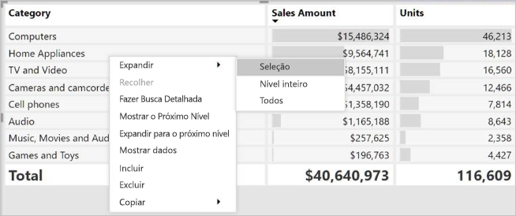
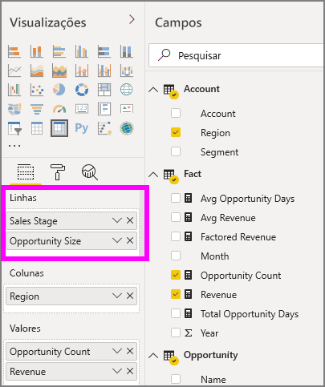
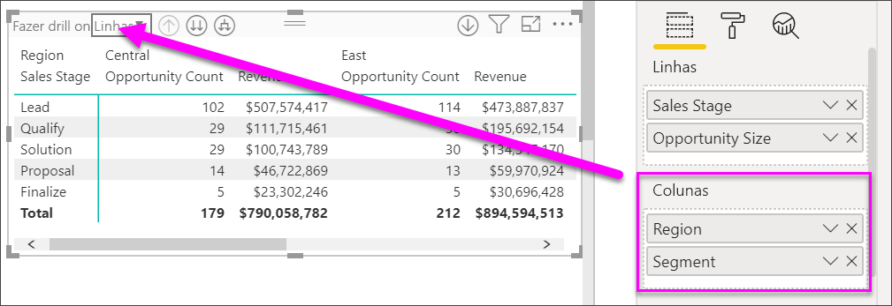
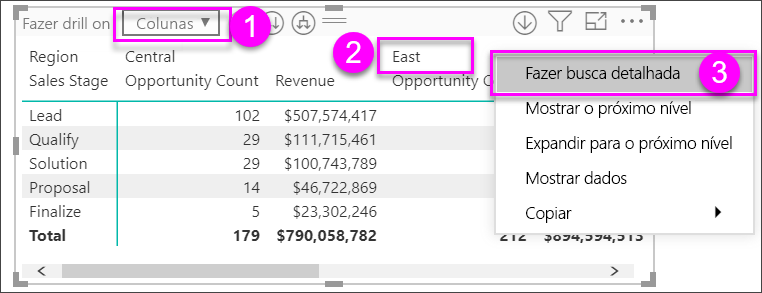
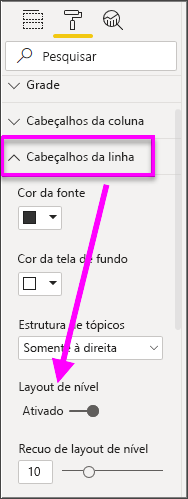
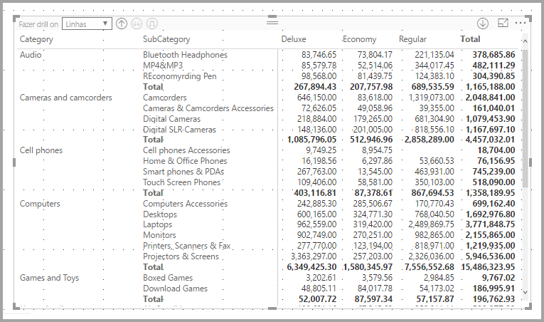
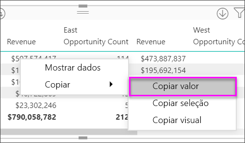
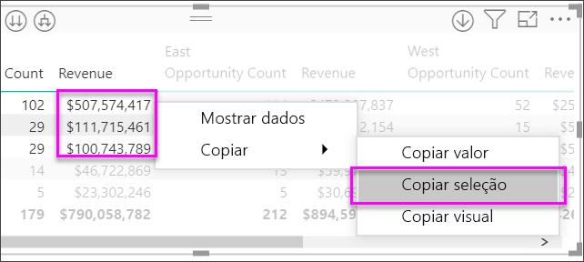
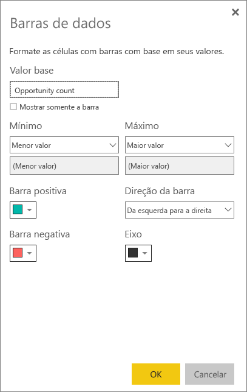

# Usar o visual de Matriz no Power BI
O **matrix** visual é semelhante a um **tabela**.  Uma tabela dá suporte a 2 dimensões e os dados são simples, valores duplicados do significado são exibidos e não agregados. Uma matriz torna mais fácil de exibir dados de maneira significativa em várias dimensões, pois ele dá suporte a um layout de nível. A matriz automaticamente agrega os dados e permite fazer drill para baixo. 

Você pode criar visuais de matriz no **Power BI Desktop** e **serviço do Power BI** relatórios e elementos de realce cruzado na matriz com outros elementos visuais nessa página de relatório. Por exemplo, você pode selecionar linhas, colunas e até mesmo células individuais e realce cruzado. Além disso, células individuais e várias seleções de célula podem ser copiadas e coladas em outros aplicativos. 

Há muitos recursos associados à matriz e vamos abordá-los nas próximas seções deste artigo.

## Noções básicas sobre como o Power BI calcula totais

Antes de ir para como usar o elemento visual **Matriz**, é importante entender como o Power BI calcula valores totais e subtotais em tabelas e matrizes. Para linhas de totais e subtotais, a medida é avaliada em todas as linhas nos dados subjacentes – *não* é apenas uma simples adição dos valores nas linhas visíveis ou exibidas. Isso significa que você pode acabar com valores diferentes na linha de total do que o esperado. 

Dar uma olhada em visuais de matriz a seguir. 

Neste exemplo, cada linha da matriz visual mais à direita está mostrando o *quantidade* para cada combinação de vendedor/Data. No entanto, como um vendedor aparece em várias datas, os números podem aparecer mais de uma vez. Assim, o total preciso dos dados subjacentes e uma simples adição de valores visíveis não são iguais. Este é um padrão comum quando o valor que você está somando está no lado 'um' de uma relação de um para muitos.

Ao examinar o total e os subtotais, lembre-se de que esses valores são baseados nos dados subjacentes e não apenas nos valores visíveis. 

<!-- use Nov blog post video

## Expanding and collapsing row headers
There are two ways you can expand row headers. The first is through the right-click menu. You’ll see options to expand the specific row header you clicked on, the entire level or everything down to the very last level of the hierarchy. You have similar options for collapsing row headers as well.

You can also add +/- buttons to the row headers through the formatting pane under the row headers card. By default, the icons will match the formatting of the row header, but you can customize the icons’ color and size separately if you want. 
Once the icons are turned on, they work similarly to the icons from PivotTables in Excel.

The expansion state of the matrix will save with your report. It can be pinned to dashboards as well, but consumers will need to open up the report to change the state. Conditional formatting will only apply to the inner most visible level of the hierarchy. Note that this expand/collapse experience is not currently supported when connecting to AS servers older than 2016 or MD servers.

Watch the following video to learn more about expand/collapse in the matrix:

-->
## Usando drill para baixo com o visual de matriz
Com o visual de matriz, você pode fazer todos os tipos de atividades que não estavam disponíveis antes de aprofundar interessante. Isso inclui a capacidade de fazer drill down usando linhas, colunas e até mesmo células e seções individuais. Vamos dar uma olhada em como cada uma delas funciona.

### Drill down nos cabeçalhos de linha
No painel **Visualizações**, ao adicionar vários campos na seção **Linhas** sob **Campos**, você habilita o drill down nas linhas do visual de matriz. Isso é semelhante à criação de uma hierarquia, o que permite fazer drill down (e, em seguida, drill up) nessa hierarquia e analisar os dados em cada nível.

Na imagem a seguir, o **linhas** seção contém *estágio de vendas* e *tamanho da oportunidade*, criando um agrupamento (ou hierarquia) nas linhas que é possível fazer drill down.

Quando o visual tiver algum agrupamento criado na seção **Linhas**, o próprio visual exibirá os ícones *analisar* e *expandir* no canto superior esquerdo do visual.

Semelhante ao comportamento de analisar e expandir nos outros visuais, selecionar esses botões permite fazer drill down (ou drill up) na hierarquia. Nesse caso, podemos pode fazer drill down de *estágio de vendas* à *tamanho da oportunidade*, conforme mostrado na imagem a seguir, onde a fazer drill down um ícone nível (a forquilha) foi selecionado.

Além de usar esses ícones, você pode selecionar qualquer um desses cabeçalhos de linha e fazer drill down escolhendo-o no menu que aparece.

Observe que há algumas opções no menu que aparece, que geram resultados diferentes:

Selecionando **fazer Drill Down** expande a matriz *que* nível, de linha *excluindo* todos os outros cabeçalhos de linha, exceto o cabeçalho da linha que foi selecionado. Na imagem a seguir **proposta** > **fazer Drill Down** foi selecionado. Observe que as outras linhas de nível superior não aparecem mais na matriz. Essa maneira de analisar é um recurso útil que fica ainda mais interessante quando chegamos à seção de **realce cruzado**.

Selecione o **Drill up** ícone voltar para a exibição de nível superior anterior. Se você selecionar **proposta** > **Mostrar próximo nível**, você obtém uma lista crescente de todos os itens do próximo nível (nesse caso, o *tamanho da oportunidade* campo), sem a categorização de hierarquia de nível superior.

Selecione o **Drill up** ícone no canto superior esquerdo para que a matriz Mostrar todas as categorias de nível superior, em seguida, selecione **proposta** > **expandir para o próximo nível**para Consulte todos os valores para ambos os níveis da hierarquia - *estágio de vendas* e *tamanho da oportunidade*.

Você também pode usar o **expandir** item de menu para controlar ainda mais a exibição.  Por exemplo, selecione **proposta** > **expandir** > **seleção**. O Power BI exibe uma linha de total para cada *estágio de vendas* e todos os as *tamanho da oportunidade* opções para *proposta*.

### Drill down nos cabeçalhos de coluna
Assim como a capacidade de fazer uma busca detalhada em linhas, você pode também fazer drill down nos **colunas**. Na imagem a seguir, há dois campos na **colunas** bem de campo, criando uma hierarquia semelhante ao que é usado para as linhas no início deste artigo. No **colunas** campo bem, temos *região* e *segmento*. Assim que o segundo campo foi adicionado ao **colunas**, um novo menu suspenso exibido no visual, ele mostra **linhas**.

Para fazer drill down em colunas, selecione **colunas** da *Drill* menu que pode ser encontrado no canto superior esquerdo da matriz. Selecione o *Leste* região e escolha **fazer Drill Down**.

Quando você seleciona **fazer Drill Down**, o próximo nível da hierarquia de coluna para *região > Leste* exibido, que nesse caso é *contagem de oportunidades*. A outra região exibe, mas está desativada.

O restante dos itens de menu funcionam nas colunas da mesma forma que eles fazem para linhas (consulte a seção anterior, **fazer Drill down nos cabeçalhos de linha**). Você pode **Mostrar próximo nível** e **expandir para o próximo nível** com exatamente como você pode fazer com linhas de colunas.

> [!NOTE]
> Os ícones de drill up e drill down no canto superior esquerdo do visual de matriz aplicam-se apenas a linhas. Para fazer drill down nas colunas, você deve usar o menu acionado com um clique com o botão direito do mouse.
> 
> 

## Layout de nível com visuais de matriz
O visual **Matriz** recua automaticamente as subcategorias em uma hierarquia abaixo de cada pai, chamado de **Layout de nível**.

Na versão *original* do visual de matriz, as subcategorias foram mostradas em uma coluna inteiramente diferente, ocupando muito mais espaço no visual. A imagem a seguir mostra a tabela no visual de **Matriz** original. Observe as subcategorias em uma coluna separada.

Na imagem a seguir, há um visual **Matriz** com o **Layout de nível** em ação. Observe que a categoria *Computadores* tem suas subcategorias (Acessórios de Computadores, Desktops, Laptops, Monitores e assim por diante) ligeiramente recuadas, fornecendo um visual mais limpo e muito mais compacto.

Você pode ajustar facilmente as configurações do layout de nível. Com o visual **Matriz** selecionado, na seção **Formatar** (o ícone de rolo de pintura) do painel **Visualizações**, expanda a seção **Cabeçalhos de linha**. Você tem duas opções: a opção (que habilita ou desabilita) **Layout de nível** e o **Recuo do layout de nível** (especifica a quantidade de recuo, em pixels).

Se você desligar **Layout de nível**, as subcategorias serão mostradas em outra coluna em vez de recuadas abaixo da categoria pai.

## Subtotais com visuais de matriz
Ative ou desative os subtotais em visuais de matriz, linhas e colunas. Na imagem a seguir, veja que os subtotais da linha são definidos como **ativados**.

Na seção **Formato** do painel **Visualizações**, expanda o cartão **Subtotais** e defina o controle deslizante **Subtotais da Linha** como **Desativado**. Quando você fizer isso, os subtotais não serão mostrados.

O mesmo processo se aplica aos subtotais da coluna.

## Realce cruzado com visuais de matriz
Com o visual **Matriz**, você pode selecionar os elementos na matriz como a base para o realce cruzado. Selecione uma coluna em uma **Matriz** e essa coluna será realçada, assim como quaisquer outros visuais na página do relatório. Esse tipo de destaque cruzado era um recurso comum de outros visuais e seleções de ponto de dados, então agora o visual **Matriz** oferece a mesma função.

Além disso, usar Ctrl + clique também funciona para o realce cruzado. Por exemplo, na imagem a seguir, uma coleção de subcategorias foi selecionada no visual **Matriz**. Observe como os itens que não foram selecionados no visual estão esmaecidos e como os outros visuais na página refletem as seleções feitas no visual **Matriz**.

## Copiar valores do Power BI para uso em outros aplicativos

Sua matriz ou tabela pode ter conteúdo que você gostaria de usar em outros aplicativos, como Dynamics CRM, Excel e até mesmo outros relatórios do Power BI. Clicando com o botão direito do mouse no Power BI, é possível copiar uma única célula ou uma seleção de células em sua área de transferência e colar em outro aplicativo.

* Para copiar o valor de uma única célula, selecione-a, clique com o botão direito do mouse e escolha **Copiar valor**. Com o valor de célula não formatado em sua área de transferência, agora é possível colá-lo em outro aplicativo.

    

* Para copiar mais de uma única célula, selecione uma variedade de células ou use CTRL para selecionar uma ou mais células. A cópia incluirá os cabeçalhos da coluna e da linha.

    

## Sombreamento e cores da fonte com visuais de matriz
Com o visual de matriz, você pode aplicar **formatação condicional** (cores e barras de dados e sombreamento) à tela de fundo das células dentro da matriz e você pode aplicar a formatação condicional para o texto e os próprios valores.

Para aplicar a formatação condicional, selecione a matriz de visual e abra o **formato** painel. Expanda o **formatação condicional** cartão e para **cor do plano de fundo**, **cor da fonte**, ou **barras de dados**, defina o controle deslizante para **Em**. Ativação de uma dessas opções exibe um link para o *controles avançados*, que permite que você personalize as cores e os valores para a formatação de cor.
  
  

Selecione *controles avançados* para exibir uma caixa de diálogo, que permite que você faça ajustes. Este exemplo mostra a caixa de diálogo **barras de dados**.

## Próximas etapas

[Gráficos de dispersão e bolhas no Power BI](power-bi-visualization-scatter.md)

[Tipos de visualização no Power BI](power-bi-visualization-types-for-reports-and-q-and-a.md)