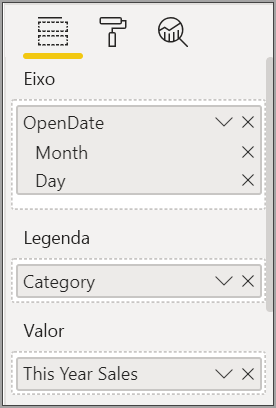
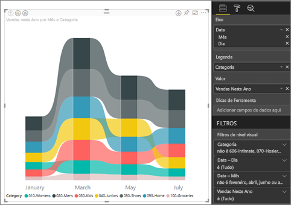
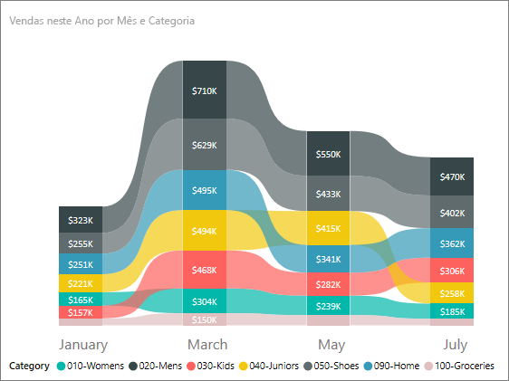

# Criar gráficos de faixa de opções no Power BI

[!INCLUDE[consumer-appliesto-nyyn](../includes/consumer-appliesto-nyyn.md)]    

[!INCLUDE [power-bi-visuals-desktop-banner](../includes/power-bi-visuals-desktop-banner.md)]

É possível criar gráficos de faixa de opções para visualizar dados e descobrir rapidamente qual categoria de dados tem a classificação mais alta (maior valor). Gráficos de faixa de opções são eficazes para mostrar alterações na classificação, com o maior intervalo (valor) sempre exibido na parte superior de cada período. 

> [!NOTE]
> Compartilhar seu relatório com um colega do Power BI exige que você tenha licenças de Power BI Pro individuais ou que o relatório seja salvo na capacidade Premium. Confira [compartilhamento de relatórios](../collaborate-share/service-share-reports.md).

## Pré-requisitos

Este tutorial usa o [arquivo PBIX de exemplo de Análise de Varejo](https://download.microsoft.com/download/9/6/D/96DDC2FF-2568-491D-AAFA-AFDD6F763AE3/Retail%20Analysis%20Sample%20PBIX.pbix).

1. Na seção superior esquerda da barra de menus, selecione **Arquivo** > **Abrir**
   
2. Encontre sua cópia do **arquivo PBIX de exemplo de Análise de Varejo**

1. Abra o **arquivo PBIX de exemplo de Análise de Varejo** na exibição de relatório .

1. Selecionar  para adicionar uma nova página.

## Criar um gráfico de faixa de opções

1. Para criar um gráfico de faixa de opções, selecione **Gráfico de faixa de opções** no painel **Visualizações**.

    

    Os gráficos de faixa de opções conectam uma categoria de dados no continuum de tempo visualizado usando faixas de opções, permitindo que você veja como determinada categoria é classificada em todo o intervalo do eixo x do gráfico (geralmente, a linha do tempo).

2. Selecione campos para **Eixo**, **Legenda** e **Valor**.  Neste exemplo, selecionamos: **Store** > **OpenDate**, **Item** > **Category** e **Sales** > **Vendas deste ano** > **Valor**.  

    

    Como o conjunto de dados contém dados para apenas um ano, removemos os campos **Ano** e **Trimestre** da lista **Eixo**.

3. O gráfico de faixa de opções mostra a classificação para cada mês. Observe como a classificação é alterada ao longo do tempo. Por exemplo, a categoria Página Inicial passa de segunda a quinta, de fevereiro a março.

    

## Formatar um gráfico de faixa de opções
Quando você cria um gráfico de faixa de opções, você tem opções de formatação disponíveis na seção **Formato** do painel **Visualizações**. As opções de formatação para gráficos de faixa de opções são semelhantes às de um gráfico de colunas empilhadas, com opções de formatação adicionais específicas às faixas de opções.

Estas opções de formatação para gráficos de faixa de opções permitem que você faça ajustes.

* A opção **Espaçamento** permite ajustar a quantidade de espaço exibida entre as faixas de opções. O número é o percentual da altura máxima da coluna.
* A opção **Corresponder cor da série** permite fazer a correspondência da cor das faixas de opções com a cor da série. Quando definidas como **desligado**, as faixas de opções ficam cinza.
* A opção **Transparência** especifica o grau de transparência das faixas de opções, com o padrão definido como 30.
* A opção **Borda** permite colocar uma borda escura na parte superior e inferior das faixas de opções. Por padrão, as bordas estão desativadas.

Já que o gráfico de faixa de opções não tem rótulos do eixo y, você talvez queira adicionar rótulos de dados. No painel de Formatação, selecione **Rótulos de dados**. 

Defina as opções de formatação para seus rótulos de dados. Neste exemplo, definimos a cor do texto como branca e as unidades de exibição como milhares.

## Próximas etapas

[Gráficos de dispersão e gráficos de bolhas no Power BI](power-bi-visualization-scatter.md)

[Tipos de visualização no Power BI](power-bi-visualization-types-for-reports-and-q-and-a.md)
