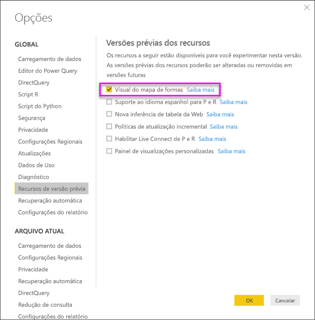
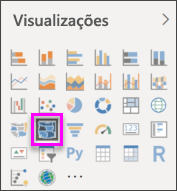
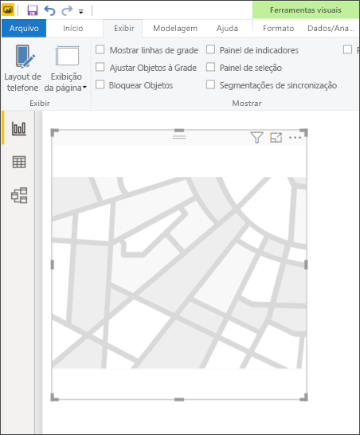
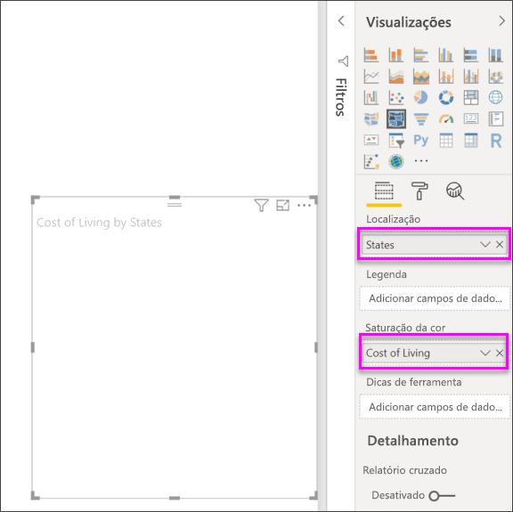
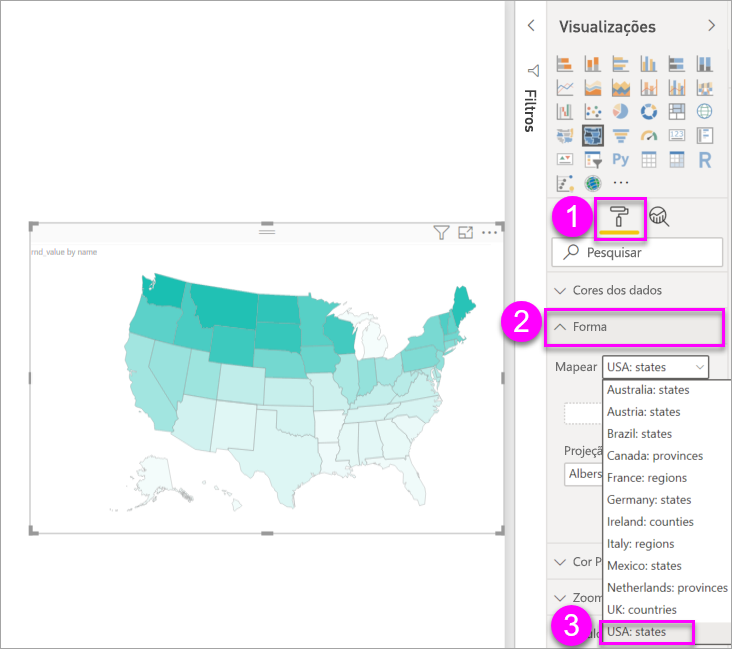
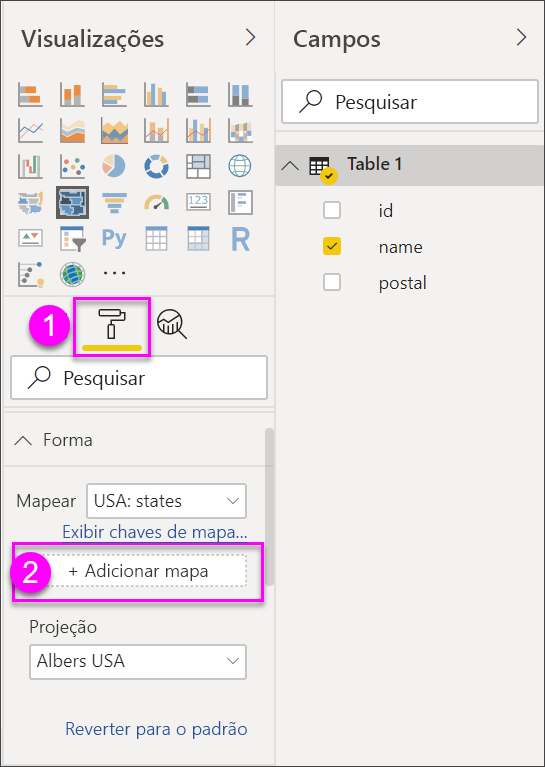
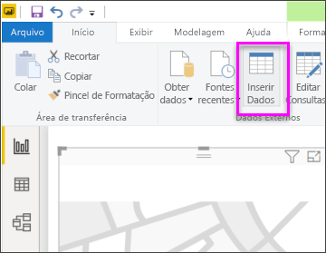
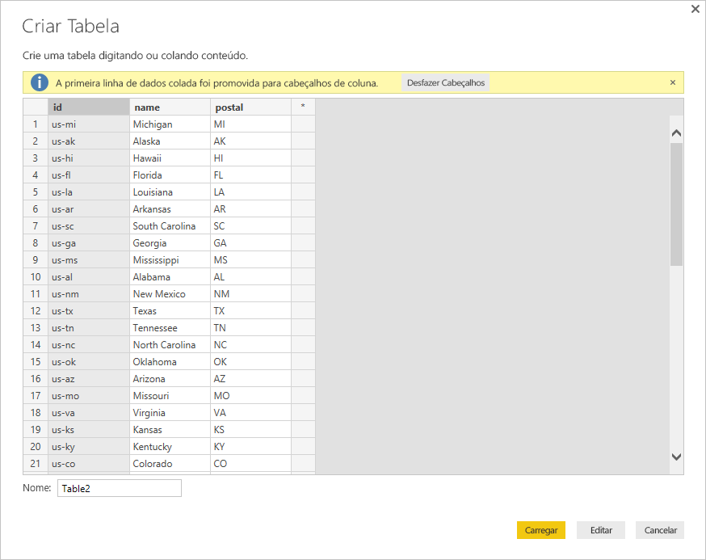

# Mapas de formas no Power BI Desktop (Preview)

[!INCLUDE [power-bi-visuals-desktop-banner](../includes/power-bi-visuals-desktop-banner.md)]

Crie um visual de **Mapa de Formas** para comparar as regiões em um mapa usando cores. Ao contrário do visual **Mapa**, o **Mapa de Formas** não consegue mostrar localizações geográficas precisas de pontos de dados em um mapa. Em vez disso, sua finalidade principal é mostrar comparações relativas de regiões em um mapa colorindo-as de modo diferente.

Visuais de **Mapa de Formas** são baseados nos mapas ESRI/TopoJSON, que têm a incrível capacidade de usar mapas personalizados que você pode criar. Exemplos de mapas personalizados são: disposições geográficas, plantas baixas e outros. A capacidade de usar mapas personalizados não está disponível nesta versão prévia do **Mapa de Formas**.

## Criando Mapas de Formas
Você pode testar o controle de **Mapa de Formas** com os mapas que são fornecidos com esta versão de visualização ou pode usar seu próprio mapa personalizado, desde que ele atende aos requisitos descritos na seção a seguir, chamada **Usar mapas personalizados**.

O visual **Mapa de Formas** está na Preview e deve ser habilitado no Power BI Desktop. Para habilitar o **Mapa de Formas**, selecione **Arquivo > Opções e Configurações > Opções > Recursos de visualização** e marque a caixa de seleção **Moldar visual do mapa**. Você precisará reiniciar o Power BI Desktop depois de fazer a seleção.

Depois que o **Mapa de Formas** for habilitado, selecione o ícone **Mapa de Formas** do painel **Visualizações**.

O Power BI Desktop cria uma tela de design em branco do visual **Mapa de Formas**.

Realize as seguintes etapas para criar um **Mapa de Formas**:

1. No painel **Campos**, arraste um campo de dados que tem os nomes de região (ou abreviações) até o bucket **Localização** e um campo de medida de dados até o bucket **Saturação de cor** (você ainda não verá um mapa).

   > [!NOTE]
   > Veja a seção intitulada **Como obter dados do mapa**, abaixo, para informações de como obter dados de mapa rapidamente para testar o **Mapa de formas**.
   > 
   > 

   
2. No painel de configurações **Formato**, expanda **Forma** e selecione a lista suspensa **Mapas Padrão** para mostrar seus dados. Neste ponto, a renderização é exibida, conforme mostrado na imagem a seguir.

   

   > [!NOTE]
   > Na seção **Chaves de região** no final deste artigo, você encontra uma coleção de tabelas com chaves de regiões do mapa que podem ser usadas para testar o visual **Mapa de formas**.
   > 
   > 
3. Em seguida, você pode modificar o mapa usando as opções de formatação, como **Cor padrão**, **Aplicar zoom** e muito mais. Você também pode adicionar uma coluna de dados de categoria ao bucket **Legenda** e classificar as regiões do mapa com base nas categorias.

## Usar mapas personalizados
Você pode usar mapas personalizados com o **Mapa de Formas**, contanto que eles estejam no formato **TopoJSON**. Se o mapa estiver em outro formato, você poderá usar ferramentas online, como [**Map Shaper**](https://mapshaper.org/), para converter seus *arquivos de formas* ou mapas *GeoJSON* no formato **TopoJSON**.

Para usar seu arquivo de mapas **TopoJSON**, adicione um visual ShapeMap ao relatório e alguns dados aos recipientes *Local* e *Saturação da cor*. Em seguida, no painel **Visualizações** com a seção **Formato** selecionada (indicada como (1) na imagem a seguir), expanda a seção **Forma** e selecione **+Adicionar Mapa**.

## Amostra de mapa personalizado
Os *Escritórios de Advocacia dos Estados Unidos* liberam um relatório fiscal anual sobre seus dados de casuística e litígio.  Todos os relatórios deles podem ser encontrados no link abaixo,

https://www.justice.gov/usao/resources/annual-statistical-reports

Já que os estados podem ser divididos em vários distritos, precisamos usar um mapa de formas personalizado.  Importando o mapa **TopoJSON** dos distritos judiciais dos EUA no **Power BI Desktop**, podemos visualizar os dados fiscais anuais de advogados do distrito.  A imagem abaixo mostra um exemplo desse mapa.

Você pode fazer coisas interessantes com os mapas dos estados individuais e mostrar mais detalhes com base nos distritos contidos nele. 

Se você quiser fazer experiências com esse conjunto de dados e essa visualização, poderá baixar o arquivo PBIX original que foi usado para gerar esse relatório usando o link a seguir.

* [Arquivo .PBIX de demonstração de mapa de formas personalizado](https://download.microsoft.com/download/1/2/8/128943FB-9231-42BD-8A5D-5E2362C9D589/DistrictAttorneyFiscalReport.pbix)

## Obtendo dados do mapa
Para inserir dados em um modelo rapidamente para testar o **Mapa de Formas**, copie uma das tabelas ao final deste artigo, e selecione **Inserir Dados** na faixa de opções **Página Inicial**.

Se os dados tiverem várias colunas, será necessário usar um editor como o Excel para colar os dados e, em seguida, copiar cada coluna de dados separadamente. Depois, cole os dados no Power BI Desktop. A linha superior é identificada automaticamente como um cabeçalho.

Você pode inserir uma nova coluna apenas digitando um novo nome de coluna (na coluna em branco à direita) e adicionar valores em cada célula, assim como você pode fazer no Excel. Quando terminar, selecione **Carregar** e a tabela será adicionada ao modelo de dados do Power BI Desktop.

> [!NOTE]
> Ao trabalhar com países ou regiões, use a abreviação de três letras para garantir que o geocódigo funcione corretamente nas visualizações de mapa. *Não* use abreviações de duas letras, pois alguns países ou algumas regiões podem não ser reconhecidos corretamente.
> 
> Caso você tenha apenas abreviações de duas letras, confira [esta postagem externa no blog](https://blog.ailon.org/how-to-display-2-letter-country-data-on-a-power-bi-map-85fc738497d6#.yudauacxp) para obter as etapas que explicam como associar abreviações de país/região de duas letras a abreviações de país/região de três letras.
> 
> 

## Comportamento e requisitos da versão prévia
Há algumas considerações e requisitos para essa versão de Preview do **Mapa de Formas**:

* O visual **Mapa de Formas** está na Preview e deve ser habilitado no Power BI Desktop. Para habilitar o **Mapa de Formas**, selecione **Arquivo > Opções e Configurações > Opções > Recursos de visualização** e marque a caixa de seleção **Moldar visual do mapa**.
* No momento, você também deve ter o bucket **Saturação da cor** definido para que a classificação de **Legenda** funcione corretamente.
* A versão final do **Mapa de Formas** terá uma interface do usuário que mostra as chaves do mapa atualmente selecionado (não há uma data definida para a versão final, e **Mapa de Formas** ainda está em versão prévia). Nessa versão prévia, você pode fazer referência às chaves de região do mapa nas tabelas encontradas na seção **Chaves de Região** deste artigo.
* O visual do **Mapa de Formas** plotará até um máximo de 1.500 pontos de dados.

## Chaves de região

Use as **Chaves de região** a seguir nesta versão prévia para testar o **Mapa de Formas**.

### Austrália: estados

| ID | Abr. | ISO | Nome | CEP |
| --- | --- | --- | --- | --- |
| au-wa |WA |AU-WA |Austrália Ocidental |WA |
| au-vic |Vic |AU-VIC |Vitória |VIC |
| au-tas |Tas |AU-TAS |Tasmânia |TAS |
| au-sa |SA |AU-SA |Sul da Austrália |SA |
| au-qld |Qld |AU-QLD |Queensland |QLD |
| au-nt |NT |AU-NT |Território do Norte |NT |
| au-nsw |NSW |AU-NSW |Nova Gales do Sul |NSW |
| au-act |ACT |AU-ACT |Território da Capital Australiana |ACT |

### Áustria: estados

| ID | ISO | Nome | Nome (pt) | CEP |
| --- | --- | --- | --- | --- |
| at-wi |AT-9 |Wien |Viena |WI |
| at-vo |AT-8 |Vorarlberg |Vorarlberg |VO |
| at-tr |AT-7 |Tirol |Tirol |TR |
| at-st |AT-6 |Steiermark |Estíria |ST |
| at-sz |AT-5 |Salzburg |Salzburgo |SZ |
| at-oo |AT-4 |Oberösterreich |Alta Áustria |OO |
| at-no |AT-3 |Niederösterreich |Baixa Áustria |NO |
| at-ka |AT-2 |Kärnten |Caríntia |KA |
| at-bu |AT-1 |Burgenland |Burgenland |BU |

### Brasil: estados

| ID |
| --- |
| Tocantins |
| Pernambuco |
| Goiás |
| Sergipe |
| São Paulo |
| Santa Catarina |
| Roraima |
| Rondônia |
| Rio Grande do Sul |
| Rio Grande do Norte |
| Rio de Janeiro |
| Piauí |
| Paraná |
| Paraíba |
| Pará |
| Minas Gerais |
| Mato Grosso |
| Maranhão |
| Mato Grosso do Sul |
| Distrito Federal |
| Ceará |
| Espírito Santo |
| Bahia |
| Amazonas |
| Amapá |
| Alagoas |
| Acre |
| Zona em disputa 1 |
| Zona em disputa 2 |
| Zona em disputa 3 |
| Zona em disputa 4 |

### Canadá: províncias

| ID | ISO | Nome | CEP |
| --- | --- | --- | --- |
| ca-nu |CA-NU |Nunavut |NU |
| ca-nt |CA-NT |Territórios do Norte |NT |
| ca-yt |CA-YT |Yukon |YT |
| ca-sk |CA-SK |Saskatchewan |SK |
| ca-qc |CA-QC |Quebec |QC |
| ca-pe |CA-PE |Ilha do Príncipe Eduardo |PE |
| ca-on |CA-ON |Ontário |ON |
| ca-ns |CA-NS |Nova Escócia |NS |
| ca-nl |CA-NL |Terra Nova e Labrador |NL |
| ca-nb |CA-NB |Nova Brunswick |NB |
| ca-mb |CA-MB |Manitoba |MB |
| ca-bc |CA-BC |Colúmbia Britânica |BC |
| ca-ab |CA-AB |Alberta |AB |

### França: regiões

| ID | nome | Nome (pt) |
| --- | --- | --- |
| Alsace |Alsace |Alsace |
| Rhone-Alpes |Rhône-Alpes |Ródano-Alpes |
| Provence-Alpes-Cote d'Azur |Provence-Alpes-Côte d'Azur |Provença-Alpes-Costa Azul |
| Poitou-Charentes |Poitou-Charentes |Poitou-Charentes |
| Picardie |Picardie |Picardia |
| Pays de la Loire |Pays de la Loire |País do Loire |
| Nord-Pas-de-Calais |Nord-Pas-de-Calais |Nord-Pas-de-Calais |
| Midi-Pyrenees |Midi-Pyrénées |Sul-Pirenéus |
| Lorraine |Lorraine |Lorena |
| Limousin |Limousin |Limusino |
| Languedoc-Roussillon |Languedoc-Roussillon |Languedoc-Roussillon |
| Ile-del-France |Île-de-France |Ilha de França |
| Haute-Normandie |Haute-Normandie |Alta Normandia |
| Franche-Comte |Franche-Comté |Franco-Condado |
| Corse |Corse |Córsega |
| Champagne-Ardenne |Champagne-Ardenne |Champanha-Ardenas |
| Centre-Val de Loire |Centre-Val de Loire |Centro-Vale do Loire |
| Bretagne |Bretagne |Bretanha |
| Bourgogne |Bourgogne |Borgonha |
| Basse-Normandie |Basse-Normandie |Baixa Normandia |
| Auvergne |Auvergne |Auvérnia |
| Aquitaine |Aquitaine |Aquitaine |

### Alemanha: estados

| ID | ISO | Nome | Nome (pt) | CEP |
| --- | --- | --- | --- | --- |
| de-be |DE-BE |Berlin |Berlim |BE |
| de-th |DE-TH |Thüringen |Turíngia |TH |
| de-st |DE-ST |Sachsen-Anhalt |Saxônia-Anhalt |ST |
| de-sn |DE-SN |Sachsen |Saxônia |SN |
| de-mv |DE-MV |Mecklenburg-Vorpommern |Mecklenburg-Vorpommern |MV |
| de-bb |DE-BB |Brandenburg |Brandemburgo |BB |
| de-sh |DE-SH |Schleswig-Holstein |Schleswig-Holstein |SH |
| de-sl |DE-SL |Saarland |Sarre |SL |
| de-rp |DE-RP |Rheinland-Pfalz |Renânia-Palatinado |RP |
| de-nw |DE-NW |Nordrhein-Westfalen |Renânia do Norte-Vestfália |NW |
| de-ni |DE-NI |Niedersachsen |Baixa Saxônia |NI |
| de-he |DE-HE |Hessen |Hesse |HE |
| de-hh |DE-HH |Hamburg |Hamburgo |HH |
| de-hb |DE-HB |Bremen |Bremen |HB |
| de-by |DE-BY |Bayern |Baviera |BY |
| de-bw |DE-BW |Baden-Württemberg |Baden-Wurttemberg |BW |

### Irlanda: municípios

| ID |
| --- |
| Wicklow |
| Wexford |
| Westmeath |
| Waterford |
| Sligo |
| Tipperary |
| Roscommon |
| Offaly |
| Monaghan |
| Meath |
| Mayo |
| Louth |
| Longford |
| Limerick |
| Leitrim |
| Laoighis |
| Kilkenny |
| Kildare |
| Kerry |
| Galway |
| Dublin |
| Donegal |
| Cork |
| Clare |
| Cavan |
| Carlow |

### Itália: regiões

| ID | ISO | Nome | Nome (pt) | CEP |
| --- | --- | --- | --- | --- |
| it-vn |IT-34 |Veneto |Veneto |VN |
| it-vd |IT-23 |Valle d'Aosta |Vale de Aosta |VD |
| it-um |IT-55 |Umbria |Úmbria |UM |
| it-tt |IT-32 |Trentino-Alto Adige |Trentino-Alto Ádige |TT |
| it-tc |IT-52 |Toscana |Toscana |TC |
| it-sc |IT-82 |Sicilia |Sicília |SC |
| it-sd |IT-88 |Sardegna |Sardenha |SD |
| it-pm |IT-21 |Piemonte |Piemonte |PM |
| it-ml |IT-67 |Molise |Molise |ML |
| it-mh |IT-57 |Marche |Marcas |MH |
| it-lm |IT-25 |Lombardia |Lombardia |LM |
| it-lg |IT-42 |Liguria |Ligúria |LG |
| it-lz |IT-62 |Lazio |Lácio |LZ |
| it-fv |IT-36 |Friuli-Venezia Giulia |Friul-Veneza Júlia |FV |
| it-er |IT-45 |Emilia-Romagna |Emília-Romanha |ER |
| it-cm |IT-72 |Campania |Campânia |CM |
| it-lb |IT-78 |Calabria |Calábria |LB |
| it-bc |IT-77 |Basilicata |Basilicata |BC |
| it-pu |IT-75 |Apulia |Apúlia |PU |
| it-ab |IT-65 |Abruzzo |Abruzos |AB |

### México: estados

| ID | Abreviatura | ISO | Nome | Nome (pt) | CEP |
| --- | --- | --- | --- | --- | --- |
| mx-zac |Zac. |MX-ZAC |Zacatecas |Zacatecas |ZA |
| mx-yuc |Yuc. |MX-YUC |Yucatán |Yucatán |YU |
| mx-ver |Ver. |MX-VER |Veracruz |Veracruz |VE |
| mx-tla |Tlax. |MX-TLA |Tlaxcala |Tlaxcala |TL |
| mx-tam |Tamps. |MX-TAM |Tamaulipas |Tamaulipas |TM |
| mx-tab |Tab. |MX-TAB |Tabasco |Tabasco |TB |
| mx-son |Son. |MX-SON |Sonora |Sonora |SO |
| mx-sin |Sin. |MX-SIN |Sinaloa |Sinaloa |SI |
| mx-slp |S.L.P. |MX-SLP |San Luis Potosí |San Luis Potosí |SL |
| mx-roo |Q.R. |MX-ROO |Quintana Roo |Quintana Roo |QR |
| mx-que |Qro. |MX-QUE |Querétaro |Querétaro |QE |
| mx-pue |Pue. |MX-PUE |Puebla |Puebla |PU |
| mx-oax |Oax. |MX-OAX |Oaxaca |Oaxaca |OA |
| mx-nle |N.L. |MX-NLE |Nuevo León |Nuevo León |NL |
| mx-nay |Nay. |MX-NAY |Nayarit |Nayarit |NA |
| mx-mor |Mor. |MX-MOR |Morelos |Morelos |MR |
| mx-mic |Mich. |MX-MIC |Michoacán |Michoacan |MC |
| mx-mex |Méx. |MX-MEX |Estado de México |Estado do México |MX |
| mx-jal |Jal. |MX-JAL |Jalisco |Jalisco |JA |
| mx-hid |Hgo. |MX-HID |Hidalgo |Hidalgo |HI |
| mx-gro |Gro. |MX-GRO |Guerrero |Guerrero |GR |
| mx-gua |Gto. |MX-GUA |Guanajuato |Guanajuato |GT |
| mx-dur |Dgo. |MX-DUR |Durango |Durango |DU |
| mx-dif |CDMX. |MX-DIF |Ciudad de México |México |DF |
| mx-col |Col. |MX-COL |Colima |Colima |CL |
| mx-coa |Coah. |MX-COA |Coahuila |Coahuila |CA |
| mx-chh |Chih. |MX-CHH |Chihuahua |Chihuahua |CH |
| mx-chp |Chis. |MX-CHP |Chiapas |Chiapas |CP |
| mx-cam |Camp. |MX-CAM |Campeche |Campeche |CM |
| mx-bcs |B.C.S. |MX-BCS |Baja California Sur |Baixa Califórnia do Sul |BS |
| mx-bcn |B.C. |MX-BCN |Baja California |Baixa Califórnia |BN |
| mx-agu |Ags. |MX-AGU |Aguascalientes |Aguascalientes |AG |

### Países Baixos: províncias

| ID | ISO | Nome | Nome (pt) |
| --- | --- | --- | --- |
| nl-zh |NL-ZH |Zuid-Holland |Holanda do Sul |
| nl-ze |NL-ZE |Zeeland |Zelândia |
| nl-ut |NL-UT |Utrecht |Utrecht |
| nl-ov |NL-OV |Overijssel |Overijssel |
| nl-nh |NL-NH |Noord-Holland |Norte da Holanda |
| nl-nb |NL-NB |Noord-Brabant |Brabante do Norte |
| nl-li |NL-LI |Limburg |Limburgo |
| nl-gr |NL-GR |Groningen |Groningen |
| nl-ge |NL-GE |Gelderland |Guéldria |
| nl-fr |NL-FR |Fryslân |Frísia |
| nl-fl |NL-FL |Flevoland |Flevolândia |
| nl-dr |NL-DR |Drenthe |Drente |

### Reino unido: Países

| ID | ISO | Nome |
| --- | --- | --- |
| gb-wls |GB-WLS |País de Gales |
| gb-sct |GB-SCT |Escócia |
| gb-nir |GB-NIR |Irlanda do Norte |
| gb-eng |GB-ENG |Inglaterra |

### EUA: estados

| ID | nome | CEP |
| --- | --- | --- |
| us-mi |Michigan |MI |
| us-ak |Alasca |AK |
| us-hi |Havaí |HI |
| us-fl |Flórida |FL |
| us-la |Louisiana |LA |
| us-ar |Arkansas |AR |
| us-sc |Carolina do Sul |SC |
| us-ga |Geórgia |GA |
| us-ms |Mississippi |MS |
| us-al |Alabama |AL |
| us-nm |Novo México |NM |
| us-tx |Texas |TX |
| us-tn |Tennessee |TN |
| us-nc |Carolina do Norte |NC |
| us-ok |Oklahoma |OK |
| us-az |Arizona |AZ |
| us-mo |Missouri |MO |
| us-va |Virgínia |VA |
| us-ks |Kansas |KS |
| us-ky |Kentucky |KY |
| us-co |Colorado |CO |
| us-md |Maryland |MD |
| us-wv |Virgínia Ocidental |WV |
| us-de |Delaware |DE |
| us-dc |Distrito de Colúmbia |DC |
| us-il |Illinois |IL |
| us-oh |Ohio |OH |
| us-ca |Califórnia |CA |
| us-ut |Utah |UT |
| us-nv |Nevada |NV |
| us-in |Indiana |IN |
| us-nj |Nova Jersey |NJ |
| us-ri |Rhode Island |RI |
| us-ct |Connecticut |CT |
| us-pa |Pensilvânia |PA |
| us-ny |Nova Iorque |NY |
| us-ne |Nebraska |NE |
| us-ma |Massachusetts |MA |
| us-ia |Iowa |IA |
| us-nh |New Hampshire |NH |
| us-or |Oregon |OR |
| us-mn |Minnesota |MN |
| us-vt |Vermont |VT |
| us-id |Idaho |ID |
| us-wi |Wisconsin |WI |
| us-wy |Wyoming |WY |
| us-sd |Dakota do Sul |SD |
| us-nd |Dakota do Norte |ND |
| us-me |Maine |ME |
| us-mt |Montana |MT |
| us-wa |Washington |WA |

## Próximas etapas

* [Matriz visual no Power BI](desktop-matrix-visual.md)

* [Tipos de visualização no Power BI](power-bi-visualization-types-for-reports-and-q-and-a.md)
