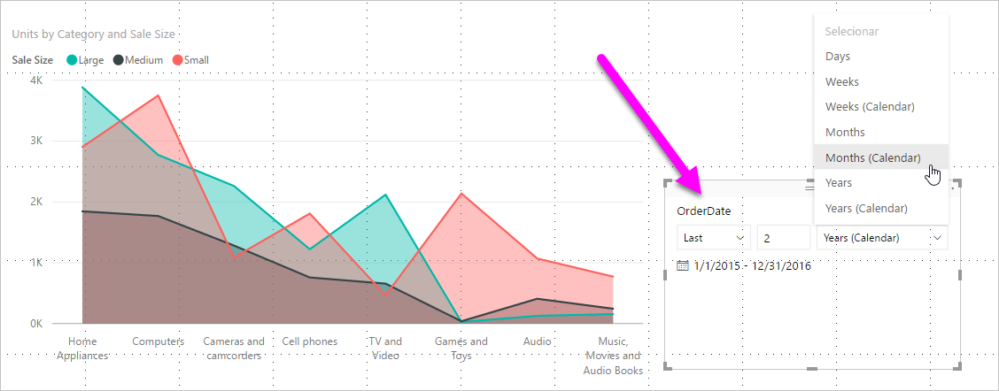
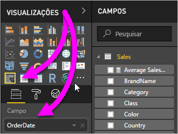
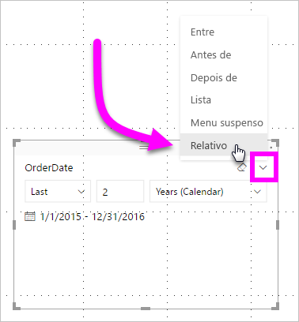
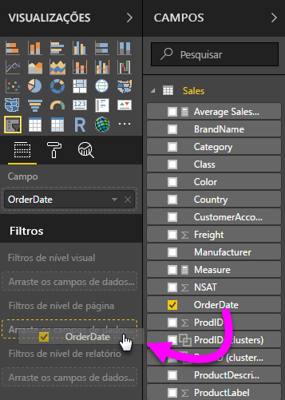
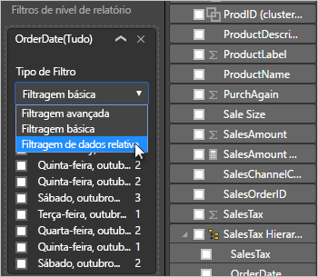
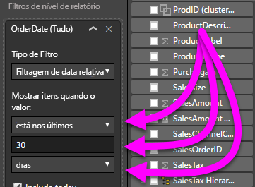

# Usar uma segmentação e um filtro de data relativa no Power BI

[!INCLUDE [applies-to](../includes/applies-to.md)] [!INCLUDE [yes-desktop](../includes/yes-desktop.md)] [!INCLUDE [yes-service](../includes/yes-service.md)]

Com a **segmentação de datas relativas** ou o **filtro de datas relativas**, aplique filtros baseados em tempo a qualquer coluna de data do modelo de dados. Por exemplo, você pode usar a **segmentação de datas relativas** para mostrar apenas os dados de vendas ocorridos nos últimos 30 dias (ou mês, meses do calendário e assim por diante). Quando você atualizar os dados, o período relativo aplicará automaticamente a restrição de datas relativas apropriada.

## Usar a segmentação de intervalo de datas relativas

Use a segmentação de datas relativas como qualquer outra segmentação. Crie um visual de **segmentação** para o relatório e, em seguida, selecione um valor de data no valor **Campo**. Na imagem a seguir, selecionamos o campo *OrderDate*.

Selecione a segmentação em sua tela e, em seguida, o acento circunflexo no canto superior direito do visual da segmentação. Se o visual tiver dados de data, o menu exibirá a opção para **Relativo**.

Na segmentação de datas relativas, selecione *Relativo*.

Em seguida, selecione as configurações.

Na primeira configuração da *segmentação de datas relativas*, você tem as seguintes opções:

* Último

* Próximo

* Atual

A segunda configuração (no meio) da *segmentação de datas relativas* permite inserir um número para definir o intervalo de datas relativas.

A terceira configuração permite escolher a medida de data. Você tem as seguintes opções:

* Dias

* Semanas

* Semanas (calendário)

* Meses

* Meses (calendário)

* Anos

* Anos (calendário)

Se você selecionar **Meses** nessa lista e inserir *2* na configuração do meio, acontecerá o seguinte:

* se hoje for 20 de julho

* os dados incluídos nos visuais restringidos pela segmentação mostrarão dados dos dois meses anteriores

* começando em 21 de maio até 20 de julho (data de hoje)

Em comparação, se você selecionou *Meses (calendário)* , os visuais restringidos mostrarão dados de 1º de maio a 30 de junho (os dois últimos meses do calendário completos).

## Usando o filtro de intervalo de datas relativas

Você também pode criar um filtro de intervalo de datas relativas para a página de relatório ou para o relatório inteiro. Para fazer isso, arraste um campo de data para as áreas **Filtros no nível de página** ou **Filtros no nível de relatório** do painel **Campo**:

Uma vez lá, você pode alterar o intervalo de datas relativas. Isso é semelhante a como você pode personalizar a **segmentação de datas relativas**. Selecione **Filtragem de datas relativas** na lista suspensa **Tipo de Filtro**.

Depois que selecionar **Filtragem de datas relativas**, você verá três seções a serem modificadas, incluindo uma caixa numérica intermediária, como a segmentação.

## Limitações e considerações

No momento, as limitações e considerações a seguir aplicam-se ao filtro e à **segmentação de intervalo de datas relativas**.

* Os modelos de dados do **Power BI** não incluem informações de fuso horário. Os modelos podem armazenar horários, mas não há nenhuma indicação do fuso horário em que estão localizados.

* A segmentação e o filtro sempre se baseiam no horário em UTC. Se você definir um filtro em um relatório e enviá-lo para um colega em um fuso horário diferente, ambos verão os mesmos dados. A menos que você esteja no fuso horário UTC, você e seu colega precisarão considerar a diferença de horário.

* É possível converter dado capturados em um fuso horário local em UTC usando o **Editor de Consultas**.

## Próximas etapas

Saiba como [usar agrupamento e compartimentalização no Power BI Desktop](../desktop-grouping-and-binning.md).
