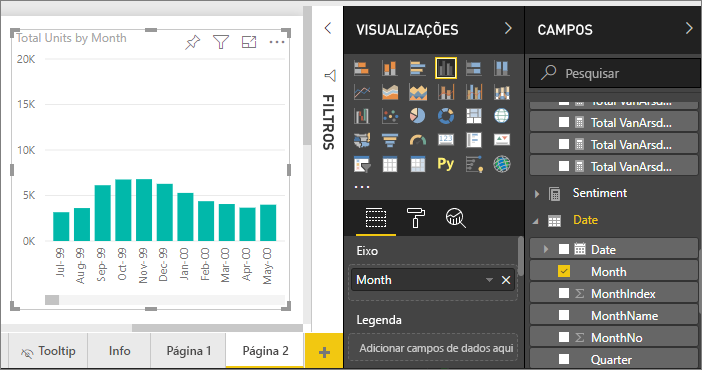
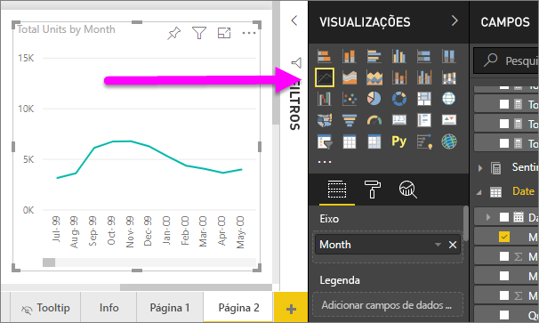
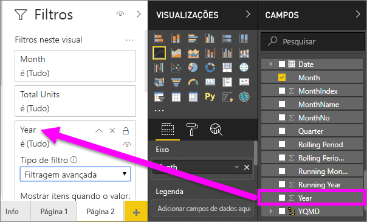
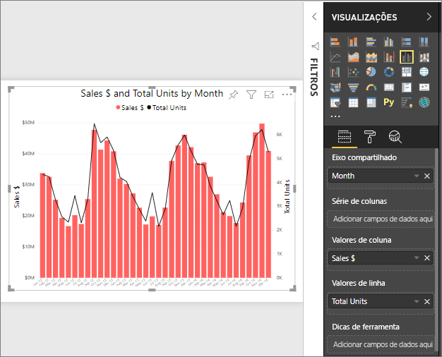

# Gráficos de linhas no Power BI
Um gráfico de linhas é uma série de pontos de dados que são representadas por pontos e conectados por linhas retas. Um gráfico de linhas pode ter uma ou muitas linhas. Gráficos de linhas têm um X e um eixo Y. 

## Criar um gráfico de linhas
Essas instruções use as vendas e o aplicativo de exemplo de Marketing para criar um gráfico de linhas que exibe as vendas deste ano por categoria. Para acompanhar, obtenha o aplicativo de exemplo de appsource.com.

1. Comece em uma página de relatório em branco. Caso esteja usando o serviço do Power BI, certifique-se de abrir o relatório no [Modo de Exibição de Edição](../service-interact-with-a-report-in-editing-view.md).

2. No painel campos, selecione **SalesFact** \> **Total de unidades**e selecione **data** > **mês**.  Power BI cria um gráfico de colunas na tela do relatório.

    

4. Converta em um gráfico de linhas selecionando o modelo de gráfico de linha no painel visualizações. 

    
   

4. Filtre o gráfico de linhas para mostrar os dados nos anos 2012-2014. Se o painel de filtros estiver recolhida, expanda-o agora. No painel campos, selecione **data** \> **ano** e arraste-o para o painel filtros. Solte-o sob o título **filtros neste Visual**. 
     
    

    Alteração **filtros avançados** à **filtros básicos** e selecione **2012**, **2013** e **2014**.

    

6. Opcionalmente, [ajuste o tamanho e a cor do texto do gráfico](power-bi-visualization-customize-title-background-and-legend.md). 

    

## Adicionar linhas adicionais ao gráfico
Gráficos de linhas podem ter muitas linhas diferentes. E, em alguns casos, os valores nas linhas podem ser tão divergentes que eles não exibem bem juntos. Vamos dar uma olhada na adição de linhas adicionais para nosso atual do gráfico e, em seguida, saiba como formatar o nosso gráfico quando os valores representados pelas linhas são muito diferentes. 

### Adicionar linhas adicionais
Em vez de examinar o total de unidades para todas as regiões como uma única linha no gráfico, vamos dividir o total de unidades por região. Adicionar linhas adicionais arrastando **geográfica** > **região** para o bem de legenda.

   

### Usar dois eixos Y
E se você quiser examinar o total de vendas e o total de unidades no mesmo gráfico? Números de vendas são muito maiores do que os números de unidade, tornando o gráfico de linhas inutilizável. Na verdade, a linha vermelha para total de unidades parece ser zero.

   

Para exibir valores altamente divergentes em um gráfico, use um gráfico de combinação. Você pode aprender tudo sobre gráficos de combinação lendo [gráficos de combinação no Power BI](power-bi-visualization-combo-chart.md). Em nosso exemplo abaixo, podemos exibir vendas e o total de unidades juntos em um gráfico, adicionando um segundo eixo Y. 

   

## Considerações e solução de problemas
* Um gráfico de linha não pode ter dois eixos Y.  Você precisará usar um gráfico de combinação em vez disso.
* Nos exemplos acima, os gráficos foram formatados para aumentar o tamanho da fonte, alterar a cor da fonte, adicionar títulos de eixo, centralize o título do gráfico e legenda, iniciar ambos os eixos em zero e muito mais. O painel de formatação (ícone de rolo de pintura) tem um conjunto aparentemente interminável de opções para tornar a aparência de gráficos da maneira que você deseja que sejam. A melhor maneira de aprender é abrir o painel formatação e explorar.

## Próximas etapas

[Tipos de visualização no Power BI](power-bi-visualization-types-for-reports-and-q-and-a.md)

