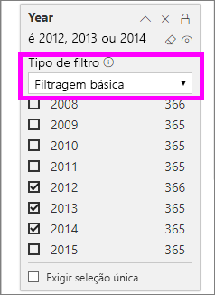
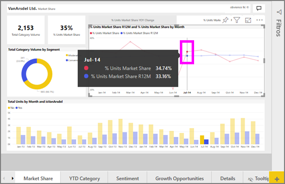

# Gráficos de linhas no Power BI
Um gráfico de linhas é uma série de pontos de dados representada por pontos e conectada por linhas retas. Um gráfico de linhas pode ter uma ou muitas linhas. Os gráficos de linhas têm um eixo X e um eixo Y. 

## Criar um gráfico de linhas
Essas instruções usam o aplicativo Exemplo de Vendas e Marketing para criar um gráfico de linhas que exibe as vendas deste ano por categoria. Para acompanhar, obtenha o aplicativo de exemplo em appsource.com.

1. Comece em uma página de relatório em branco. Caso esteja usando o serviço do Power BI, abra o relatório no [Modo de Exibição de Edição](../service-interact-with-a-report-in-editing-view.md).

2. No painel Campos, selecione **SalesFact** \> **Total de unidades**e selecione **Data** > **Mês**.  O Power BI cria um gráfico de colunas na tela do relatório.

    

4. Converta em um gráfico de linhas selecionando o modelo de gráfico de linhas no painel Visualizações. 

    
   

4. Filtre o gráfico de linhas para mostrar os dados nos anos 2012-2014. Se o painel Filtros estiver recolhido, expanda-o agora. No painel Campos, selecione **Data** \> **Ano** e arraste para o painel Filtros. Solte-o sob o título **Filtros neste visual**. 
     
    

    Altere os **Filtros avançados** para **Filtros básicos** e selecione **2012**, **2013** e **2014**.

    

6. Opcionalmente, [ajuste o tamanho e a cor do texto do gráfico](power-bi-visualization-customize-title-background-and-legend.md). 

    

## Adicionar linhas adicionais ao gráfico
Os gráficos de linhas podem ter muitas linhas diferentes. E, em alguns casos, os valores nas linhas podem ser tão divergentes que não são exibidos bem juntos. Vamos dar uma olhada na adição de linhas adicionais a nosso gráfico atual e, em seguida, saiba como formatar o gráfico quando os valores representados pelas linhas são muito diferentes. 

### Adicionar linhas adicionais
Em vez de examinar o total de unidades para todas as regiões como uma única linha no gráfico, vamos dividir o total de unidades por região. Adicione mais linhas arrastando **Área geográfica** > **Região** para a caixa Legenda.

   

### Usar dois eixos Y
E se você quiser examinar o total de vendas e o total de unidades no mesmo gráfico? Os números de vendas são muito maiores do que os números de unidade, tornando o gráfico de linhas inutilizável. Na verdade, a linha vermelha para total de unidades parece ser zero.

   

Para exibir valores altamente divergentes em um gráfico, use um gráfico de combinação. Você pode saber tudo sobre gráficos de combinação lendo [Gráficos de combinação no Power BI](power-bi-visualization-combo-chart.md). Em nosso exemplo abaixo, exibimos as vendas e o total de unidades juntos em um gráfico, adicionando um segundo eixo Y. 

   

## Realce e filtragem cruzada
Para obter informações sobre como usar o painel Filtros, veja [Adicionar um filtro a um relatório](../power-bi-report-add-filter.md).

Selecionar um ponto de dados em um gráfico de linhas realiza o realce cruzado e a filtragem cruzada das outras visualizações na página do relatório e vice-versa. Para acompanhar, abra a guia **Participação no mercado**.  

Em um gráfico de linhas, um único ponto de dados é a interseção de um ponto no eixo X e Y. Quando você seleciona um ponto de dados, o Power BI adiciona marcadores indicando qual ponto (para uma única linha) ou pontos (se houver duas ou mais linhas) são a origem para o realce cruzado e filtragem cruzada de outros visuais na página do relatório. Se o visual for muito denso, o Power BI selecionará o ponto mais próximo de onde você clica no visual.

Neste exemplo, selecionamos um ponto de dados que abrange: Julho de 2014, percentual de unidades de Participação no mercado R12 de 33,16 e percentual de unidades de Participação de no mercado de 34,74.

Observe como o gráfico de colunas é realçado de forma cruzada, e o medidor é filtrado de forma cruzada.

Para gerenciar como os gráficos são filtrados e realçados de forma cruzada entre si, veja [Interações de visualização em um relatório do Power BI](../service-reports-visual-interactions.md)

## Considerações e solução de problemas
* Um gráfico de linhas não pode ter dois eixos Y.  Você precisará usar um gráfico de combinação em vez disso.
* Nos exemplos acima, os gráficos foram formatados para aumentar o tamanho da fonte, alterar a cor da fonte, adicionar títulos de eixo, centralizar o título do gráfico e legenda, iniciar ambos os eixos em zero e muito mais. O painel Formatação (ícone de rolo de tinta) tem um conjunto aparentemente interminável de opções para fazer com que seus gráficos tenham a aparência desejada. A melhor maneira de saber mais sobre isso é explorando o painel Formatação.

## Próximas etapas

[Tipos de visualização no Power BI](power-bi-visualization-types-for-reports-and-q-and-a.md)

