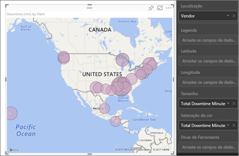
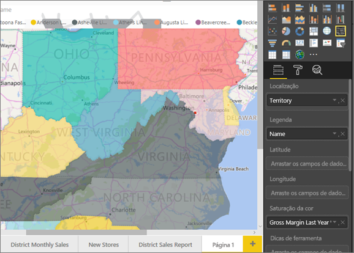
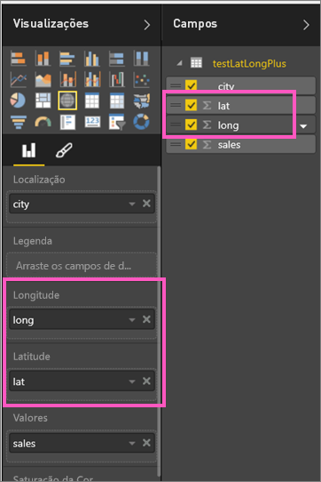
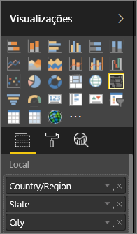

# Dicas e truques para visualizações de mapa do Power BI
O Power BI é integrado ao Bing Mapas para fornecer as coordenadas de mapa padrão (um processo chamado codificação geográfica) para a criação de mapas. Juntos, eles usam algoritmos para identificar a localização correta, mas, às vezes, é a melhor estimativa. Se o Power BI tentar, mas não puder criar a visualização de mapa por conta própria, ele conseguirá a ajuda do Bing Mapas. 

Você ou seu administrador talvez precise atualizar o firewall para permitir o acesso às URLs usadas pelo Bing para geocodificação.  Essas URLs são:
* https://dev.virtualearth.net/REST/V1/Locations
* https://platform.bing.com/geo/spatial/v1/public/Geodata
* https://www.bing.com/api/maps/mapcontrol

Para aumentar a probabilidade de uma codificação geográfica correta, use as seguintes dicas. O primeiro conjunto de dicas deverá ser usado se você tiver acesso ao próprio conjunto de dados. O segundo conjunto de dicas são coisas que você pode fazer no Power BI, caso você não tenha acesso ao conjunto de dados. 

## O que é enviado ao Bing Mapas?
O serviço do Power BI e o Power BI Desktop enviam ao Bing os dados geográficos necessários para criar a visualização de mapa. Isso pode incluir os dados nos buckets **Localização**, **Latitude** e **Longitude** da caixa de campo do visual. Exatamente o que é enviado varia segundo o tipo do mapa. Para obter mais informações, consulte [Privacidade do Bing Maps](https://go.microsoft.com/fwlink/?LinkID=248686).

* Para mapas (mapas de bolhas, dispersão e gráfico de pontos), se a latitude e a longitude forem fornecidas, nenhum dado será enviado ao Bing. Caso contrário, nenhum dado no bucket **Localização** será enviado ao Bing.     

* Os mapas coropléticos exigem um campo no bucket **Localização**, mesmo se a latitude e a longitude são fornecidas. Todos os dados existentes nos buckets **Localização**, **Latitude** ou **Longitude** são enviados ao Bing.
  
    No exemplo a seguir, o campo **Vendor** (Fornecedor) está sendo usado para codificação geográfica, de modo que os valores na coluna Vendor (Fornecedor) serão enviados ao Bing. Dados dos buckets **Size** (Tamanho) e **Color saturation** (Saturação de cores) não são enviados ao Bing.
  
    
  
    Neste segundo exemplo, o campo **Territory** (Território) está sendo usado para codificação geográfica, de modo que os valores na coluna Territory (Território) serão enviados ao Bing. Dados dos buckets **Legenda** e **Saturação de cores** não são enviados ao Bing.
  
    

## No conjunto de dados: dicas para melhorar o conjunto de dados subjacente
Se você tiver acesso ao conjunto de dados que está sendo usado para criar a visualização do mapa, há algumas coisas que você pode fazer para aumentar a probabilidade de codificação geográfica correta.

**1. Categorizar campos geográficos no Power BI Desktop**

No Power BI Desktop, é possível assegurar que os campos sejam codificados geograficamente de maneira correta definindo a *Categoria de Dados* nos campos de dados. Na exibição de dados, selecione a coluna desejada. Na faixa de opções, selecione a guia **Modelagem** e então defina a **Categoria de Dados** como **Endereço**, **Cidade**, **Continente**, **País/Região**, **Condado**, **Código Postal**, **Estado** ou **Província**. Essas categorias de dados ajudam o Bing a codificar corretamente a data. Para saber mais, veja [Categorização de dados no Power BI Desktop](../desktop-data-categorization.md). Se você estiver se conectando dinamicamente ao SQL Server Analysis Services, precisará definir a categorização de dados fora do Power BI usando o [SSDT (SQL Server Data Tools)](https://docs.microsoft.com/sql/ssdt/download-sql-server-data-tools-ssdt).

**2. Use mais de uma coluna de localização.**     
 Às vezes, até mesmo definir as categorias de dados de mapeamento não é suficiente para o Bing adivinhar corretamente a intenção. Algumas designações são ambíguas porque a localização existe em vários países ou regiões. Por exemplo, há um ***Southampton*** na Inglaterra, Pensilvânia e em Nova York.

O Power BI usa o [serviço de modelo de URL não estruturado](https://msdn.microsoft.com/library/ff701714.aspx) do Bing para obter as coordenadas de latitude e longitude com base em um conjunto de valores de endereço para qualquer país. Se seus dados não contiverem dados de local suficientes, adicione essas colunas e categorize-as corretamente.

 Por exemplo, se você tiver apenas uma coluna Cidade, o Bing poderá ter dificuldades para realizar o geocódigo. Adicione outras colunas geográficas para tornar a localização inequívoca.  Às vezes, basta adicionar mais uma coluna de localização ao conjunto de dados – nesse caso, estado/província. E não se esqueça de categorizá-la corretamente. Consulte a etapa 1 acima.

Cada campo deve ter apenas uma única categoria de localização. Por exemplo, o campo de local Cidade deve ser **Southampton**, não **Southampton, Nova York**.  E os campos de local Endereço devem ser **1 Microsoft Way** e não **1 Microsoft Way, Redmond, WA**.

**3. Use a Latitude e a Longitude específicas**

Adicione valores de latitude e longitude no conjunto de dados. Isso remove qualquer ambiguidade e retorna os resultados mais rapidamente. Os campos de Latitude e Longitude devem estar no formato *Número Decimal* , que pode ser definido no modelo de dados.

<iframe width="560" height="315" src="https://www.youtube.com/embed/ajTPGNpthcg" frameborder="0" allowfullscreen></iframe>

**4. Use a categoria Local para colunas com informações de local completas**

Embora recomendemos usar hierarquias geográficas em seus mapas, se for necessário usar uma coluna de local único com informações geográficas completas, será possível definir a categorização de dados como **Local**. Por exemplo, se os dados em sua coluna forem endereços completos, como 1 Microsoft Way, Redmond Washington 98052, essa categoria de dados generalizados funcionará melhor com o Bing. 

## No Power BI: dicas para obter melhores resultados ao usar visualizações de mapa
**1. Usar campos de latitude e longitude (se existirem)**

No Power BI, se o conjunto de dados que você estiver usando tiver campos de longitude e latitude – use-os!  O Power BI tem buckets especiais para ajudar a tornar os dados de mapa inequívocos. Basta arrastar o campo que contém os dados de latitude na área **Visualizações > Latitude**.  E faça o mesmo para os dados de longitude. Quando você fizer isso, também será necessário preencher o campo *Local* ao criar suas visualizações. Caso contrário, os dados são agregados por padrão, por exemplo, a latitude e a longitude poderiam ser emparelhadas no nível de estado, e não no nível de cidade.

 

## Usar hierarquias geográficas para fazer drill down de diferentes "níveis" de localização
Quando o conjunto de dados já tiver diferentes níveis de dados de localização, você e seus colegas poderão usar o Power BI para criar *hierarquias geográficas*. Para fazer isso, arraste mais de um campo para o bucket **Localização**. Usados juntos dessa forma, os campos passam a ser uma hierarquia geográfica. No exemplo abaixo, adicionamos campos geográficos para: País/Região, Estado e Cidade. No Power BI, você e seus colegas podem fazer drill up e drill down usando essa hierarquia geográfica.

  

   

Ao analisar hierarquias geográficas, é importante saber como cada botão de análise funciona e o que é enviado para o Bing Mapas. 

* O botão de detalhamento no canto direito, chamado de Modo de Análise  permite que você selecione um local do mapa e faça uma busca detalhada nesse local específico um nível por vez. Por exemplo, se você ativar Fazer drill down e clicar em América do Norte, você se moverá para baixo na hierarquia para o próximo nível – estados na América do Norte. Para geocódigo, o Power BI envia dados de estado e de país ao Bing Mapas apenas para América do Norte.  
* À esquerda, há outras duas opções de análise. A primeira opção,  , analisa o próximo nível da hierarquia para todos os locais de uma vez. Por exemplo, se no momento você estiver vendo países e, em seguida, usar esta opção para passar para o próximo nível, estados, o Power BI exibirá os dados de estado para todos os países. Para geocódigo, o Power BI envia dados de estado do Bing Mapas (nenhum dado de país) para todos os locais. Esta opção será útil se cada nível da sua hierarquia não estiver relacionado ao nível acima dele. 
* A segunda opção,  , é semelhante a Fazer drill down, exceto que não é necessário clicar no mapa.  Ela se expande até o próximo nível da hierarquia, lembrando o contexto do nível atual. Por exemplo, se você estiver vendo países e selecione e selecionar esse ícone, você se moverá para baixo na hierarquia para o próximo nível – estados. Para geocódigo, o Power BI envia dados para cada estado e seu país correspondente para ajudar o Bing Mapas a codificar geograficamente de maneira mais precisa. Na maioria dos mapas, você usará essa opção ou a opção de Fazer drill down à direita, portanto será possível enviar ao Bing o máximo de informação possível para obter informações precisas de localização. 

## Próximas etapas
[Fazer drill down em uma visualização do Power BI](../consumer/end-user-drill.md)

[Visualizações do Power BI](power-bi-report-visualizations.md)

Mais perguntas? [Experimente a Comunidade do Power BI](https://community.powerbi.com/)

