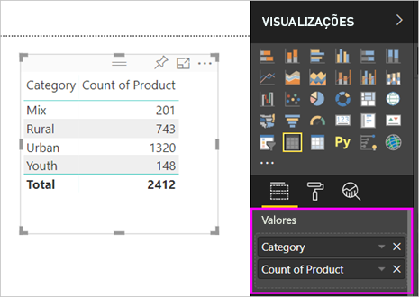
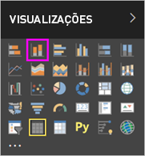
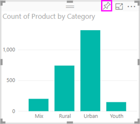

# Parte 1, Adicionar visualizações a um relatório do Power BI

Este artigo apresenta uma breve introdução à criação de uma visualização em um relatório. Ele se aplica ao serviço do Power BI e ao Power BI Desktop. Para ver conteúdo mais avançado, [veja a Parte 2](power-bi-report-add-visualizations-ii.md) desta série. Assista à Amanda demonstrando algumas maneiras diferentes de criar, editar e formatar visuais na tela do relatório. Em seguida, experimente você mesmo, usando o [exemplo Vendas e Marketing](../sample-datasets.md) para criar seu próprio relatório.

<iframe width="560" height="315" src="https://www.youtube.com/embed/IkJda4O7oGs" frameborder="0" allowfullscreen></iframe>

## Abrir um relatório e adicionar uma nova página

1. Abra um [relatório no Modo de Exibição de Edição](../service-interact-with-a-report-in-editing-view.md).

    Este tutorial use o [exemplo de Vendas e Marketing](../sample-datasets.md).

1. Se o painel **Campos** não estiver visível, selecione o ícone de seta para abri-lo.

   

1. Adicione uma página em branco ao relatório.

## Adicionar visualizações ao relatório

1. Crie uma visualização selecionando um campo no painel **Campos** .

    Comece com um campo numérico como **SalesFact** > **Vendas $** . O Power BI cria um gráfico de colunas com uma coluna.

    

    Ou comece com um campo de categoria, como **Nome** ou **Produto**. O Power BI cria uma tabela e adiciona esse campo ao espaço **Valores**.

    

    Ou, comece com um campo com informações geográficas, como **Área Geográfica** > **Cidade**. O Power BI e o Bing Mapas criam uma visualização de mapa.

    

1. Crie uma visualização e, em seguida, alterar o tipo. Selecione **Produto** > **Categoria** e **Produto** > **Contagem do Produto** para adicioná-los ao espaço **Valores**.

   

1. Altere a visualização para um gráfico de colunas selecionando o ícone de **gráfico de colunas empilhadas**.

   

1. Quando você cria visualizações no relatório, é possível [fixá-las no dashboard](../service-dashboard-pin-tile-from-report.md). Para fixar a visualização, selecione o ícone de pino .

   
  
## Próximas etapas

 Continue em:

* [Parte 2: Adicionar visualizações a um relatório do Power BI](power-bi-report-add-visualizations-ii.md)

* [Interaja com as visualizações](../consumer/end-user-reading-view.md) no relatório.

* [Faça ainda mais com as visualizações](power-bi-report-visualizations.md).

* [Salve seu relatório](../service-report-save.md).
