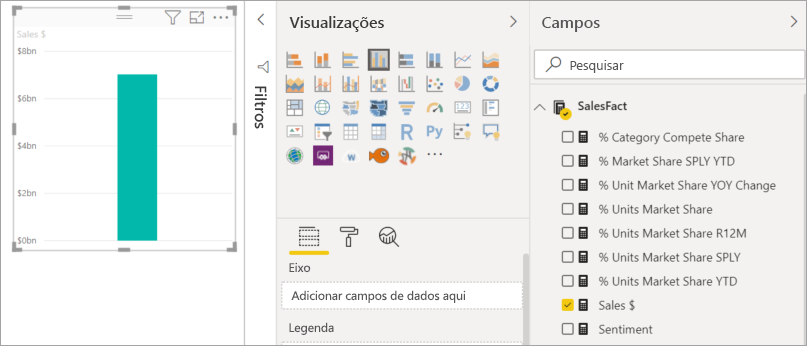
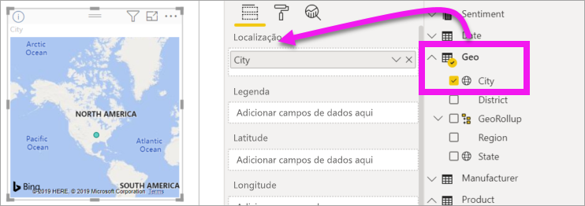
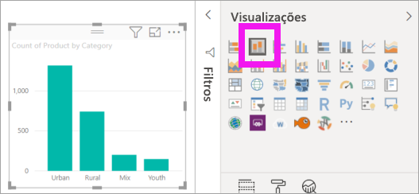
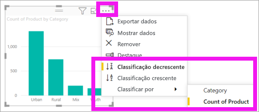

# Adicionar visuais a um relatório do Power BI (parte 1)

[!INCLUDE [power-bi-visuals-desktop-banner](../includes/power-bi-visuals-desktop-banner.md)]

Este artigo apresenta uma breve introdução à criação de uma visualização em um relatório. Ele se aplica ao serviço do Power BI e ao Power BI Desktop. Para ver conteúdo mais avançado, [veja a Parte 2](power-bi-report-add-visualizations-ii.md) desta série. Assista à Amanda demonstrando algumas maneiras diferentes de criar, editar e formatar visuais na tela do relatório. Em seguida, experimente você mesmo, usando o [exemplo Vendas e Marketing](../sample-datasets.md) para criar seu próprio relatório.

<iframe width="560" height="315" src="https://www.youtube.com/embed/IkJda4O7oGs" frameborder="0" allowfullscreen></iframe>

## Pré-requisitos

Este tutorial usa o [arquivo PBIX de Vendas e Marketing](https://download.microsoft.com/download/9/7/6/9767913A-29DB-40CF-8944-9AC2BC940C53/Sales%20and%20Marketing%20Sample%20PBIX.pbix).

1. Na seção superior esquerda da barra de menus do Power BI Desktop, selecione **Arquivo** > **Abrir**
   
2. Localize sua cópia do **Arquivo PBIX de exemplo de vendas e marketing**

1. Abra o **Arquivo PBIX de exemplo de vendas e marketing** na exibição de relatório .

1. Selecionar  para adicionar uma nova página.

## Adicionar visualizações ao relatório

1. Crie uma visualização selecionando um campo no painel **Campos** .

    Comece com um campo numérico como **Vendas** > **VendasTotais**. O Power BI cria um gráfico de colunas com uma coluna.

    

    Ou comece com um campo de categoria, como **Nome** ou **Produto**. O Power BI cria uma tabela e adiciona esse campo ao espaço **Valores**.

    

    Ou, comece com um campo com informações geográficas, como **Área Geográfica** > **Cidade**. O Power BI e o Bing Mapas criam uma visualização de mapa.

    

## Alterar o tipo de visualização

 Crie uma visualização e, em seguida, alterar o tipo. 
 
 1. Selecione **Produto** > **Categoria** e **Produto** > **Contagem do Produto** para adicioná-los ao espaço **Valores**.

    

1. Altere a visualização para um gráfico de colunas selecionando o ícone de **gráfico de colunas empilhadas**.

   

1. Para alterar a maneira como o visual é classificado, selecione **Mais ações** (...).  Use as opções de classificação para alterar a direção da classificação (crescente ou decrescente) e alterar a coluna que está sendo usada para classificar (**Classificar por**).

   
  
## Próximas etapas

 Continue em:

* [Parte 2: Adicionar visualizações a um relatório do Power BI](power-bi-report-add-visualizations-ii.md)

* [Interaja com as visualizações](../consumer/end-user-reading-view.md) no relatório.

