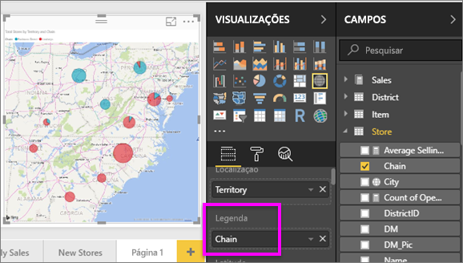

# Parte 2, Adicionar visualizações a um relatório do Power BI
Na [Parte 1](power-bi-report-add-visualizations-ii.md), você criou uma visualização básica marcando as caixas de seleção ao lado dos nomes de campo.  Na parte 2, você aprenderá como usar o arrastar e soltar e fazer uso integral dos painéis **Campos** e **Visualizações** para criar e modificar as visualizações.

### Pré-requisitos
- [Parte 1](power-bi-report-add-visualizations-ii.md)
- Power BI Desktop – visualizações podem ser adicionadas a relatórios usando o serviço Power BI ou Power BI Desktop. Este tutorial usa o Power BI Desktop. 
- [Exemplo de Análise de Varejo](http://download.microsoft.com/download/9/6/D/96DDC2FF-2568-491D-AAFA-AFDD6F763AE3/Retail%20Analysis%20Sample%20PBIX.pbix)

## Criar uma nova visualização
Neste tutorial, vamos examinar nosso conjunto de dados de Análise de Varejo e criar algumas visualizações chave.

### Abra um relatório e adicione uma nova página em branco.
1. Abra o arquivo .PBIX de amostra de análise de varejo no Power BI Desktop. 
      

2. Adicione uma nova página selecionando o ícone de sinal de adição amarelo na parte inferior da tela.

### Adicione uma visualização que examina o débito no último ano de vendas deste ano.
1. Na tabela **Vendas**, selecione **Vendas deste Ano** > **Valor** e **Vendas do Ano Passado**. O Power BI cria um gráfico de colunas.  Isso é interessante e você deseja investigar. O que torna as vendas semelhantes por mês?  
   
   
2. Na tabela Tempo, arraste **FiscalMonth** para a área **Eixo**.  
   
3. [Mude a visualização](power-bi-report-change-visualization-type.md) para um gráfico Área.  Há muitos tipos de visualização dentre as quais escolher – veja as [descrições de cada uma, dicas de melhores práticas e tutoriais](power-bi-visualization-types-for-reports-and-q-and-a.md) para ajudar a decidir qual tipo usar. No painel de visualizações, selecione o ícone do gráfico Área .
4. Classifique a visualização selecionando as reticências e escolhendo **Classificar por FiscalMonth**.
5. [Redimensione a visualização](power-bi-visualization-move-and-resize.md) selecionando a visualização, captando um dos círculos da estrutura de tópicos e arrastando-o. Torne-a grande o suficiente para eliminar a barra de rolagem e pequeno o suficiente para nos dar espaço suficiente para adicionar outra visualização.
   
   
6. [Salve o relatório](../service-report-save.md).

### Adicionar uma visualização do mapa que analisa as vendas por local
1. Na tabela **Loja**, selecione **Território**. O Power BI reconhece que a Região é um local e cria uma visualização de mapa.  
   
2. Arraste **Pontuação Total** na área Tamanho.  
   
3. Adicione uma legenda.  Para ver os dados por nome de loja, arraste a **Cadeia** para a área Legenda.  
   

## Próximas etapas
* Mais sobre [Visualizações nos relatórios do Power BI](power-bi-report-visualizations.md).  
* Mais perguntas? [Experimente a Comunidade do Power BI](http://community.powerbi.com/)

