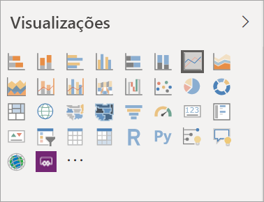
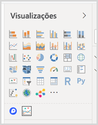

# Visualizações em relatórios do Power BI

Visualizações (também conhecidas como visuais) exibem insights que foram descobertos nos dados. Um relatório do Power BI pode ter uma única página com um visual ou então páginas repletas de visuais. No serviço do Power BI, os visuais podem ser [fixados dos relatórios nos dashboards](../service-dashboard-pin-tile-from-report.md).

É importante fazer a distinção entre *designers* de relatórios e *consumidores* de relatórios.  Se estiver criando ou modificando o relatório, você será um designer.  Designers têm permissões de edição para o relatório e para o respectivo conjunto de dados subjacente. No Power BI Desktop, isso significa que você pode abrir o conjunto de dados no modo de exibição de dados e criar elementos visuais no modo de exibição de Relatório. No serviço do Power BI, isso significa que você pode abrir o relatório ou conjunto de dados no editor de relatório no [Modo de Exibição de Edição](../consumer/end-user-reading-view.md). Se um relatório ou dashboard foi [compartilhado com você](../consumer/end-user-shared-with-me.md), você é um *consumidor* de relatório. Você poderá exibir e interagir com o relatório e os respectivos visuais, mas não poderá fazer tantas alterações quanto um *designer*.

Há muitos tipos de visual diferentes disponíveis diretamente no painel Visualizações do Power BI.

E para ainda mais opções, visite o [site da comunidade do Microsoft AppSource](https://appsource.microsoft.com) para localizar e [baixar](https://appsource.microsoft.com/marketplace/apps?page=1&product=power-bi-visuals) [ visuais personalizados](../developer/visuals/custom-visual-develop-tutorial.md) fornecidos pela Microsoft e pela comunidade.

<iframe width="560" height="315" src="https://www.youtube.com/embed/SYk_gWrtKvM?list=PL1N57mwBHtN0JFoKSR0n-tBkUJHeMP2cP" frameborder="0" allowfullscreen></iframe>

Se você não estiver familiarizado com o Power BI ou precisar de um lembrete, use os links abaixo para aprender os fundamentos de visualizações de Power BI.  Como alternativa, use o Sumário (no lado esquerdo deste artigo) para encontrar informações ainda mais úteis.

## Adicionar uma visualização no Power BI

[Crie visualizações](power-bi-report-add-visualizations-i.md) nas páginas de seus relatórios. Navegue na [lista de visualizações e tutoriais de visualização disponíveis.](power-bi-visualization-types-for-reports-and-q-and-a.md) 

## Carregar uma visualização personalizada e usá-la no Power BI

Adicione uma visualização personalizada que você criou ou que encontrou no [site da comunidade do Microsoft AppSource](https://appsource.microsoft.com/marketplace/apps?product=power-bi-visuals). Se sentindo criativo? Aprofunde-se em nosso código-fonte e use nossas [ferramentas para desenvolvedores](../developer/visuals/custom-visual-develop-tutorial.md) para criar um novo tipo de visualização e [compartilhá-la com a comunidade](../developer/office-store.md). Para saber mais sobre o desenvolvimento de um visual personalizado, confira [Developing a Power BI custom visual](../developer/visuals/custom-visual-develop-tutorial.md) (Desenvolvimento de um visual personalizado do Power BI).

## Personalizar seu painel de visualização (versão prévia)

Se estiver usando o mesmo visual personalizado em vários relatórios, você poderá fixar a visualização personalizada ao seu painel de visualização. Para fixar a visualização, clique com botão direito do mouse no visual para fixá-lo no painel.

Depois que um visual foi fixado, ele é movido para cima para conviver com os outros visuais internos. Esse visual agora está vinculado à sua conta conectada. Portanto, todos os novos relatórios que você criar automaticamente terão esse visual incluído, supondo que você está conectado. Isso facilita muito a padronização em um visual específico sem a necessidade de adicioná-lo a cada relatório único.

Embora esse recurso esteja em versão prévia, você verá apenas os visuais fixados no Power BI Desktop. Além disso, você precisa estar conectado para que esse recurso esteja disponível.

## Altere o tipo de visualização

Tente [alterar o tipo de visualização](power-bi-report-change-visualization-type.md) para ver o que funciona melhor com seus dados.

## Fixe a visualização

No serviço do Power BI, quando a visualização estiver da forma que deseja, é possível [fixá-la em um dashboard](../service-dashboard-pin-tile-from-report.md) como um bloco. Se você alterar a visualização usada no relatório depois de fixá-lo, o bloco no dashboard não será alterado – se fosse um gráfico de linhas, ele permaneceria um gráfico de linhas, mesmo que você o alterasse para um gráfico de rosca no relatório.

## Limitações e considerações
- Dependendo da fonte de dados e do número de campos (medidas ou colunas), um visual pode ser carregado lentamente.  É recomendável limitar os visuais para 10 a 20 campos no total, por motivos de desempenho e legibilidade. 

- O limite superior para visuais é de 100 campos (medidas ou colunas). Se o seu visual não for carregado, reduza o número de campos.   

## Próximas etapas

* [Tipos de visualização no Power BI](power-bi-visualization-types-for-reports-and-q-and-a.md)
* [Visuais Personalizados](../developer/power-bi-custom-visuals.md)
