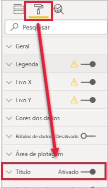
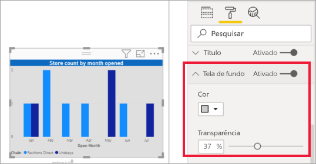
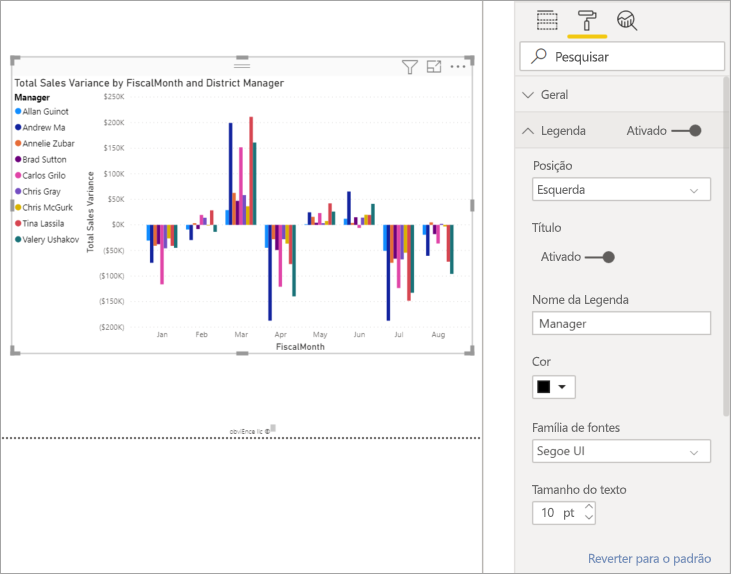

# Personalizar títulos, legendas e telas de fundo de visualizações

Neste tutorial, você aprenderá várias maneiras diferentes de personalizar as visualizações. Há muitas opções para personalizar as visualizações. A melhor maneira de aprender sobre elas é explorando o painel **Formatar** (selecione o ícone de rolo de tinta). Para que você possa começar, este artigo mostrará como personalizar o título, a legenda e a tela de fundo de uma de visualização, bem como adicionar um tema.

Não é possível personalizar todas as visualizações. Confira a [lista completa](#visualization-types-that-you-can-customize) de visualizações para obter detalhes.

## Pré-requisitos

- O serviço do Power BI ou o Power BI Desktop

- Relatório Exemplo de Análise de Varejo

## Personalizar títulos de visualização em relatórios

Para acompanhar, entre no Power BI Desktop e abra o relatório [Exemplo de Análise de Varejo](../sample-datasets.md).

> [!NOTE]
> Ao fixar uma visualização em um dashboard, ela se torna um bloco do dashboard. Você também pode personalizar os blocos em si com [novos títulos e subtítulos, hiperlinks e redimensionamento](../service-dashboard-edit-tile.md).

1. Vá para a página **Novas Lojas** do relatório **Exemplo de Análise de Varejo**.

1. Selecione o gráfico de colunas clusterizado **Contagem de Loja Aberta por Mês e Cadeia Abertos**.

1. No painel **Visualizações**, selecione o ícone de rolo de tinta para revelar as opções de formato.

1. Selecione **Título** para expandir essa seção.

   

1. Mova o controle deslizante de **Título** para **Ativado**.

1. Par alterar o título, insira *Contagem de loja por mês aberto* no campo **Texto do título**.

    

1. Altere a **Cor da fonte** para branco e a **Cor do plano de fundo** para azul.    

    a. Selecione o menu suspenso e escolha uma cor em **Cores do tema**, **Cores recentes** ou **Cores personalizadas**.

        

    b. Selecione o menu suspenso para fechar a janela de cores.

1. Aumente o tamanho do texto para **16 pt**.

1. A última personalização que você fará no título do gráfico é alinhá-lo no centro da visualização.

    

    Nesse ponto do tutorial, o título do gráfico de colunas clusterizado se parecerá com este:

    

Salve as alterações e vá para a próxima seção.

Se você precisar reverter todas as alterações, selecione **Reverter ao padrão**, na parte inferior do painel de personalização do **Título**.

## Personalizar planos de fundo de visualização

Com o mesmo gráfico de colunas clusterizado selecionado, expanda as opções de **Plano de fundo**.

1. Mova o controle deslizante de **Plano de fundo** para **Ativado**.

1. Selecione a lista suspensa e escolha uma cor cinza.

1. Altere a **Transparência** para **74%** .

Nesse ponto do tutorial, o plano de fundo do gráfico de colunas clusterizado se parecerá com este:

Salve as alterações e vá para a próxima seção.

Se você precisar reverter todas as alterações, selecione **Reverter ao padrão**, na parte inferior do painel de personalização do **Plano de fundo**.

## Personalizar legendas de visualização

1. Abra a página do relatório **Visão geral** e selecione o gráfico **Variação das Vendas Totais por FiscalMonth e Gerente do Distrito**.

1. Na guia **Visualização**, selecione o ícone de rolo de pintura para abrir o painel Formatar.

1. Expanda as opções de **Legenda**:

    

1. Mova o controle deslizante de **Legenda** para **Ativado**.

1. Mova a legenda para a esquerda da visualização.

1. Adicione um título de legenda alternando **Título** para **Ativado**.

1. Insira *Gerente* no campo **Nome da legenda**.

1. Altere a **Cor** para preto.

Salve as alterações e vá para a próxima seção.

Se você precisar reverter todas as alterações, selecione **Reverter ao padrão** na parte inferior do painel de personalização de **Legenda**.

## Personalizar cores usando um tema

Com os temas de relatório, você pode aplicar alterações no design de seu relatório inteiro para, por exemplo, usar cores corporativas, alterar conjuntos de ícones ou aplicar uma nova formatação visual padrão. Quando você aplica um tema de relatório, todos os elementos visuais do relatório passam a usar as cores e a formatação do tema selecionado.

Para aplicar um tema ao relatório, selecione **Mudar tema** na barra de menus. Escolha um tema.  O relatório abaixo usa o tema **Solar**.

 

## Tipos de visualização que podem ser personalizados

Veja a seguir uma lista de visualizações e as opções de personalização que estão disponíveis para cada:

| Visualização | Título | Tela de fundo | Legenda |
|:--- |:--- |:--- |:--- |
| Área | sim | sim |sim |
| Barras | sim | sim |sim |
| Cartão | sim | sim |n/a |
| Cartão de múltiplas linhas | sim | sim | n/a |
| Coluna | sim | sim | sim |
| Combinação | sim | sim | sim |
| Donut | sim | sim | sim |
| Mapa coroplético | sim | sim | sim |
| Funil | sim | sim | n/a |
| Medidor | sim | sim | n/a |
| Influenciador principal | sim | sim | n/a |
| KPI | sim | sim | n/a |
| Linha | sim | sim | sim |
| Mapear | sim | sim | sim |
| Matriz | sim | sim | n/a |
| Pizza | sim | sim | sim |
| P e R | sim | sim | n/a |
| Dispersão | sim | sim | sim |
| Forma | sim | sim | sim |
| Segmentação de Dados | sim | sim | n/a |
| Tabela | sim | sim | n/a |
| Caixa de texto | não | sim | n/a |
| Mapa de árvore | sim | sim | sim |
| Waterfall | sim | sim | sim |

## Próximas etapas

- [Personalizar as propriedades dos eixos X e Y](power-bi-visualization-customize-x-axis-and-y-axis.md)

- [Introdução com propriedades de eixo e formatação de cor](service-getting-started-with-color-formatting-and-axis-properties.md)

Mais perguntas? [Experimente a Comunidade do Power BI](https://community.powerbi.com/)
