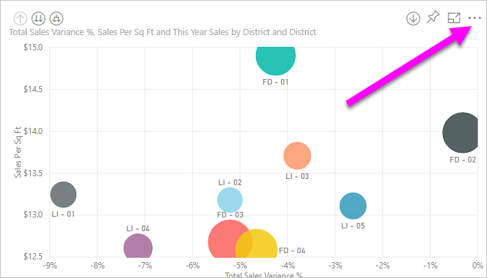
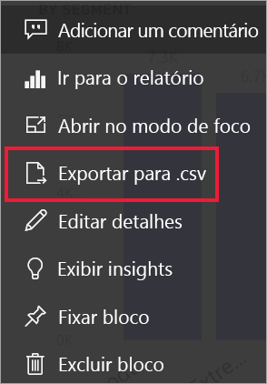
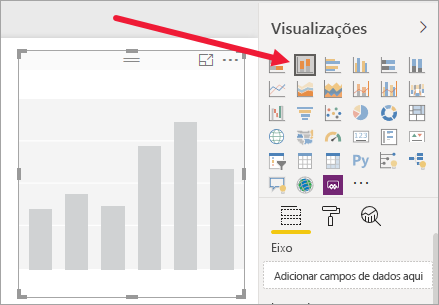
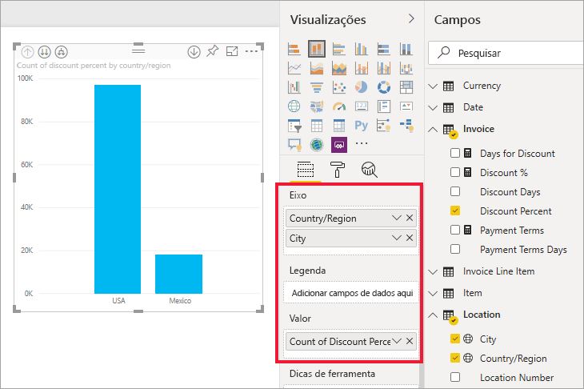
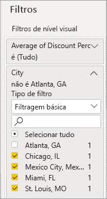
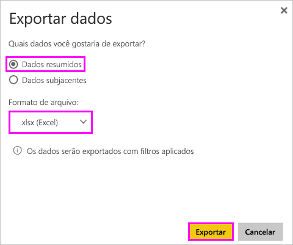
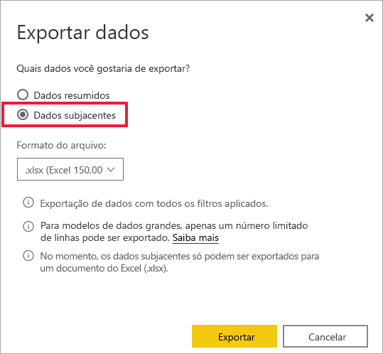

# Exportar os dados que foram usados para criar uma visualização

> [!IMPORTANT]
> Nem todos os dados podem ser exibidos ou exportados por todos os usuários. Há proteções que os designers e os administradores de relatórios usam ao criar dashboards e relatórios. Alguns dados são restritos, ocultos ou confidenciais e não podem ser vistos nem exportados sem permissões especiais. 

## Quem pode exportar dados

Se você tiver permissões para os dados, poderá ver e exportar os dados que o Power BI usa para criar uma visualização. Com frequência, os dados são confidenciais ou limitados a usuários específicos. Nesses casos, você não poderá ver nem exportar esses dados. Para obter detalhes, confira a seção **Limitações e considerações** no final deste documento. 

## Como exibir e exportar dados

Se desejar ver os dados usados pelo Power BI para criar uma visualização, [poderá exibi-los no Power BI](service-reports-show-data.md). Você também pode exportá-los para o Excel como um arquivo *.xlsx* ou *.csv*. A opção de exportação de dados requer uma licença Pro ou Premium, bem como permissões de edição para o conjunto de dados e o relatório. <!--If you have access to the dashboard or report but the data is classified as *highly confidential*, Power BI will not allow you to export the data.-->

Assista a Will exportar os dados de uma das visualizações de seu relatório, salvá-los como um arquivo *.xlsx* e abri-lo no Excel. Em seguida, siga as instruções passo a passo abaixo do vídeo para testá-la por conta própria. Observe que este vídeo usa uma versão mais antiga do Power BI.

<iframe width="560" height="315" src="https://www.youtube.com/embed/KjheMTGjDXw" frameborder="0" allowfullscreen></iframe>

## Exportar dados de um painel do Power BI

1. Selecione Mais ações (...) no canto superior direito da visualização.

    

1. Escolha a opção **Exportar para .csv**.

    

1. O Power BI exporta os dados para um arquivo *.csv*. Se você tiver filtrado a visualização, a exportação .csv também será filtrada. 

1. O navegador solicitará que você salve o arquivo.  Após salvá-lo, abra o arquivo *.csv* no Excel.

    

## Exportar dados de um relatório

Para continuar, abra o [Relatório de exemplo de análise de compras](../sample-procurement.md) na exibição de Edição do serviço do Power BI. Adicionar uma nova página de relatório em branco. Em seguida, siga as etapas abaixo para adicionar uma agregação, uma hierarquia e um filtro de nível de visualização.

### Crie um gráfico de colunas empilhadas

1. Crie um novo **Gráfico de colunas empilhadas**.

    

1. No painel **Campos**, selecione **Localização > Cidade** e **Localização > País/Região** e **Fatura > Percentual de Desconto**.  Talvez você precise mover a **Porcentagem de Desconto** para o **Valor** também.

    

1. Alterar a agregação de **Porcentagem de Desconto** de **Contagem** para **Média**. Na seção **Valor**, selecione a seta à direita de **Porcentagem de Desconto** (poderá estar como **Contagem de Porcentagem de Desconto**) e escolha **Média**.

    

1. Adicione um filtro à **Cidade**, selecione todas as cidades e, em seguida, remova **Atlanta**.

    

   
1. Faça uma busca detalhada para um nível abaixo na hierarquia. Ative o detalhamento e faça uma busca detalhada para o nível de **Cidade**. 

    

Agora estamos prontos para experimentar as duas opções de exportação de dados.

### Exportar dados ***resumidos***
Selecione a opção de **Dados resumidos** se você quiser exportar dados para o que você vê nesse visual.  Esse tipo de exportação mostra somente os dados (colunas e medidas) que estão sendo usados para criar o visual.  Se o visual tiver uma agregação, você exportará dados agregados. Por exemplo, se um gráfico de barras mostrar quatro barras, você obterá quatro linhas de dados do Excel. Os dados resumidos estão disponíveis no serviço do Power BI como *.xlsx* e *.csv* e no Power BI Desktop como .csv.

1. Selecione as reticências no canto superior direito da visualização. Selecione **Exportar dados**.

    

    No serviço do Power BI, como sua visualização tem uma agregação (você alterou **Contagem** para *média*), você terá duas opções:

    - **Dados resumidos**

    - **Dados subjacentes**

    Para entender melhor as agregações, consulte [Agregações no Power BI](../service-aggregates.md).

    > [!NOTE]
    > No Power BI Desktop, você só terá a opção de exportar dados resumidos como um arquivo .csv. 
    
    
1. Em **Exportar dados**, selecione **Dados resumidos**, escolha *.xlsx* ou *.csv* e, em seguida, selecione **Exportar**. O Power BI exporta os dados.

    

1. Ao selecionar **Exportar**, o navegador solicitará que você salve o arquivo. Após salvá-lo, abra o arquivo no Excel.

    

    Neste exemplo, a nossa exportação do Excel mostra um total para cada cidade. Como filtramos e retiramos Atlanta, ela não está incluída nos resultados. A primeira linha da nossa planilha mostra os filtros que foram usados pelo Power BI ao extrair os dados.
    
    - Todos os dados usados pela hierarquia são exportados, não apenas os dados usados para o nível de detalhamento atual do visual. Por exemplo, detalhamos até o nível da cidade, mas nossa exportação também inclui dados de país.  

    - Nossos dados exportados são agregados. Obtemos um total, uma linha, para cada cidade.

    - Uma vez que aplicamos filtros à visualização, os dados serão exportados da maneira que foram filtrados. Observe que a primeira linha exibe **Filtros aplicados: a cidade não é Atlanta, GA**. 

### Exportar dados ***subjacentes***

Selecione esta opção se quiser ver os dados no visual ***e*** dados adicionais do conjunto de dados (consulte o gráfico abaixo para obter detalhes). Se a visualização tiver uma agregação, selecionar **Dados subjacentes** removerá a agregação. Neste exemplo, a exportação do Excel mostra uma linha para cada linha única de Cidade do nosso conjunto de dados e a porcentagem de desconto para aquela entrada única. O Power BI mescla os dados, não os agrega.  

Quando você seleciona **Exportar**, o Power BI exporta os dados para um arquivo *.xlsx*, e seu navegador solicita o salvamento do arquivo. Após salvá-lo, abra o arquivo no Excel.

1. Selecione as reticências no canto superior direito da visualização. Selecione **Exportar dados**.

    

    No serviço do Power BI, como sua visualização tem uma agregação (você alterou **Contagem** para **média**), você terá duas opções:

    - **Dados resumidos**

    - **Dados subjacentes**

    Para entender melhor as agregações, consulte [Agregações no Power BI](../service-aggregates.md).

    > [!NOTE]
    > No Power BI Desktop, você só terá a opção de exportar dados resumidos. 
    
    
1. Em **Exportar dados**, selecione **Dados subjacentes** e, em seguida, selecione **Exportar**. O Power BI exporta os dados.

    

1. Ao selecionar **Exportar**, o navegador solicitará que você salve o arquivo. Após salvá-lo, abra o arquivo no Excel.

    
    
    - Esta captura de tela mostra apenas uma pequena parte do arquivo do Excel. Ele tem mais de 100 mil linhas.  
    
    - Todos os dados usados pela hierarquia são exportados, não apenas os dados usados para o nível de detalhamento atual do visual. Por exemplo, detalhamos até o nível da cidade, mas nossa exportação também inclui dados de país.  

    - Uma vez que aplicamos filtros à visualização, os dados serão exportados da maneira que foram filtrados. Observe que a primeira linha exibe **Filtros aplicados: a cidade não é Atlanta, GA**. 

## Como proteger dados proprietários

Seu conjunto de dados pode ter conteúdo que não deve ser visto por todos os usuários. Se você não tiver cuidado, a exportação de dados subjacentes poderá permitir que os usuários vejam todos os dados detalhados desse visual, cada coluna e cada linha nos dados. 

Há várias estratégias que os administradores e designers do Power BI devem usar para proteger os dados proprietários. 

- Os designers [decidem quais *opções de exportação*](#set-the-export-options) estão disponíveis para os usuários.  

- Os administradores do Power BI podem desligar a exportação de dados para sua organização. 

- Os proprietários do conjunto de dados podem definir a RLS (Segurança em Nível de Linha). A RLS restringirá o acesso a usuários somente leitura. Porém, se você tiver configurado um workspace de aplicativo e os membros receberem permissões para editar, as funções RLS não serão aplicadas a eles. Para saber mais, confira [Segurança em nível de linha](../service-admin-rls.md).

- Os designers de relatórios podem ocultar colunas para que não apareçam na lista **Campos**. Para obter mais informações, confira [Propriedades do conjunto de dados](../developer/automation/api-dataset-properties.md)

- Os administradores do Power BI podem adicionar [rótulos de sensibilidade](../admin/service-security-data-protection-overview.md) a dashboards, relatórios, conjuntos de gráficos e fluxos de dados. Em seguida, eles podem impor as configurações de proteção, como criptografia ou marcas d'água, ao exportar dados. 

- Os administradores do Power BI pode usar o [Microsoft Cloud App Security](../admin/service-security-data-protection-overview.md) para monitorar o acesso e a atividade do usuário, executar a análise de risco em tempo real e definir controles específicos do rótulo. Por exemplo, as organizações podem usar o Microsoft Cloud App Security para configurar uma política que impede que os usuários baixem dados confidenciais do Power BI para dispositivos não gerenciados. 

## Exportar detalhes dos dados subjacentes

O que você vê quando seleciona **Dados subjacentes** pode variar. Compreender esses detalhes pode exigir ajuda do administrador ou do departamento de TI. 

>

| O visual contém | O que você verá na exportação  |
|---------------- | ---------------------------|
| Agregações | os *primeiros* dados de agregação e não ocultos da tabela inteira para essa agregação |
| Agregações | Dados relacionados – Se o visual usa dados de outras tabelas de dados que são *relacionados* à tabela de dados que contém a agregação (desde que essa relação seja \*:1 ou 1:1) |
| Medidas* | todas as medidas no visual *e* todas as medidas de qualquer tabela de dados contendo uma medida usada no visual |
| Medidas* | todos os dados não ocultos de tabelas que contêm essa medida (desde que essa relação seja \*: 1 ou 1:1) |
| Medidas* | todos os dados de todas as tabelas relacionadas à tabela que contém as medidas por meio de uma cadeia de \*: 1 de 1:1) |
| Somente medidas | todas as colunas não ocultas de todas as tabelas relacionadas (para expandir a medida) |
| Somente medidas | dados resumidos de quaisquer linhas duplicadas para medidas de modelo |

\* No Power BI Desktop ou serviço, no modo de exibição relatório, uma *medida* aparece na lista **Campos** com um ícone de calculadora . As medidas podem ser criadas no Power BI Desktop.

### Definir as opções de exportação

Designers de relatório do Power BI controlam os tipos de opções de exportação de dados que estão disponíveis para seus consumidores. As opções são:

- Permitir que os usuários finais exportem dados resumidos do serviço do Power BI ou do Servidor de Relatórios do Power BI

- Permitir que os usuários finais exportem tanto dados resumidos quanto subjacentes do serviço ou Servidor de Relatórios

- Não permitir que os usuários finais exportem dados do serviço ou do Servidor de Relatórios

    > [!IMPORTANT]
    > É recomendável que os designers de relatório examinem novamente relatórios antigos e redefinam manualmente a opção de exportação, conforme necessário.

Para definir essas opções:

1. Inicie o Power BI Desktop.

1. No canto superior esquerdo, selecione **Arquivo** > **Opções e configurações** > **Opções**.

1. Em **ARQUIVO ATUAL**, selecione **Configurações de relatório**.

    

1. Faça sua seleção na seção **Exportar dados**.

Você também pode atualizar essa configuração no serviço do Power BI.

É importante observar que, se as configurações do portal de administração do Power BI entrarem em conflito com as do relatório para exportação de dados, as configurações de administração substituirão as de exportação de dados.

## Limitações e considerações
Essas considerações e limitações se aplicam ao Power BI Desktop e ao serviço do Power BI, incluindo o Power BI Pro e o Premium.

- Para exportar os dados de um visual, você precisa ter [Permissão de criação em conjuntos de dados subjacentes](https://docs.microsoft.com/power-bi/service-datasets-build-permissions).

-  O número máximo de linhas que o **Power BI Desktop** e o **serviço do Power BI** podem exportar de um **relatório de modo de importação** para um arquivo *.csv* é 30.000.

- O número máximo de linhas que os aplicativos podem exportar de um **relatório de modo de importação** para um arquivo *.xlsx* é 150.000.

- Exportar usando os *Dados subjacentes* não funcionará se:

  - a versão for anterior a 2016;

  - as tabelas no modelo não tiverem uma chave exclusiva;
    
  -  um administrador ou o designer de relatórios tiver desabilitado esse recurso.

- Exportar usando *Dados subjacentes* não funcionará se você habilitar a opção *Mostrar itens sem dados* para a visualização que está sendo exportada pelo Power BI.

- Quando o DirectQuery é usado, a quantidade máxima de dados que o Power BI pode exportar é 16 MB em dados descompactados. Um resultado não intencional pode ser a exportação de um número de linhas inferior ao máximo permitido. É provável que isso aconteça se:

    - Houver muitas colunas.

    - Houver dados difíceis de compactar.

    - Outros fatores aumentam o tamanho do arquivo e diminuem o número de linhas que o Power BI pode exportar.

- Se a visualização usar dados de mais de uma tabela de dados e não existir relação para essas tabelas no modelo de dados, o Power BI só exportará os dados para a primeira tabela.

- No momento, os visuais do Power BI e os visuais do R não são compatíveis.

- No Power BI, você pode renomear um campo (coluna) clicando duas vezes nele e digitando um novo nome. O Power BI refere-se ao novo nome como um *alias*. É possível que um relatório do Power BI termine com nomes de campo duplicados, mas o Excel não permite duplicatas. Assim, quando o Power BI exporta os dados para o Excel, os aliases de campo são revertidos para seus nomes originais de campo (coluna).  

- Se forem usados caracteres Unicode no arquivo *.csv*, o texto no Excel poderá não ser exibido corretamente. Exemplos de caracteres Unicode são símbolos de moeda e palavras estrangeiras. Você pode abrir o arquivo no Bloco de notas, e o Unicode será exibido corretamente. Se quiser abrir o arquivo no Excel, a solução alternativa é importar o *.csv*. Para importar o arquivo para o Excel:

  1. Abra o Excel.

  1. Vá para a guia **Dados**.
  
  1. Selecione **Obter dados externos** > **De texto**.
  
  1. Vá para a pasta local onde o arquivo está armazenado e selecione o *.csv*.

- Os administradores do Power BI podem desabilitar a exportação de dados.

Mais perguntas? [Experimente perguntar à Comunidade do Power BI](https://community.powerbi.com/)
