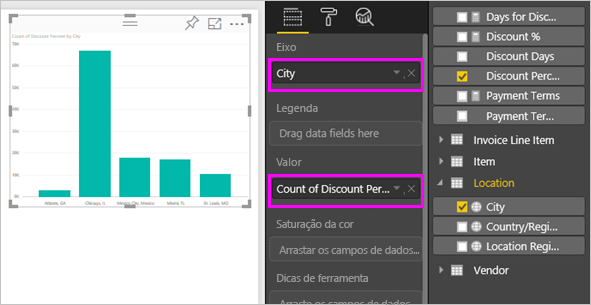
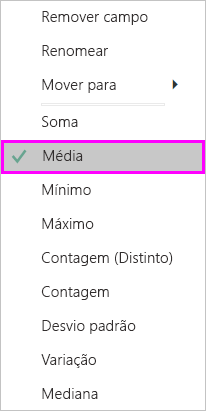

# Exportar dados de uma visualização

Se desejar ver os dados usados pelo Power BI para criar uma visualização, [poderá exibi-los no Power BI](service-reports-show-data.md). Você também pode exportá-los para o Excel como um arquivo *.xlsx* ou *.csv*. A opção de exportação de dados requer uma licença Pro ou Premium e a edição de permissões para o conjunto de dados e o relatório.

Assista a Will exportar os dados de uma das visualizações de seu relatório, salvá-los como um arquivo *.xlsx* e abri-lo no Excel. Em seguida, siga as instruções passo a passo abaixo do vídeo para testá-la por conta própria.

<iframe width="560" height="315" src="https://www.youtube.com/embed/KjheMTGjDXw" frameborder="0" allowfullscreen></iframe>

## Exportar dados de um painel do Power BI

1. Selecione as reticências no canto superior direito da visualização.

    

1. Escolha o ícone **Exportar dados**.

    

1. O Power BI exporta os dados para um arquivo *.csv*. Se você tiver filtrado a visualização, o aplicativo filtrará os dados baixados.

1. O navegador solicitará que você salve o arquivo.  Após salvá-lo, abra o arquivo *.csv* no Excel.

    

## Exportar dados de um relatório

Para continuar, abra o [Relatório de exemplo de análise de compras](../sample-procurement.md) no Modo de Exibição de Edição. Adicionar uma nova página de relatório em branco. Em seguida, siga as etapas abaixo para adicionar uma agregação e um filtro de nível de visualização.

1. Crie um novo **Gráfico de colunas empilhadas**.

1. No painel **Campos**, selecione **Localização > Cidade** e **Fatura > Porcentagem de Desconto**.  Talvez você precise mover a **Porcentagem de Desconto** para o **Valor** também.

    

1. Alterar a agregação de **Porcentagem de Desconto** de **Contagem** para **Média**. Na seção **Valor**, selecione a seta à direita de **Porcentagem de Desconto** (poderá estar como **Contagem de Porcentagem de Desconto**) e escolha **Média**.

    

1. Adicione um filtro à **Cidade**, selecione todas as cidades e, em seguida, remova **Atlanta**.

    

   Agora estamos prontos para experimentar as duas opções de exportação de dados.

1. Selecione as reticências no canto superior direito da visualização. Selecione **Exportar dados**.

    

    No Power BI online, se a visualização tiver uma agregação (um exemplo seria a alteração de **Contagem** para *média*, *soma* ou *mínimo*), haverá duas opções:

    - **Dados resumidos**

    - **Dados subjacentes**

    No Power BI Desktop, você terá apenas a opção para **Dados resumidos**. Para entender melhor as agregações, consulte [Agregações no Power BI](../service-aggregates.md).

1. Em **Exportar dados**, selecione **Dados resumidos**, escolha *.xlsx* ou *.csv* e, em seguida, selecione **Exportar**. O Power BI exporta os dados.

    

    Se você aplicou filtros à visualização, os dados serão exportados da maneira que foram filtrados. Ao selecionar **Exportar**, o navegador solicitará que você salve o arquivo. Após salvá-lo, abra o arquivo no Excel.

    **Dados resumidos**: Selecione esta opção se você quiser exportar dados para o que vê nesse visual.  Esse tipo de exportação mostra somente os dados (colunas e medidas) que você escolheu para criar o visual.  Se o visual tiver uma agregação, você exportará dados agregados. Por exemplo, se um gráfico de barras mostrar quatro barras, você obterá quatro linhas de dados. Os dados resumidos estão disponíveis como *.xlsx* e *.csv*.

    Neste exemplo, a nossa exportação do Excel mostra um total para cada cidade. Como filtramos e retiramos Atlanta, ela não está incluída nos resultados. A primeira linha da nossa planilha mostra os filtros que foram usados pelo Power BI ao extrair os dados.

    

1. Agora tente selecionar **Dados subjacentes**, *.xlsx* e **Exportar**. O Power BI exporta os dados. 

    > [!NOTE]
    > Dependendo das configurações de relatório, talvez você tenha a opção de exportar dados subjacentes.

    Se você aplicou filtros à visualização, os dados serão exportados da maneira que foram filtrados. Ao selecionar **Exportar**, o navegador solicitará que você salve o arquivo. Após salvá-lo, abra o arquivo no Excel.

    >[!WARNING]
    >A exportação de dados subjacentes permite que os usuários vejam todos os dados detalhados – todas as colunas nos dados. Os administradores do serviço do Power BI podem desativar esse recurso para sua organização. Se for o proprietário de um conjunto de dados, você poderá definir colunas proprietárias como **ocultas** para que elas não apareçam na lista **Campo** no Power BI Desktop ou no seu serviço.

    **Dados subjacentes**: Selecione esta opção se quiser ver os dados no visual ***e*** dados adicionais do modelo (consulte o gráfico abaixo para obter detalhes). Se a visualização tiver uma agregação, selecionar *Dados subjacentes* removerá a agregação. Quando você seleciona **Exportar**, o Power BI exporta os dados para um arquivo *.xlsx*, e seu navegador solicita o salvamento do arquivo. Após salvá-lo, abra o arquivo no Excel.

    Neste exemplo, a exportação do Excel mostra uma linha para cada linha única de Cidade do nosso conjunto de dados e a porcentagem de desconto para aquela entrada única. O Power BI nivela os dados. Ele não os agrega. A primeira linha da nossa planilha mostra os filtros que foram usados pelo Power BI ao extrair os dados.  

    

## Exportar detalhes dos dados subjacentes

O que você vê quando seleciona **Dados subjacentes** pode variar. Compreender esses detalhes pode exigir ajuda do administrador ou do departamento de TI. No Power BI Desktop ou no serviço, no modo de exibição de relatório, uma *medida* é exibida na lista **Campos** com um ícone de calculadora . O Power BI Desktop cria medidas. O serviço do Power BI não faz isso.

| O visual contém | O que você verá na exportação  |
|---------------- | ---------------------------|
| Agregações | os *primeiros* dados de agregação e não ocultos da tabela inteira para essa agregação |
| Agregações | Dados relacionados – Se o visual usa dados de outras tabelas de dados que são *relacionados* à tabela de dados que contém a agregação (desde que essa relação seja \*:1 ou 1:1) |
| Medidas | todas as medidas no visual *e* todas as medidas de qualquer tabela de dados contendo uma medida usada no visual |
| Medidas | todos os dados não ocultos de tabelas que contêm essa medida (desde que essa relação seja \*: 1 ou 1:1) |
| Medidas | todos os dados de todas as tabelas relacionadas à tabela que contém as medidas por meio de uma cadeia de \*: 1 de 1:1) |
| Somente medidas | todas as colunas não ocultas de todas as tabelas relacionadas (para expandir a medida) |
| Somente medidas | dados resumidos de quaisquer linhas duplicadas para medidas de modelo |

### Definir as opções de exportação

Designers de relatório do Power BI controlam os tipos de opções de exportação de dados que estão disponíveis para seus consumidores. As opções são:

- Permitir que os usuários finais exportem dados resumidos do serviço do Power BI ou do Servidor de Relatórios do Power BI

- Permitir que os usuários finais exportem tanto dados resumidos quanto subjacentes do serviço ou Servidor de Relatórios

- Não permitir que os usuários finais exportem dados do serviço ou do Servidor de Relatórios

    > [!IMPORTANT]
    > É recomendável que os designers de relatório examinem novamente relatórios antigos e redefinam manualmente a opção de exportação, conforme necessário.

Para definir essas opções:

1. Inicie o Power BI Desktop.

1. No canto superior esquerdo, selecione **Arquivo** > **Opções e configurações** > **Opções**.

1. Em **ARQUIVO ATUAL**, selecione **Configurações de relatório**.

    

1. Faça sua seleção na seção **Exportar dados**.

Você também pode atualizar essa configuração no serviço do Power BI.

É importante observar que, se as configurações do portal de administração do Power BI entrarem em conflito com as do relatório para exportação de dados, as configurações de administração substituirão as de exportação de dados.

## Limitações e considerações
Essas considerações e limitações se aplicam ao Power BI Desktop e ao serviço do Power BI, incluindo o Power BI Pro e o Premium.

- Para exportar os dados de um visual, você precisa ter [Permissão de criação em conjuntos de dados subjacentes](https://docs.microsoft.com/power-bi/service-datasets-build-permissions#build-permissions-for-shared-datasets).

-  O número máximo de linhas que o **Power BI Desktop** e o **serviço do Power BI** podem exportar de um **relatório de modo de importação** para um arquivo *.csv* é 30.000.

- O número máximo de linhas que os aplicativos podem exportar de um **relatório de modo de importação** para um arquivo *.xlsx* é 150.000.

- Exportar usando os *Dados subjacentes* não funcionará se:

  - A fonte de dados for uma conexão dinâmica do Analysis Services.

  - A versão for anterior a 2016.

  - As tabelas no modelo não tiverem uma chave exclusiva.
    
  -  Se um administrador ou o designer de relatórios tiver desabilitado esse recurso.

- Exportar usando *Dados subjacentes* não funcionará se você habilitar a opção *Mostrar itens sem dados* para a visualização que está sendo exportada pelo Power BI.

- Quando o DirectQuery é usado, a quantidade máxima de dados que o Power BI pode exportar é 16 MB em dados descompactados. Um resultado não intencional pode ser a exportação de um número de linhas inferior ao máximo permitido. É provável que isso aconteça se:

    - Houver muitas colunas.

    - Houver dados difíceis de compactar.

    - Outros fatores aumentam o tamanho do arquivo e diminuem o número de linhas que o Power BI pode exportar.

- Se a visualização usar dados de mais de uma tabela de dados e não existir relação para essas tabelas no modelo de dados, o Power BI só exportará os dados para a primeira tabela.

- No momento, os visuais personalizados e visuais do R não são compatíveis.

- A opção Exportar dados não está disponível para usuários externos à sua organização que estejam usando um painel compartilhado com eles por um usuário interno.

- No Power BI, você pode renomear um campo (coluna) clicando duas vezes nele e digitando um novo nome. O Power BI refere-se ao novo nome como um *alias*. É possível que um relatório do Power BI termine com nomes de campo duplicados, mas o Excel não permite duplicatas. Assim, quando o Power BI exporta os dados para o Excel, os aliases de campo são revertidos para seus nomes originais de campo (coluna).  

- Se forem usados caracteres Unicode no arquivo *.csv*, o texto no Excel poderá não ser exibido corretamente. Exemplos de caracteres Unicode são símbolos de moeda e palavras estrangeiras. Você pode abrir o arquivo no Bloco de notas, e o Unicode será exibido corretamente. Se quiser abrir o arquivo no Excel, a solução alternativa é importar o *.csv*. Para importar o arquivo para o Excel:

  1. Abra o Excel.

  1. Vá para a guia **Dados**.
  
  1. Selecione **Obter dados externos** > **De texto**.
  
  1. Vá para a pasta local onde o arquivo está armazenado e selecione o *.csv*.

- Os administradores do Power BI podem desabilitar a exportação de dados.

Mais perguntas? [Experimente perguntar à Comunidade do Power BI](http://community.powerbi.com/)
