# Visualização de influenciadores principais
Os influenciadores principais visual ajuda a entender os fatores nessa unidade uma métrica que você está interessado. Ele analisa os dados, classifica os fatores importantes e os exibe como influenciadores principais. Por exemplo, suponha que você queira descobrir quais influencia a rotatividade de funcionários, que é também conhecido como variação. Um dos fatores pode ser o comprimento de contrato de emprego e outro fator pode ser a idade do funcionário. 
 
## Quando usar os influenciadores principais 
O visual de influenciadores principais é uma ótima opção se você quiser: 
- Ver quais fatores afetam a métrica que está sendo analisada.
- Compare a importância relativa desses fatores. Por exemplo, os contratos de curto prazo têm mais impacto na rotatividade comparado aos contratos de longo prazo? 

## Requisitos dos influenciadores principais 
A métrica que você analise deve ser o campo categórico ou numérico (agregações e as medidas ainda não têm suporte).

## Recursos dos influenciadores principais visual

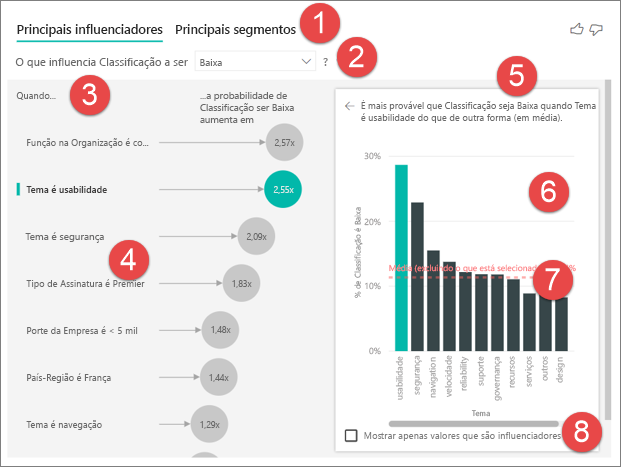

1. **Guias**: Selecione uma guia para alternar entre modos de exibição. **Chave influenciadores** mostra os principais colaboradores para o valor da métrica selecionado. **Principais segmentos** mostra os principais segmentos que contribuem para o valor da métrica selecionado. Um *segmento* é composto por uma combinação de valores. Por exemplo, um segmento pode ser consumidores que tenham sido clientes pelo menos de 20 anos e ao vivo na região Oeste. 

2. **Caixa suspensa**: O valor da métrica sob investigação. Neste exemplo, examine a métrica **classificação**. O valor selecionado é **baixa**.

3. **Reformulação**: Ele ajuda você a interpretar o visual no painel esquerdo.

4. **Painel esquerdo**: O painel esquerdo contém um elemento visual. Nesse caso, o painel esquerdo mostra uma lista dos influenciadores principais superior.

5. **Reformulação**: Ele ajuda você a interpretar o visual no painel direito.

6. **Painel direito**: O painel direito contém um elemento visual. Nesse caso, o gráfico de colunas exibe todos os valores para os influenciadores principais **tema** que foi selecionado no painel esquerdo. O valor específico do **usabilidade** no painel à esquerda é mostrado em verde. Todos os outros valores para **tema** são mostrados em preto.

7. **Linha média**: A média é calculada para todos os outros valores possíveis para **tema** exceto **usabilidade**. Portanto, o cálculo se aplica a todos os valores em preto. Informa a você qual porcentagem dos outros **temas** lhe deu uma classificação baixa. Em outras palavras, quando uma classificação é fornecida por um cliente, esse cliente também descreve o motivo ou o tema para a classificação. Alguns temas são usabilidade, velocidade e segurança. 

   **Tema é usabilidade** é o Influenciador segundo maior chave para uma classificação baixa, de acordo com o visual no painel esquerdo. Se você média de todos os temas e sua contribuição para a classificação de **baixa**, você obterá o resultado mostrado em vermelho. De todos os outros temas fornecidos, apenas 11.35% são maiores do que **usabilidade**.

8. **Caixa de seleção**: **Mostrar apenas os valores que são os influenciadores**.

## Criar um visual de influenciadores principais 
 
Assista a este vídeo para aprender a criar um influenciadores principais visual. Em seguida, siga estas etapas para criar um. 

<iframe width="560" height="315" src="https://www.youtube.com/embed/fDb5zZ3xmxU" frameborder="0" allow="accelerometer; autoplay; encrypted-media; gyroscope; picture-in-picture" allowfullscreen></iframe>

Seu gerente de produto quer você a descobrir quais fatores líder de clientes para deixar as revisões negativas sobre o serviço de nuvem. Para acompanhar, abra o [arquivo PBIX de Comentários do Cliente](https://github.com/Microsoft/powerbi-desktop-samples/blob/master/2019/customerfeedback.pbix) no Power BI Desktop. Você também pode baixar o [arquivo do Excel de comentários do cliente para o serviço do Power BI ou Power BI Desktop](https://github.com/Microsoft/powerbi-desktop-samples/blob/master/2019/customerfeedback.xlsx). 

> [!NOTE]
> O conjunto de dados de comentários do cliente é com base em [Moro farão, 2014] S. Moro, P. Cortez e Rita P. "Uma controlada por dados abordagem para prever o sucesso da Bank Telemarketing." *Sistemas de suporte de decisão*, Elsevier, 62:22-31, de junho de 2014. 

1. Abra o relatório e, em seguida, selecione a **chave influenciadores** ícone. 

    

2. Mover a métrica que você deseja investigar para o **analisar** campo. O **analisar** campo oferece suporte a variáveis categóricas ou não contínua, apenas. Para ver o que leva um cliente a classificação do serviço a ser baixo, selecione **tabela Customer** > **classificação**. 
3. Mover campos que você acha que podem influenciar **Rating** para o **explicar por** campo. Você pode mover quantos campos desejar. Nesse caso, inicie com:
    - País-Região 
    - Função na Organização 
    - Tipo de Assinatura 
    - Porte da Empresa 
    - Tema 
1. Para restringir as avaliações negativo, marque **baixa** na **o que influencia a classificação de ser** caixa suspensa.  

    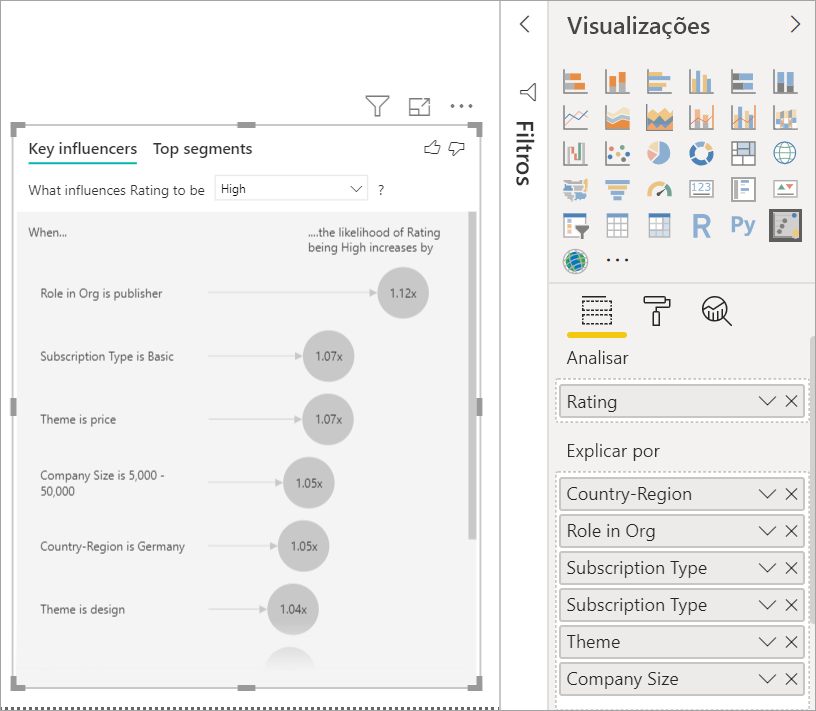

A análise é executada no nível de tabela do campo que está sendo analisado. Nesse caso, ele tem o **classificação** métrica. Essa métrica é definida em um nível de cliente. Cada cliente tenha dado uma pontuação alta ou uma pontuação baixa. Todos os fatores explicativos devem ser definidos no nível do cliente para o visual tornar usá-los. 

No exemplo anterior, todos os fatores explicativos tem uma relação muitos-para-um com a métrica ou um-para-um. Nesse caso, cada pontuação tem exatamente um tema associado a ele. Este tema era o tema principal da revisão de cliente. Da mesma forma, os clientes vêm de um país, têm um tipo de associação e executar uma função em sua organização. Os fatores explicativos já são atributos de um cliente, e nenhuma transformação é necessária. O visual pode fazer uso imediato deles. 

Posteriormente no tutorial, você ver exemplos mais complexos que têm relações um-para-muitos. Nesses casos, as colunas precisam primeiro ser agregados no nível do cliente antes de executar a análise. 

Medidas e agregações usadas como fatores explicativos também são avaliadas no nível de tabela das **analisar** métrica. Alguns exemplos são mostrados neste artigo. 

## Interpretar categóricos influenciadores principais 
Vamos dar uma olhada nos influenciadores principais para classificações baixas. 

### Principais único fator que influencia a probabilidade de uma classificação baixa

A organização neste exemplo tem três funções: consumidor, o administrador e o publicador. Sendo um consumidor é o fator superior que contribui para uma classificação baixa. 

Mais precisamente, seus consumidores provavelmente 2.57 vezes mais dar ao serviço uma pontuação negativa. Os influenciadores principais listas de gráfico **função na organização é o consumidor** primeiro na lista à esquerda. Selecionando **função na organização é o consumidor**, Power BI mostra detalhes adicionais no painel direito. O efeito comparativo de cada função sobre a probabilidade de uma classificação baixa é mostrado.
  
- % 14.93 de consumidores oferecem uma pontuação baixa. 
- Em média, todas as outras funções fornecem uma pontuação baixa 5.78% do tempo.
- Os consumidores são 2.57 vezes mais prováveis dar uma pontuação baixa em comparação comparada todas as outras funções. Você pode determinar isso dividindo-se a barra verde pela linha pontilhada vermelha. 

### Segundo fator único que influencia a probabilidade de uma classificação baixa

Os influenciadores principais visual compara e classifica os fatores de muitas variáveis diferentes. O segundo Influenciador não tem nada a ver com **função na organização**. Selecione o Influenciador segundo na lista, que é **tema é usabilidade**. 

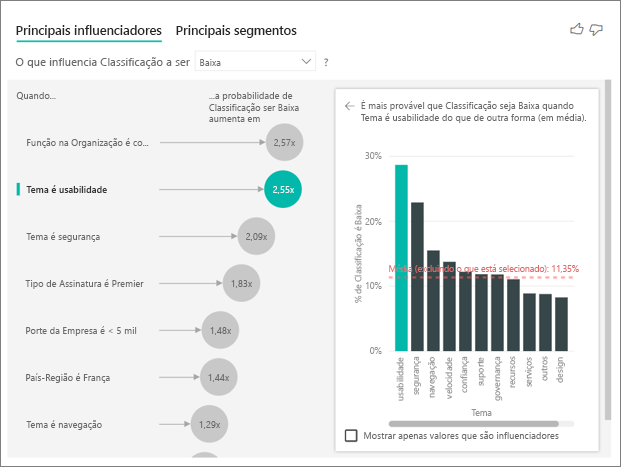

O fator segundo o mais importante está relacionado ao tema da revisão do cliente. Os clientes que comentou sobre a usabilidade do produto foram 2.55 vezes mais prováveis dar uma pontuação baixa em comparação comparada os clientes que comentado em outros temas, como confiabilidade, design ou velocidade. 

Entre os elementos visuais, a média, o que é exibida pela linha pontilhada vermelha, alterado de % 5.78 para % 11.34. A média é dinâmica porque ele se baseia na média de todos os outros valores. Para o Influenciador primeiro, a média excluídas a função do cliente. Para o segundo Influenciador, ele excluído o tema de usabilidade. 
 
Selecione o **Mostrar apenas os valores que são os influenciadores** caixa de seleção para filtrar usando somente os valores influentes. Nesse caso, eles são as funções que orientam uma pontuação baixa. Doze temas são reduzidos para os quatro Power BI identificados como os temas que classificações baixas de unidade. 

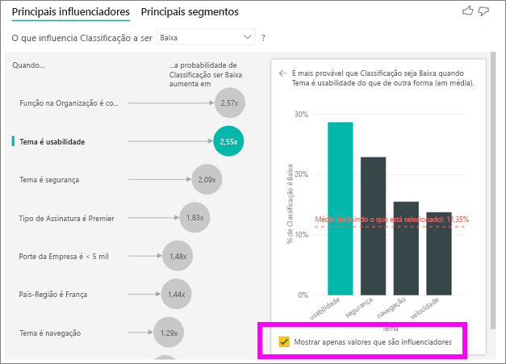

## Interagir com outros elementos visuais 
 
Sempre que você selecione uma segmentação de dados, filtro ou outro elemento visual na tela, os influenciadores principais visual executa novamente a sua análise sobre a nova parte dos dados. Por exemplo, você pode mover **tamanho da empresa** no relatório e usá-lo como uma segmentação de dados. Usá-lo para ver se os influenciadores principais para seus clientes empresariais são diferentes de população geral. Um tamanho da empresa enterprise é maior que 50.000 funcionários.
 
Selecionando **> 50.000** repetições, a análise e você pode ver que os influenciadores é alterado. Para clientes de grande porte, os influenciadores principais para classificações de baixa tem um tema relacionado à segurança. Você talvez queira investigar detalhadas para ver se há recursos de segurança específicos que seus grandes clientes estão descontentes. 

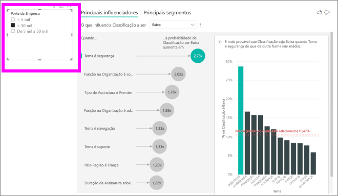

## Interpretar contínuos influenciadores principais 
 
Até agora, você viu como usar o visual para explorar como os diferentes campos categóricos influenciar passo que classificações baixas. Também é possível ter contínuas fatores como idade, altura e preço na **Explique por** campo. Vejamos o que acontece quando **gestão** é movido da tabela customer na **explicam por**. Gestão mostra quanto tempo um cliente tiver usado o serviço. 
 
À medida que aumenta de gestão, também aumenta a probabilidade de receber uma classificação mais baixa. Essa tendência sugere que os clientes a longo prazo são mais prováveis dar uma pontuação negativa. Essa ideia é interessante e outra que talvez você queira acompanhar posteriormente. 
 
A visualização mostra que sempre que a gestão sobe por meses 13.44, em média a probabilidade de uma classificação baixa aumenta em 1,23 vezes. Nesse caso, os 13,44 meses representam o desvio padrão do tempo de uso. Para que o insight que você receber examina como o aumento de gestão por um valor padrão, o que é o desvio padrão de gestão, afeta a probabilidade de receber uma classificação baixa. 
 
O gráfico de dispersão no painel direito plota a porcentagem média de classificações de baixa para cada valor de gestão. Ele destaca a inclinação com uma linha de tendência.

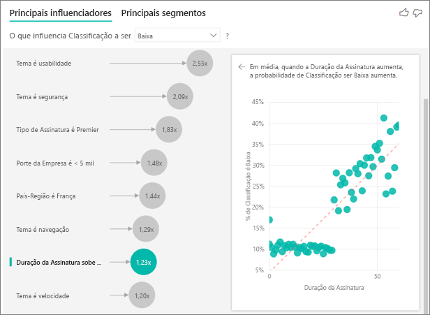

## Interpretar medidas e agregações, como os influenciadores principais 
 
Você pode usar medidas e agregações como fatores explicativos dentro de sua análise. Por exemplo, você talvez queira ver o efeito a contagem de tíquetes de suporte do cliente ou a duração média de um tíquete aberta sobre a pontuação de receber. 
 
Nesse caso, você deseja ver se o número de tíquetes de suporte que tem um cliente influencia a pontuação de que dar a eles. Agora você trazer **ID do tíquete de suporte** da tabela de tíquete de suporte. Como um cliente pode ter vários tíquetes de suporte, você pode agregar a ID para o nível do cliente. Agregação é importante porque a análise é executada no nível do cliente, portanto, todos os drivers devem ser definidos no nível de granularidade. 
 
Vamos examinar a contagem de IDs. Cada linha do cliente tem uma contagem de tíquetes de suporte associado a ele. Nesse caso, como a contagem de tíquetes de suporte, aumenta a probabilidade de ser a classificação baixa vai 5,51 vezes. O visual à direita mostra o número médio de tíquetes de suporte por diferentes **classificação** valores avaliados no nível do cliente. 

## Interprete os resultados: Principais segmentos 
 
Você pode usar o **chave influenciadores** guia para avaliar cada fator individualmente. Você também pode usar o **principais segmentos** tab para ver como uma combinação de fatores afeta a métrica que você está analisando. 
 
Principais segmentos inicialmente mostram uma visão geral de todos os segmentos do Power BI descoberto. O exemplo a seguir mostra que seis segmentos foram encontrados. Esses segmentos são classificados pela porcentagem de classificações baixas no segmento. Segmento 1, por exemplo, tem % 74.3 classificações de cliente que estão baixos. Quanto maior a bolha, maior é a proporção de classificações baixas. O tamanho da bolha representa quantos clientes estão dentro do segmento. 

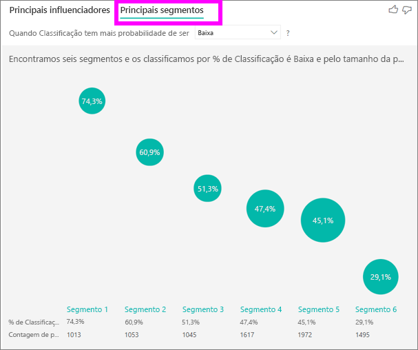

A seleção de uma bolha faz uma busca detalhada nos detalhes desse segmento. Se você selecionar 1 segmento, por exemplo, você encontrar que ele é composto de clientes relativamente estabelecidos. Eles já foram clientes para mais de 29 meses e tem mais de quatro tíquetes de suporte. Por fim, eles não são editores, para que eles sejam os consumidores ou administradores. 
 
Nesse grupo, 74.3% dos clientes deu uma classificação baixa. A média dos clientes deu uma baixa classificação 11,7% do tempo, portanto, este segmento tem uma proporção maior do que classificações baixas. Ele é 63 pontos percentuais mais altos. Segmento 1 também contém aproximadamente 2.2% dos dados, portanto ele representa uma parte endereçável da população. 

## Trabalhando com dados numéricos

Se você mover um campo numérico para o **analisar** campo, você pode escolher como lidar com esse cenário. Você pode alterar o comportamento do visual entrando na **painel de formatação** e alternar entre **categóricos tipo de análise** e **tipo de análise contínua**.

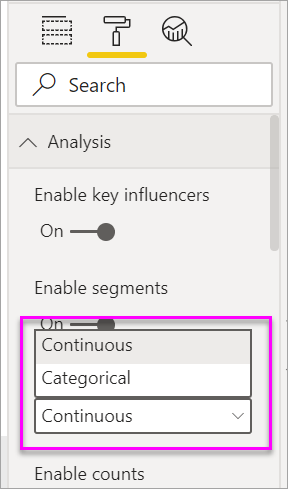

Um **tipo de análise categórico** se comporta conforme descrito acima. Por exemplo, se vocês estivessem olhando as pontuações de pesquisa, variando de 1 a 10, você poderia perguntar 'O que influencia pontuações de pesquisa seja 1?'

Um **tipo de análise contínua** altera a pergunta para um contínuo. No exemplo acima, nossa nova pergunta seria 'O que influencia as pontuações de pesquisa para aumentar/diminuir de'?

Essa distinção é muito útil quando você tem muitos valores exclusivos no campo que você está analisando. No exemplo a seguir, vamos ver os preços de casa. Não faz muito sentido perguntar 'O que influenciará o preço de casa para ser 156,214'? como isso é muito específico e, provavelmente não tem dados suficientes para inferir um padrão.

Em vez disso, podemos querer perguntar: 'O que influenciará o preço de casa para aumentar'? que nos permite tratar os preços de casa como um intervalo em vez de valores distintos.

## Interprete os resultados: Principais influenciadores 

Nesse cenário, vamos examinar 'O que influenciará o preço de casa para aumentar a'. Estamos observando uma série de fatores explicativos que poderiam afetar um preço de casa, como **ano criados** (ano a casa foi criada), **KitchenQual** (qualidade de cozinha) e **YearRemodAdd** (ano que a casa foi remodelada). 

O exemplo a seguir vamos examinar nosso influenciadores principais que está sendo excelente de qualidade de cozinha. Os resultados são muito semelhantes aos que vimos quando estamos foram analisando métricas categóricas com algumas diferenças importantes:

- O gráfico de colunas à direita está observando a médias em vez de porcentagens. Ele, portanto, nos mostra o que o preço médio de casa de uma casa com uma excelente cozinha é (verde de barras) em comparação com o preço médio de casa, de uma casa sem uma cozinha excelente (linha pontilhada)
- O número na bolha ainda é a diferença entre a linha pontilhada vermelha e a barra verde, mas ele é expresso como um número (US $158. K 49) em vez de uma probabilidade (1.93 x). Assim por diante médio, casas, com excelente cozinhas são quase US $160 mil mais caro do que casas sem cozinhas excelente.

No exemplo a seguir que vemos o impacto um fator contínuo (ano casa foi remodelada) tem no preço de casa. As diferenças em comparação comparadas como podemos analisar os influenciadores contínuos para métricas categóricos são da seguinte maneira:

-   O gráfico de dispersão no painel direito plota o preço médio de casa para cada valor distinto de ano remodelado. 
-   O valor na bolha mostra por quanto a casa média preço aumenta (neste caso, US $2. k 87) quando o ano a casa foi remodelado aumenta por seu desvio padrão (nesse caso, 20 anos)

Por fim, analisamos o ano médio de medidas no caso de uma casa foi criada. A análise aqui é da seguinte maneira:

-   O preço médio de casa para cada valor distinto na tabela cria gráficos de dispersão no painel à direita
-   O valor na bolha mostra por quanto a casa média preço aumenta (neste caso, US $1.35 mil) quando o ano médio aumenta o desvio padrão (nesse caso, 30 anos)

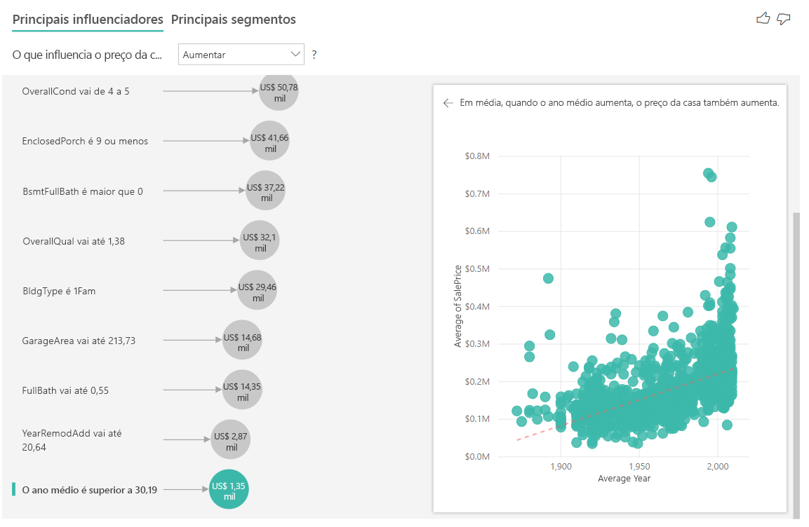

## Interprete os resultados: Segmentos superior

Principais segmentos para destinos numéricos mostram grupos em que a casa de preços em média são maiores do que no conjunto de dados geral. Por exemplo, veja abaixo vemos que **1 segmento** é composto de casas em que **GarageCars** (número de carros de garagem pode caber) é maior que 2 e o **RoofStyle** é Hip. Casas com essas características têm um preço médio de 355 mil dólares em comparação com a média geral nos dados que é de 180 mil.

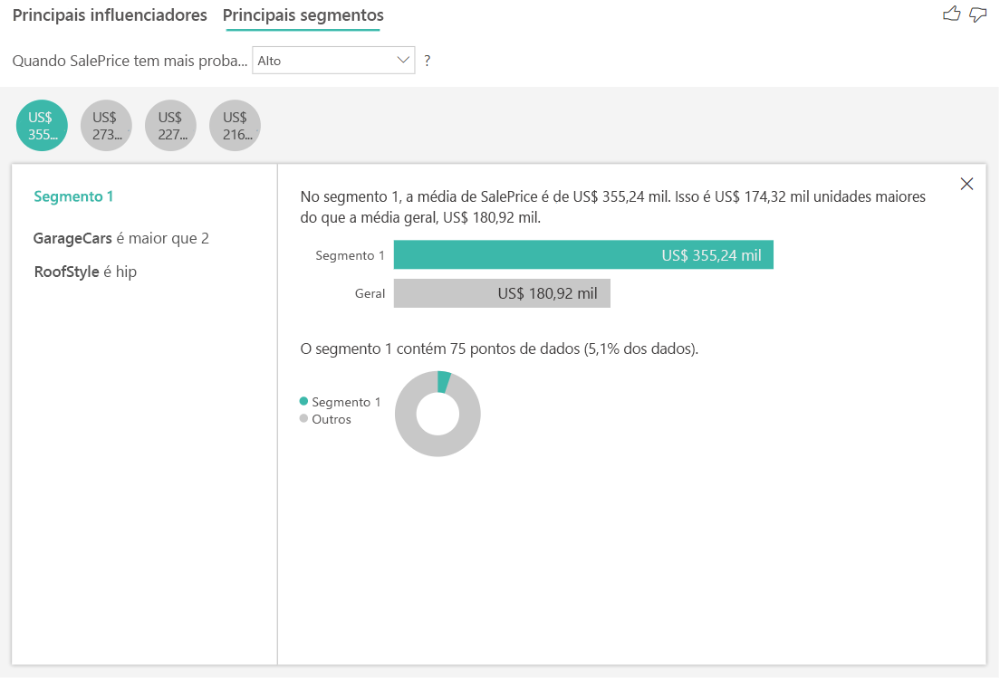

## Considerações e solução de problemas 
 
**Quais são as limitações para a versão prévia?** 
 
Os influenciadores principais visual está atualmente em visualização pública, e ele tem algumas limitações. Inclui a funcionalidade que não está disponível no momento: 
- Analisando as métricas que são agregados ou medidas.
- Consumindo o visual no Power BI Embedded.
- Consumindo o visual nos aplicativos móveis do Power BI.
- Suporte a RLS.
- Suporte para consulta direta.
- Suporte de Conexão ao vivo.

**Eu vejo um erro sem influenciadores ou segmentos encontrados. Por que isso acontece?** 

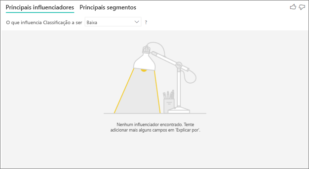

Esse erro ocorre quando você incluiu os campos no **Explique por** , mas nenhum influenciadores foram encontrados. 
- Você incluiu a métrica que você estava analisando em ambos **Analyze** e **explicam por**. Remova-o da **Explique por**. 
- Os campos explicativos tem muitas categorias com poucas observações. Essa situação torna difícil para a visualização determinar quais fatores são os influenciadores. É difícil generalizar com base em apenas algumas observações. Se você estiver analisando um campo numérico você talvez queira alternar de **análise categóricos** para **análise contínua** no **painel de formatação** sob o  **Análise** cartão.
- Seus fatores explicativos tem suficiente observações para generalizar, mas a visualização não encontrar correlações significativas ao relatório.
 
**Eu vejo um erro que a métrica que eu estou analisando não tem dados suficientes para executar a análise em. Por que isso acontece?** 

A visualização funciona, observando os padrões nos dados para um grupo em comparação comparado outros grupos. Por exemplo, ele procura por clientes que deu passo que classificações baixas em comparação aos clientes que deu classificações altas. Se os dados em seu modelo tem apenas algumas observações, os padrões são difíceis de encontrar. Se a visualização não tem dados suficientes para localizar os influenciadores significativos, ele indica que mais dados são necessários para executar a análise. 

É recomendável que você tenha pelo menos 100 observações para o estado selecionado. Nesse caso, o estado é os clientes que a variação. Você também precisa pelo menos 10 observações para os estados usado para comparação. Nesse caso, o estado de comparação é os clientes que não de variação.

Se você estiver analisando um campo numérico você talvez queira alternar de **análise categóricos** para **análise contínua** no **painel de formatação** sob o  **Análise** cartão.

**Eu vejo um erro que um campo na *Explique por* não está relacionado exclusivamente para a tabela que contém a métrica que eu estou analisando. Por que isso acontece?**
 
A análise é executada no nível de tabela do campo que está sendo analisado. Por exemplo, se você analisar os comentários dos clientes para seu serviço, você pode ter uma tabela que informa se um cliente forneceu uma classificação alta ou uma classificação baixa. Nesse caso, a análise está em execução no nível da tabela customer. 

Se você tiver uma tabela relacionada que é definida em um nível mais granular que a tabela que contém sua métrica, você verá esse erro. Aqui está um exemplo: 
 
- Você analisar o que orienta os clientes para dar um passo que classificações baixas do seu serviço.
- Você deseja ver se o dispositivo no qual o cliente está consumindo seu serviço influencia as revisões de que dar a eles.
- Um cliente pode consumir o serviço de várias maneiras diferentes.
- No exemplo a seguir, o cliente 10000000 usa um navegador e um tablet para interagir com o serviço.

Se você tentar usar a coluna de dispositivo como um fator explicativo, você verá o seguinte erro: 

Esse erro aparece porque o dispositivo não está definido no nível do cliente. Um cliente pode consumir o serviço em vários dispositivos. Para a visualização localizar padrões, o dispositivo deve ser um atributo do cliente. Há várias soluções que dependem de sua compreensão dos negócios: 
 
- Você pode alterar o resumo de dispositivos para contar. Por exemplo, use a contagem se o número de dispositivos pode afetar a pontuação que fornece um cliente. 
- Você pode dinamizar coluna dispositivo para ver se o consumo do serviço em um dispositivo específico influencia a classificação de um cliente.
 
Neste exemplo, os dados foi dinamizados para criar novas colunas para o navegador, móvel e de tablet. Agora você pode usar esses dispositivos específicos na **Explique por**. Todos os dispositivos se tornar os influenciadores e o navegador tem o maior efeito na pontuação de cliente.

Mais precisamente, os clientes que não usam o navegador para consumir o serviço provavelmente 3.79 vezes mais dar uma pontuação baixa que os clientes que fazer. Menor para baixo na lista, para dispositivos móveis o inverso é verdadeiro. Os clientes que usam o aplicativo móvel serão mais prováveis dar uma pontuação baixa que os clientes que não o fazem. 

**Posso ver um aviso de que as medidas não foram incluídas na minha análise. Por que isso acontece?** 

A análise é executada no nível de tabela do campo que está sendo analisado. Se você analisar a rotatividade de clientes, você pode ter uma tabela que informa se um cliente formados ou não. Nesse caso, sua análise é executada no nível da tabela customer.
 
Medidas e agregações são por padrão, analisado no nível de tabela. Se houver uma medida para média de gastos mensal, eles ser analisados no nível da tabela customer. 

Se a tabela customer não tem um identificador exclusivo, você não é possível avaliar a medida e ele será ignorado pela análise. Para evitar essa situação, verifique se que a tabela com sua métrica tem um identificador exclusivo. Nesse caso, ele é a tabela de cliente e o identificador exclusivo é a ID do cliente. Também é fácil adicionar uma coluna de índice usando Power Query.
 
**Posso ver um aviso de que a métrica que eu estou analisando tem mais de 10 valores exclusivos e que esse valor pode afetar a qualidade da minha análise. Por que isso acontece?** 

A visualização de inteligência Artificial pode analisar os campos categóricos e numéricos. No caso de campos categóricos, um exemplo pode ser a variação é Sim ou não, e a satisfação do cliente é alto, médio ou baixo. Aumentar o número de categorias para analisar significa que há menos de observações por categoria. Essa situação é mais difícil para a visualização localizar padrões nos dados. 

Ao analisar os campos numéricos, você pode escolher entre tratando os campos numéricos como o texto nesse caso, você executará a mesma análise como faria para dados categóricos (**categóricos análise**). Se você tiver muitos distintos valores, recomendamos que você mude a análise **análise contínua** conforme o que significa que você pode inferir padrões a partir de quando os números de aumentar ou diminuir em vez de tratá-los como distintas de valores. Você pode alternar de **análise categóricos** para **análise contínua** no **painel de formatação** sob o **análise** cartão.

Para localizar os influenciadores mais fortes, é recomendável que você agrupe valores semelhantes em uma única unidade. Por exemplo, se você tiver uma métrica por preço, você provavelmente obter resultados melhores, agrupando os preços semelhantes em alto, médio e baixo categorias versus o uso de faixas de preço individual. 

**Há fatores nos meus dados que eles devem ser os influenciadores principais, mas eles não são. Como isso pode acontecer?**

No exemplo a seguir, os clientes que são consumidores de unidade passo que classificações baixas, com % 14.93 de classificações estão baixos. A função de administrador também tem uma grande proporção de classificações baixa, 13.42%, mas ele não é considerado um Influenciador. 

O motivo para essa determinação é que a visualização também considera o número de pontos de dados quando ele encontra os influenciadores. O exemplo a seguir tem mais de 29.000 consumidores e administradores de menos de 10 vezes, aproximadamente 2,900. Somente 390 deles deu uma classificação baixa. O visual não tem dados suficientes para determinar se ele encontrar um padrão com as classificações de administrador ou se é apenas uma chance de encontrar. 

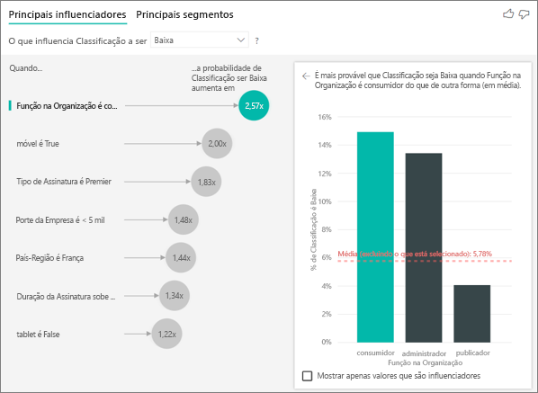

**Como calcular os influenciadores principais para análise categórico?**

Nos bastidores, a visualização IA utiliza [ML.NET](https://dotnet.microsoft.com/apps/machinelearning-ai/ml-dotnet) para executar uma regressão logística para calcular os influenciadores principais. Uma regressão logística é um modelo estatístico que compara diferentes grupos entre si. 

Se você quiser ver o que orienta passo que classificações baixas, a regressão logística analisa como os clientes que forneceu uma pontuação baixa diferem dos clientes que forneceu uma pontuação alta. Se você tiver várias categorias, como pontuações neutras, alta e baixa, examinar como os clientes que forneceu uma classificação baixa diferem dos clientes que não deram uma classificação baixa. Nesse caso, como os clientes que forneceu uma pontuação baixa diferem dos clientes que forneceu uma classificação alta ou uma classificação neutra? 
 
A regressão logística procura padrões nos dados e procura por como os clientes que forneceu uma classificação baixa podem ser diferentes dos clientes que forneceu uma classificação alta. Por exemplo, ele pode achar que os clientes com mais tíquetes de suporte oferecem uma porcentagem maior de classificações de baixa do que os clientes com poucas ou nenhuma tíquetes de suporte.
 
A regressão logística também considera como vários pontos de dados estão presentes. Por exemplo, se os clientes que desempenham uma função de administrador dar pontuações proporcionalmente mais negativas, mas há apenas alguns administradores, esse fator não é considerado influente. Isso é feito porque não existem pontos de dados suficientes inferir um padrão. Um teste estatístico, conhecido como um teste de Wald, é usado para determinar se um fator é considerado um Influenciador. O visual usa um valor p de 0,05 para determinar o limite. 

**Como calcular os influenciadores principais para análise numérica?**

Nos bastidores, a visualização IA utiliza [ML.NET](https://dotnet.microsoft.com/apps/machinelearning-ai/ml-dotnet) para executar uma regressão linear para calcular os influenciadores principais. Uma regressão linear é um modelo estatístico que examina como o resultado do campo que você está analisando é alterado com base em seus fatores explicativas.

Por exemplo, se o que estamos analisando os preços de casa, uma regressão linear examinará o impacto para ter que uma excelente cozinha terá sobre o preço de casa. Casas com excelente cozinhas geralmente têm preços de casa inferior ou superior em comparação com casas sem cozinhas excelente?

A regressão linear também considera o número de pontos de dados. Por exemplo, se casas com cortes de tênis com preços mais alto, mas temos muito poucos residências que têm um tribunal de Tênis, esse fator não é considerado influente. Isso é feito porque não existem pontos de dados suficientes inferir um padrão. Um teste estatístico, conhecido como um teste de Wald, é usado para determinar se um fator é considerado um Influenciador. O visual usa um valor p de 0,05 para determinar o limite. 

**Como calcular os segmentos?**

Nos bastidores, a visualização IA utiliza [ML.NET](https://dotnet.microsoft.com/apps/machinelearning-ai/ml-dotnet) para executar uma árvore de decisão para encontrar os subgrupos interessantes. O objetivo da árvore de decisão é contar com um subgrupo de pontos de dados que é relativamente alto na métrica que você está interessado. Isso pode ser clientes com que classificações baixas ou casas com preços altos.

A árvore de decisão usa cada fator explicativo e tenta a razão factor que concede a ele o melhor *dividir*. Por exemplo, se você filtrar os dados para incluir somente os clientes de grande porte, será que separar os clientes que forneceu uma classificação alta versus uma classificação baixa? Ou talvez é melhor para filtrar os dados para incluir somente os clientes comentam sobre segurança? 

Depois que a árvore de decisão faz uma divisão, ele usa o subgrupo de dados e determina a melhor divisão próximo para os dados. Nesse caso, o subgrupo estiver os clientes que comentado na segurança. Depois de cada divisão, ele também considera se ele tem pontos de dados suficientes para esse grupo para ser representativos suficiente para inferir um padrão de ou se é uma anomalia nos dados e não um segmento real. Outro teste estatístico é aplicado para verificar a significância estatística da condição de divisão com o valor p de 0,05. 

Após a árvore de decisão a execução, ele usa todas as divisões, como comentários de segurança e grandes empresas e cria os filtros do Power BI. Essa combinação de filtros é empacotada como um segmento no visual. 
 
**Por que certos fatores se tornam os influenciadores ou interrompa sendo influenciadores quando eu mudar mais campos para o *Explique por* campo?**

A visualização avalia todos os fatores explicativos em conjunto. Um fator pode ser um Influenciador por si só, mas quando ele é considerado com outros fatores pode não ser. Suponha que você deseja analisar o que conduz a um preço de casa seja alta, com quartos e o tamanho de casa como fatores explicativos:

- Por si só, quartos mais podem ser um driver para os preços de casa seja alta.
- Incluindo tamanho casa na análise significa que agora você examinar o que acontece com quartos enquanto o tamanho de casa permanece constante.
- Se o tamanho de casa é fixo em 1.500 pés quadrados, é improvável que um aumento contínuo no número de quartos aumentará consideravelmente o preço de casa. 
- Quartos podem não ser tão importantes de um fator, como era antes de tamanho de casa foi considerado. 

## Próximas etapas
- [Gráficos de combinação no Power BI](power-bi-visualization-combo-chart.md)
- [Tipos de visualização no Power BI](power-bi-visualization-types-for-reports-and-q-and-a.md)
