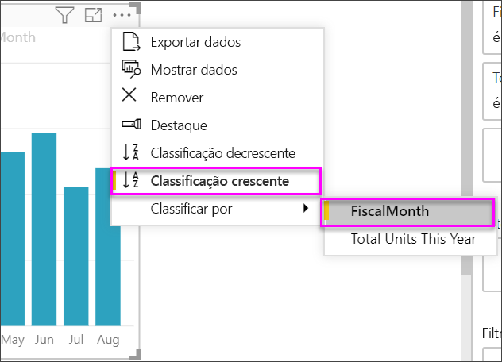
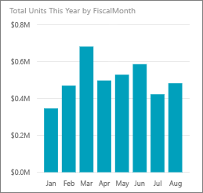
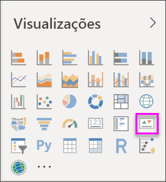
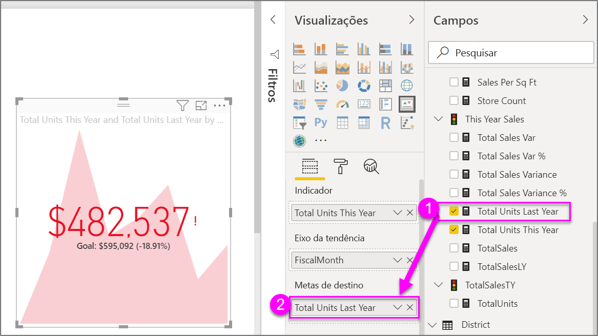

# Visuais de KPI (Indicador Chave de Desempenho)

[!INCLUDE [power-bi-visuals-desktop-banner](../includes/power-bi-visuals-desktop-banner.md)]

Um KPI (Indicador Chave de Desempenho) é uma indicação visual que comunica a quantidade de progresso feito em relação a uma meta mensurável. Para saber mais sobre KPIs, confira [KPIs (Indicadores Chave de Desempenho) no PowerPivot](/previous-versions/sql/sql-server-2012/hh272050(v=sql.110)).

Veja Will mostrando como criar elementos visuais de métrica únicos: medidores, cartões e KPIs.
   > [!NOTE]
   > Este vídeo usa uma versão mais antiga do Power BI Desktop.
   > 
   > 
<iframe width="560" height="315" src="https://www.youtube.com/embed/xmja6EpqaO0?list=PL1N57mwBHtN0JFoKSR0n-tBkUJHeMP2cP" frameborder="0" allowfullscreen></iframe>

## Quando usar um KPI

Os KPIs são uma ótima opção:

* Para medir o progresso. Responde à pergunta: "Estou à frente ou atrás do quê?"

* Para medir a distância até uma meta. Responde à pergunta: "O quão longe estou?"

## Requisitos de KPI

Um designer baseia um visual de KPI em uma medida específica. A intenção do KPI é ajudar você a avaliar o valor e o status atuais de uma métrica em relação a um alvo definido. Um visual de KPI requer uma medida *base* que é avaliada como um valor, uma medida ou um valor de *destino*, bem como um *limite* ou uma *meta*.

Um conjunto de dados de KPI precisa conter valores de meta referente a um KPI. Se seu conjunto de dados não contiver valores de meta, você poderá criá-los adicionando uma planilha do Excel com as metas ao seu modelo de dados ou ao arquivo PBIX.

## Pré-requisitos

Este tutorial usa o [arquivo PBIX de exemplo de Análise de Varejo](http://download.microsoft.com/download/9/6/D/96DDC2FF-2568-491D-AAFA-AFDD6F763AE3/Retail%20Analysis%20Sample%20PBIX.pbix).

1. Na seção superior esquerda da barra de menus, selecione **Arquivo** > **Abrir**

1. Encontre sua cópia do **arquivo PBIX de exemplo de Análise de Varejo**

1. Abra o **arquivo .PBIX de amostra de Análise de Varejo** na exibição de relatório. 

1. Selecionar **+** para adicionar uma nova página. 

## Como criar um KPI

Neste exemplo, você criará um KPI que mede o progresso feito para atingir uma meta de vendas.

1. No painel **Campos**, selecione **Vendas > Total de Unidades neste Ano**.  Esse valor será o indicador.

1. Adicione **Hora > FiscalMonth**.  Esse valor representará a tendência.

1. No canto superior direito do visual, selecione as reticências e verifique se o Power BI classificou as colunas em ordem crescente por **FiscalMonth**.

    > [!IMPORTANT]
    > Depois de converter a visualização em um KPI, **não** haverá opção para classificar. Você deve classificá-lo corretamente agora.

    

    Uma vez classificado corretamente, o visual terá esta aparência:

    

1. Converta o visual em um KPI selecionando o ícone de **KPI** no painel **Visualização**.

    

1. Para adicionar uma meta, arraste **Total de Unidades do Ano Passado** para o campo **Metas de destino**.

    

1. Opcionalmente, formate o KPI selecionando o ícone de rolo de pintura para abrir o painel Formatação.

    * **Indicador** – controla as unidades de exibição e as casas decimais do indicador.

    * **Eixo de tendência** – quando definido como **Ativado**, o visual mostra o eixo de tendência como o plano de fundo do visual de KPI.  

    * **Metas** – quando definido como **Ativado**, o visual mostra a meta e a distância da meta como um percentual.

    * **Codificação de cor > Direção** – as pessoas consideram alguns KPIs melhores para valores *mais altos* e outros melhores para valores *mais baixos*. Por exemplo, ganhos versus tempo de espera. Normalmente, um valor mais alto de ganhos é melhor em comparação com um valor mais alto de tempo de espera. Selecione **alto é bom** e, opcionalmente, altere as configurações de cor.

Os KPIs também estão disponíveis no serviço do Power BI e nos dispositivos móveis. Assim, você tem a opção de estar sempre conectado à pulsação da sua empresa.

## Considerações e solução de problemas

Se seu KPI não se parecer com o mostrado acima, talvez seja porque você não classificou por **FiscalMonth**. Os KPIs não têm uma opção de classificação. Você precisará iniciar novamente e classificar por **FiscalMonth** *antes* de converter sua visualização em um KPI.

## Próximas etapas

* [Dicas e truques para visualizações de mapa do Power BI](power-bi-map-tips-and-tricks.md)

* [Tipos de visualização no Power BI](power-bi-visualization-types-for-reports-and-q-and-a.md)

Mais perguntas? [Experimente a Comunidade do Power BI](http://community.powerbi.com/)
