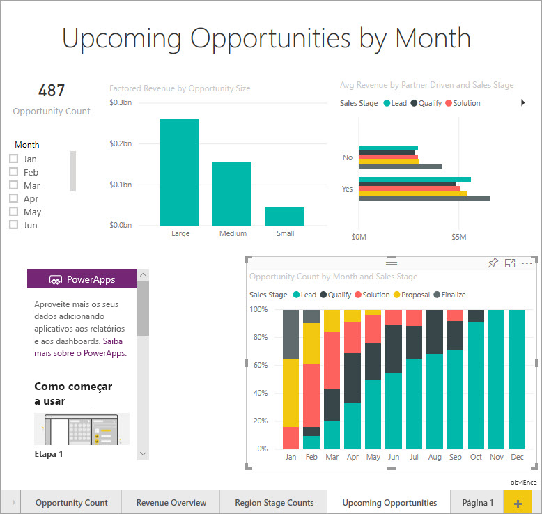
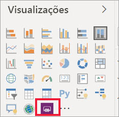
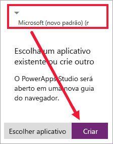
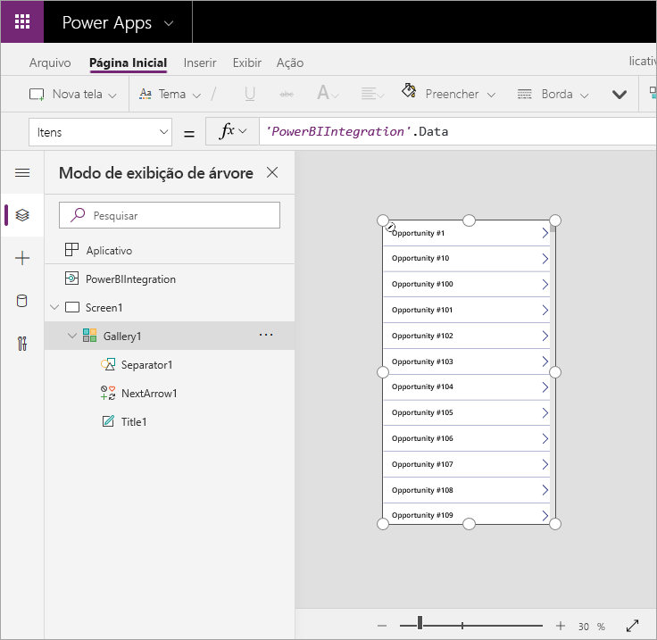
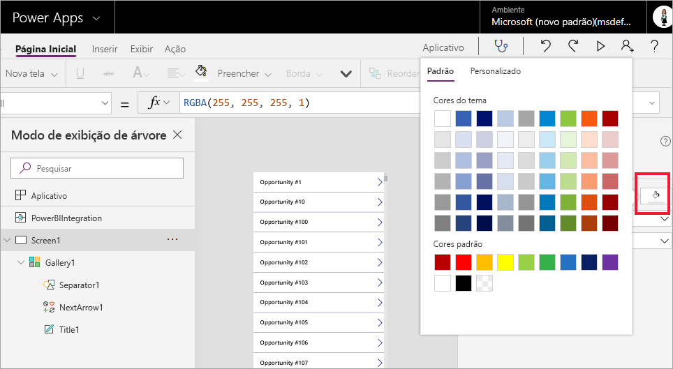
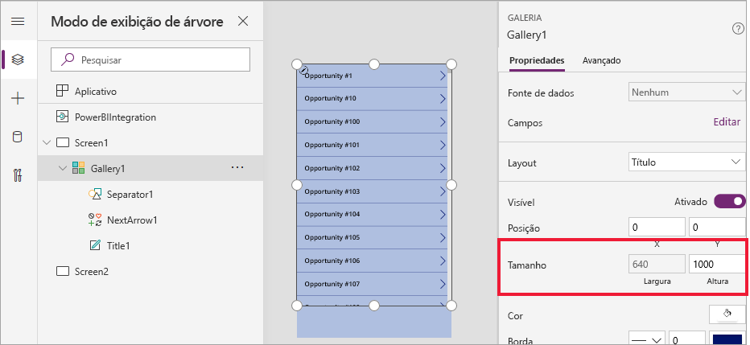
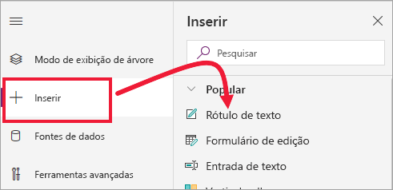
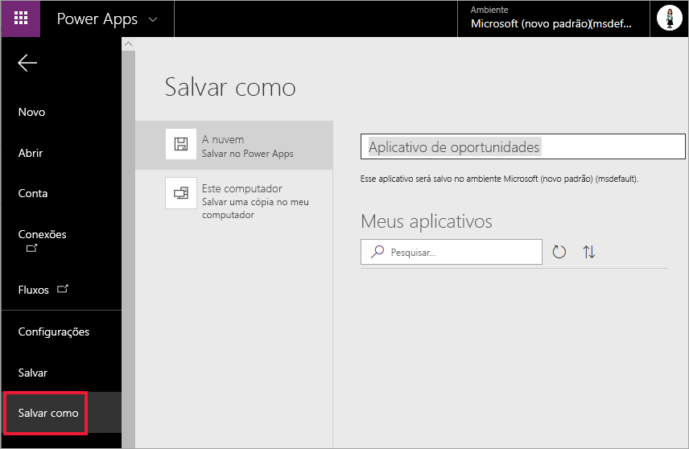
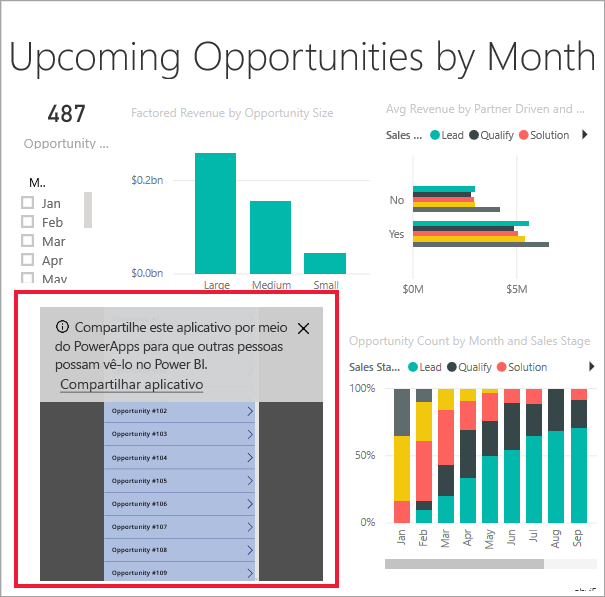

# Tutorial: Inserir um visual do Power Apps em um relatório do Power BI

Neste tutorial, você vai usar o visual do Power Apps para criar um novo aplicativo que é inserido em um relatório de exemplo do Power BI. Este aplicativo interage com outros visuais no relatório.

Caso você não tenha uma assinatura do Power Apps, [crie uma conta gratuita](https://docs.microsoft.com/powerapps/maker/signup-for-powerapps) antes de começar.

Neste tutorial, você aprenderá a:
> [!div class="checklist"]
> * Adicionar um visual do Power Apps a um relatório do Power BI
> * Trabalhar no Power Apps para criar um novo aplicativo que usa dados do relatório do Power BI
> * Exibir e interagir com o visual do Power Apps no relatório

## Pré-requisitos

* Navegador [Google Chrome](https://www.google.com/chrome/browser/) ou [Microsoft Edge](https://www.microsoft.com/windows/microsoft-edge)
* Uma [assinatura do Power BI](https://docs.microsoft.com/power-bi/service-self-service-signup-for-power-bi), com a [Amostra de Análise de Oportunidade](https://docs.microsoft.com/power-bi/sample-opportunity-analysis#get-the-content-pack-for-this-sample) instalada
* Noções básicas de como [criar aplicativos no Power Apps](https://docs.microsoft.com/powerapps/maker/canvas-apps/data-platform-create-app-scratch.md) e como [editar relatórios do Power BI](https://docs.microsoft.com/power-bi/service-the-report-editor-take-a-tour)

## Criar um novo aplicativo
Ao adicionar o visual do Power Apps a seu relatório, ele iniciará o Power Apps Studio com uma conexão de dados dinâmicos entre o Power Apps e o Power BI.

1. Abra o relatório de amostra de Análise de Oportunidade e selecione a página *Oportunidades Futuras*. 

2. Mova e redimensione alguns dos blocos do relatório para liberar espaço para o novo visual.

    

2. No painel Visualizações, selecione o ícone do Power Apps e redimensione o visual para se ajustar ao espaço que você criou.

    

3. No painel **Campos**, selecione **Nome**, **Código do Produto** e **Estágio da Venda**. 

    

4. No visual do Power Apps, selecione o ambiente do Power Apps no qual deseja criar o aplicativo e selecione **Criar novo**.

    

    No Power Apps Studio, você verá que um aplicativo básico foi criado, com uma *galeria* que mostra um dos campos selecionados no Power BI.

    

5.  Redimensione a galeria para que ela ocupe somente metade da tela. 

6. No painel esquerdo, selecione **Tela1** e defina a propriedade **Preencher** da tela como "LightBlue" (de modo que ela tenha uma melhor exibição no relatório).

    

6. Libere espaço para um controle de rótulo. 

    

8. Em **galeria**, insira um controle de rótulo de texto.

   

7. Arraste o rótulo para a parte inferior do visual. Defina a propriedade de **Texto** como `"Opportunity Count: " & CountRows(Gallery1.AllItems)`. Agora, ele mostra o número total de oportunidades no conjunto de dados.

    

    

7. Salve o aplicativo com o nome "aplicativo Oportunidades". 

    

## Exibir o aplicativo no relatório
O aplicativo agora está disponível no relatório do Power BI e interage com outros visuais, pois compartilha a mesma fonte de dados.

No relatório do Power BI, selecione **Jan** na segmentação, que filtra o relatório inteiro, incluindo os dados do aplicativo.

Observe que a contagem de oportunidades no aplicativo corresponde à contagem no canto superior esquerdo do relatório. Selecione outros itens no relatório e os dados no aplicativo serão atualizados.

## Limpar os recursos
Caso não deseje mais usar a Amostra de Análise de Oportunidade, exclua o dashboard, o relatório e o conjunto de dados.

## Próximas etapas
[Visual de P e R](power-bi-visualization-types-for-reports-and-q-and-a.md)
