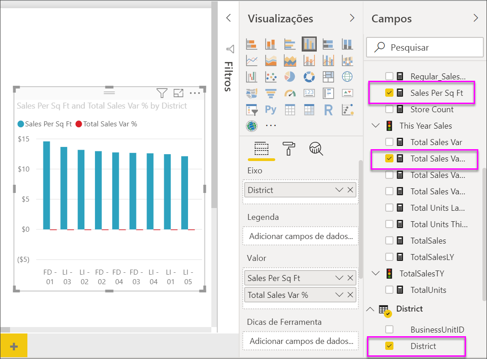
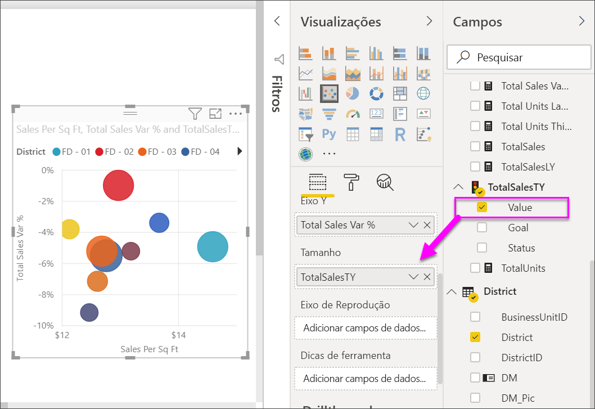
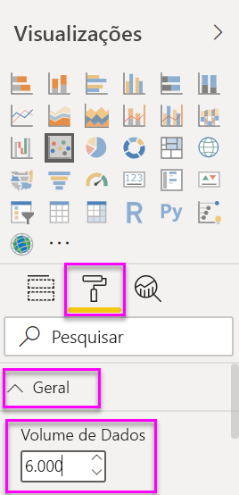
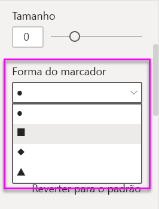
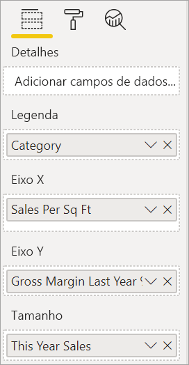
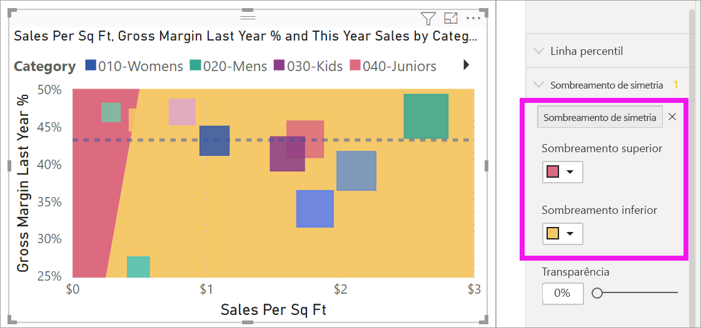
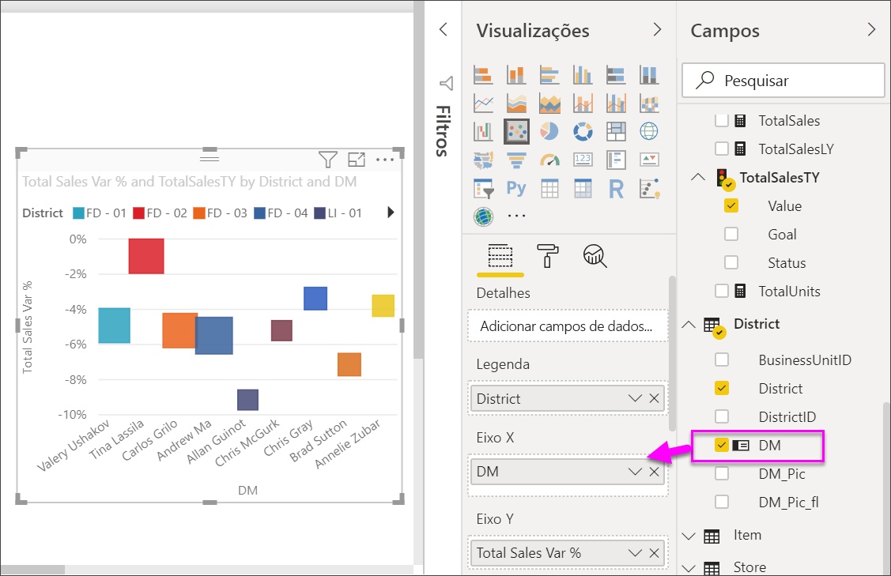
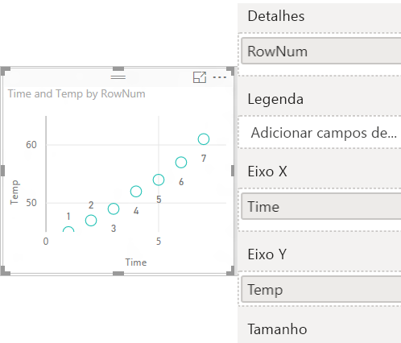
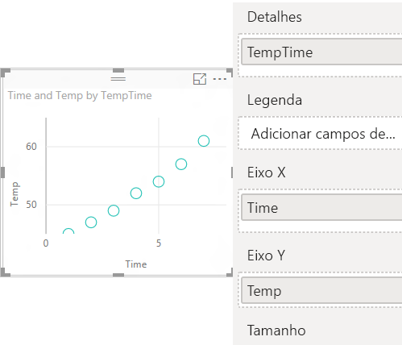

# Gráficos de dispersão, gráficos de bolhas e gráficos de pontos no Power BI

[!INCLUDE[consumer-appliesto-nyyn](../includes/consumer-appliesto-nyyn.md)]

[!INCLUDE [power-bi-visuals-desktop-banner](../includes/power-bi-visuals-desktop-banner.md)]

Um gráfico de dispersão sempre tem dois eixos de valor para mostrar um conjunto de dados numéricos em um eixo horizontal e outro conjunto de valores numéricos em um eixo vertical. O gráfico exibe pontos na interseção de um valor numérico de x e y, combinando esses valores em pontos de dados individuais. O Power BI pode distribuir esses pontos de dados de maneira uniforme ou não pelo eixo horizontal. Ele depende dos dados que o gráfico representa.

Você pode definir o número de pontos de dados até um máximo de 10 mil.  

## Quando usar um gráfico de dispersão ou de bolhas, um gráfico de pontos

### Gráficos de dispersão e bolhas

Um gráfico de dispersão mostra a relação entre dois valores numéricos. Um gráfico de bolhas substitui os pontos de dados por bolhas, com o *tamanho* de bolha representando uma terceira dimensão de dados adicional.

Os gráficos de dispersão são uma ótima opção:

* Para mostrar as relações entre dois valores numéricos.

* Para plotar dois grupos de números como uma série de coordenadas X e Y.

* Para usar em vez de um gráfico de linhas quando desejar alterar a escala do eixo horizontal.

* Para transformar o eixo horizontal em uma escala logarítmica.

* Para exibir os dados da planilha que incluem pares ou conjuntos de valores agrupados.

    > [!TIP]
    > Em um gráfico de dispersão, é possível ajustar as escalas independentes dos eixos para exibir mais informações sobre os valores agrupados.

* Para mostrar padrões em grandes conjuntos de dados, por exemplo, mostrando exceções, clusters e tendências lineares ou não lineares.

* Para comparar grandes números de pontos de dados sem preocupação com o tempo.  Quanto mais dados você incluir em um gráfico de dispersão, melhores serão as comparações que você poderá fazer.

Além do que os gráficos de dispersão podem fazer por você, os gráficos de bolhas são uma ótima opção:

* Se os dados tiverem três séries de dados que contêm um conjunto de valores cada um.

* Para apresentar dados financeiros.  Os diferentes tamanhos de bolha são úteis para destacar visualmente os valores específicos.

* Para usar com quadrantes.

### Gráficos de pontos

Um gráfico de pontos é semelhante a um gráfico de bolhas e um gráfico de dispersão, mas é usado para plotar dados categóricos ao longo do eixo X.

Eles são uma ótima opção se você quiser incluir dados categóricos ao longo do eixo X.

## Pré-requisitos

Este tutorial usa o [arquivo PBIX de exemplo de Análise de Varejo](https://download.microsoft.com/download/9/6/D/96DDC2FF-2568-491D-AAFA-AFDD6F763AE3/Retail%20Analysis%20Sample%20PBIX.pbix).

1. Na seção superior esquerda da barra de menus, selecione **Arquivo** > **Abrir**
   
2. Encontre sua cópia do **arquivo PBIX de exemplo de Análise de Varejo**

1. Abra o **arquivo PBIX de exemplo de Análise de Varejo** na exibição de relatório .

1. Selecionar  para adicionar uma nova página.

> [!NOTE]
> Compartilhar seu relatório com um colega do Power BI exige que você tenha licenças de Power BI Pro individuais ou que o relatório seja salvo na capacidade Premium.    

## Criar um gráfico de dispersão

1. Inicie em uma página de relatório em branco e, no painel **Campos**, selecione estes campos:

    * **Vendas** > **Vendas por pé quadrado**

    * **Vendas** > **Percentual de variância total de vendas**

    * **Distrito** > **Distrito**

    

1. No painel **Visualização**, selecione a  para converter o gráfico de colunas de cluster em um gráfico de dispersão.

   

1. Arraste **Distrito** de **Detalhes** para **Legenda**.

    O Power BI exibe um gráfico de dispersão que plota a **% da Variação do Total de Vendas** no eixo Y e as **Vendas por Pé Quadrado** no eixo X. As cores do ponto de dados representam distritos:

    

Agora vamos adicionar uma terceira dimensão.

## Criar um gráfico de bolhas

1. No painel **Campos**, arraste **Vendas** > **Vendas Deste Ano** > **Valor** para a caixa **Tamanho**. Os pontos de dados são expandidos para volumes proporcionais com o valor de vendas.

   

1. Focalize uma bolha. O tamanho da bolha reflete o valor das **Vendas Deste Ano**.

    

1. Para definir o número de pontos de dados a serem mostrados em seu gráfico de bolhas, na seção **Formato** do painel **Visualizações**, expanda o cartão **Geral** e ajuste o **Volume de Dados**.

    

    É possível definir o volume máximo de dados para qualquer número até 10.000. Para garantir um bom desempenho ao definir os números mais altos, faça um teste antes.

    > [!NOTE]
    > Mais pontos de dados podem significar um tempo de carregamento mais longo. Se você optar por publicar relatórios com limites na extremidade mais elevada da escala, teste seus relatórios em toda a Web e dispositivos móveis também. Você deseja confirmar se o desempenho do gráfico corresponde às expectativas dos usuários.

1. Continue formatando as cores de visualização, os rótulos, os títulos, a tela de fundo e muito mais. Para [melhorar a acessibilidade](../desktop-accessibility.md), considere adicionar formas de marcador a cada linha. Para selecionar a forma do marcador, expanda **Formas**, selecione **Forma do marcador** e, em seguida, selecione uma forma.

    

    Altere a forma do marcador para losango, triângulo ou quadrado. Usar uma forma de marcador diferente para cada linha torna mais fácil para os consumidores do relatório diferenciar as linhas (ou áreas) umas das outras.

1. Abra o painel Análise  para adicionar mais informações à sua visualização.  
    - Adicione uma linha mediana. Selecione **Linha mediana** > **Adicionar**. Por padrão, o Power BI adiciona uma linha mediana para *Vendas por pé quadrado*. Isso não é muito útil, pois podemos ver que há 10 pontos de dados e sabemos que a mediana será criada com cinco pontos de dados em cada lado. Em vez disso, alterne a **Medida** para *Percentual de variância total de vendas*.  

        

    - Adicione sombreamento de simetria para mostrar quais pontos têm um valor maior da medida do eixo X em comparação com a medida do eixo Y e vice-versa. Quando você ativa o sombreamento de simetria no painel Análise, o Power BI mostra a tela de fundo do seu gráfico de dispersão simetricamente com base nos limites superior e inferior do eixo atual. Esse é uma maneira muito rápida de identificar qual medida de eixo um ponto de dados favorece, principalmente quando você tem um intervalo de eixo diferente para seu eixo X e Y.

        a. Altere o campo **Percentual de variância total de vendas** para **Percentual de margem bruta no ano passado**

        

        b. No painel Análise, adicione **Sombreamento de simetria**. Podemos ver no sombreamento que Meias e Roupa Íntima (a bolha verde na área sombreada em rosa) é a única categoria que favorece a margem bruta em vez das vendas por metros quadrados. 

        

    - Continue explorando o painel Análise para descobrir informações interessantes em seus dados. 

        

## Criar um gráfico de pontos

Para criar um gráfico de pontos, substitua o campo numérico do **eixo X** por um campo categórico.

No painel **eixo X**, remova **Vendas por pé quadrado** e substitua por **Distrito** > **Gerente de distrito**.

## Considerações e solução de problemas

### O gráfico de dispersão tem apenas um ponto de dados

O gráfico de dispersão contém apenas um ponto de dados que agrega todos os valores nos eixos X e Y?  Ou talvez ele agrega todos os valores em uma linha horizontal ou vertical?

Adicione um campo à caixa **Detalhes** para informar o Power BI como agrupar os valores. O campo deve ser exclusivo para cada ponto que você deseja plotar. Um simples número de linha ou campo de ID serve.

Caso não tenha isso em seus dados, crie um campo que concatene os valores de X e Y em algo exclusivo por ponto:

Para criar um novo campo, [use o Editor de Consultas do Power BI Desktop para adicionar uma Coluna de Índice](../desktop-add-custom-column.md) ao conjunto de dados. Em seguida, adicione essa coluna à caixa de visualização **Detalhes**.

## Próximas etapas

Você também pode estar interessado nos seguintes artigos:

* [Amostragem de alta densidade em gráficos de dispersão do Power BI](desktop-high-density-scatter-charts.md)
* [Tipos de visualização no Power BI](power-bi-visualization-types-for-reports-and-q-and-a.md)
* [Dicas para classificar e distribuir gráficos de dados nos relatórios do Power BI](../guidance/report-tips-sort-distribute-data-plots.md)

Mais perguntas? [Experimente a Comunidade do Power BI](https://community.powerbi.com/)
