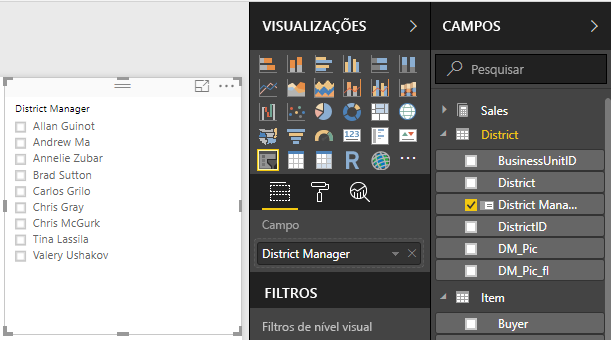
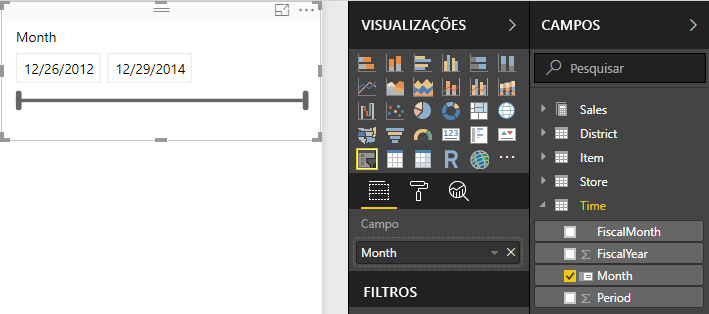
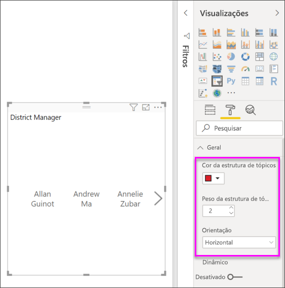

# Segmentação de Dados no Power BI
Seus leitores de relatório devem poder examinar as métricas gerais de vendas, mas também realçar o desempenho de cada gerente regional individual e em diferentes períodos. Você poderia criar relatórios separados ou gráficos comparativos, ou então usar segmentação. Uma segmentação é uma forma alternativa de filtragem que restringe a parte do conjunto de dados que é mostrada em outras visualizações em um relatório. 

Este tutorial usa o [Exemplo de análise de varejo](../sample-retail-analysis.md) gratuito para orientar você a criar, formatar e usar segmentações de listas e intervalos de datas. Divirta-se ao descobrir maneiras de formatar e usar segmentações. 

## Quando usar uma segmentação
As segmentações são uma ótima opção quando você deseja:

* Exibir os filtros mais usados ou importantes na tela do relatório para facilitar o acesso.
* Facilitar a exibição do estado atual filtrado sem precisar abrir uma lista suspensa. 
* Filtrar por colunas que são desnecessárias e que ficam ocultas nas tabelas de dados.
* Criar relatórios mais específicos, colocando as segmentações ao lado de visuais importantes.

As segmentações do Power BI têm as seguintes limitações:

- As segmentações de dados não dão suporte a campos de entrada.
- As segmentações de dados não podem ser anexadas a um dashboard.
- Não há suporte para busca detalhada para segmentações de dados.
- As segmentações não são compatíveis com filtros de nível de visual.

## Criar segmentações

Para criar uma segmentação, selecione o ícone de segmentação e escolha o campo de dados a ser filtrado (ou então, arraste-os para a caixa **Campos** no painel **Visualizações**), selecione ou arraste o campo de dados primeiramente para criar uma visualização e escolha o ícone de segmentação para transformar a visualização em uma segmentação. Tipos de dados diferentes criam tipos diferentes de segmentação, com efeitos e opções também diferentes. 

Na primeira vez que você alterar um relatório, o botão para **Redefinir para padrão** acenderá. Este é um lembrete de que você fez uma alteração nas configurações originais do relatório. Se você sair do relatório, essa alteração será salva (persistirá). Ao retornar ao relatório, você não terá que fatiá-lo novamente.  No entanto, se você deseja redefinir o relatório para as configurações padrão do autor, selecione o botão **Redefinir para padrão** na barra de menus superior.

> [!NOTE]
> Se o botão **Redefinir para padrão** permanecer desabilitado, isso significará que o autor do relatório desabilitou esse recurso ou que o relatório contém um visual personalizado. Basta passar o mouse sobre o botão para ler a dica de ferramenta e obter uma explicação. 

**Para criar uma segmentação para filtrar os dados por gerente regional**

1. No Power BI Desktop ou no serviço do Power BI, abra o [Exemplo de análise de varejo](../sample-retail-analysis.md). (No serviço do Power BI, selecione **Editar Relatório** na parte superior esquerda.)
2. Na página **Visão geral**, sem ter nada selecionado na tela, escolha o ícone **Segmentação**  no painel **Visualizações** para criar uma segmentação. 
3. Com a nova segmentação selecionada, escolha **Gerente regional** em **Distrito** no painel **Campos** para popular a segmentação. A nova segmentação é uma lista com caixas de seleção antes dos nomes. 
    
    
    
4. Redimensione e arraste a segmentação e outros elementos na tela para liberar espaço para a segmentação. Observe que os itens de segmentação serão cortados se, quando você redimensionar a segmentação, ela ficar pequena demais. 
5. Selecione os nomes na segmentação e observe os efeitos sobre as outras visualizações na página. Selecione os nomes novamente para desmarcá-los e mantenha pressionada a tecla **Ctrl** para selecionar mais de um nome. Selecionar todos os nomes tem o mesmo efeito de não selecionar nenhum. 

>[!TIP]
>Itens de segmentação de lista são classificados em ordem alfanumérica crescente por padrão. Para inverter a ordem de classificação para decrescente, selecione as reticências **(…)** no canto superior direito da segmentação e escolha **Classificar por gerente regional** na lista suspensa. 

**Para criar uma segmentação para filtrar os dados por intervalo de datas**

1. Sem nada selecionado na tela, selecione **Hora** no painel Campos e arraste **Mês** (ou **Data** no serviço do Power BI) para a caixa **Valores** no painel Visualizações para criar uma visualização.
2. Com a nova visualização selecionada, escolha o ícone **Segmentação** para converter a nova visualização em uma segmentação. Esta segmentação é um controle deslizante com o intervalo de datas populado.
    
    
    
4. Redimensione e arraste a segmentação e outros elementos na tela para liberar espaço para a segmentação. Observe que o controle deslizante é redimensionado conforme o tamanho da segmentação, mas ele desaparecerá e as datas serão cortadas se a segmentação for redimensionada para um formato pequeno demais. 
4. Selecione intervalos de datas diferentes com o controle deslizante ou escolha um campo de data para digitar um valor ou defini-lo no calendário pop-up para uma seleção mais precisa. Observe como isso afeta as outras visualizações na página.
    
    >[!NOTE]
    >Tipos de dados numéricos e de data/hora produzem segmentações de controle deslizante no intervalo por padrão. A partir da atualização de fevereiro de 2018 do Power BI, controles deslizantes de intervalos de tipos de dados de números inteiros agora transformam os valores em números inteiros em vez de mostrar casas decimais. 

>[!TIP]
>Embora o campo **Mês** produza um tipo de segmentação de controle deslizante de intervalo **Entre** por padrão, é possível alterá-lo para outros tipos de segmentação e opções de seleção. Para alterar o tipo de segmentação, com a segmentação selecionada, passe o mouse sobre a parte superior direita da segmentação, selecione o símbolo mostrado e escolha uma das outras opções, como **Lista** ou **Antes de**. Observe como as opções de aparência e de seleção da segmentação mudam. 

Para obter mais informações sobre como criar e usar segmentações de intervalo numérico e de datas, assista ao vídeo a seguir e consulte [Usar a segmentação de intervalo numérico no Power BI Desktop](../desktop-slicer-numeric-range.md).
<iframe width="560" height="315" src="https://www.youtube.com/embed/zIZPA0UrJyA" frameborder="0" allowfullscreen></iframe> 

## Controlar quais visuais da página são afetados pelas segmentações
Por padrão, as segmentações nas páginas de relatório afetam todas as demais visualizações na página em questão, incluindo umas às outras. Ao escolher valores nas segmentações de lista e de datas criadas, observe o efeito sobre as outras visualizações. Os dados filtrados são uma interseção dos valores selecionados em ambas as segmentações. 

Você pode usar as **Interações visuais** para excluir algumas visualizações de página sejam afetadas por outras. Na página **Visão geral**, o gráfico “Variação de vendas totais por Mês fiscal e Gerente regional” mostra dados comparativos gerais para os Gerentes regionais por Mês, que você deseja manter visíveis sempre. Você pode usar as **Interações visuais** para impedir que as seleções da segmentação filtrem o gráfico. 

1. Com a segmentação de Gerente regional selecionada:
    - No Power BI Desktop, clique no menu **Formatar**, em **Ferramentas Visuais**, e selecione **Editar interações**.
    - No serviço do Power BI, selecione a lista suspensa **Interações visuais**, na barra de menus, e ative **Editar interações**. 
   
   Os controles de filtro  são exibidos acima de todos os outros visuais na página. Inicialmente, todos os ícones de **Filtro** estão selecionados.
   
2. Selecione o ícone **Nenhum** acima do gráfico **Variação do total de vendas por Mês fiscal e Gerente regional** para que a segmentação pare de filtrá-lo. 
3. Selecione a segmentação **Mês** e, novamente, o ícone **Nenhum** acima do gráfico **Variação do total de vendas por Mês fiscal e Gerente regional** para que a segmentação pare de filtrá-lo. Agora, ao selecionar os nomes e os intervalos de datas nas segmentações, o gráfico Variação do total de vendas por Mês fiscal e Gerente regional permanece inalterado. 

Consulte [Interações visuais em um relatório do Power BI](../service-reports-visual-interactions.md) para obter mais informações sobre como editar interações.

## Sincronizar e usar segmentações em outras páginas
Começando com a atualização de fevereiro de 2018 do Power BI, você pode sincronizar uma segmentação e usá-la em uma ou em todas as páginas de um relatório. 

No relatório atual, a página **Vendas mensais do distrito** também tem uma segmentação **Gerente regional**, mas ela não é sincronizada com aqueles criados na página **Visão geral** (as duas segmentações podem ter diferentes seleções de itens). A página **Novas lojas** tem apenas uma segmentação **Nome da loja**. Você pode sincronizar sua nova segmentação **Gerente regional** com essas páginas, para que as seleções da segmentação em qualquer página afetem as visualizações em todas as três páginas. 

1. No menu **Exibir**, selecione **Sincronizar segmentações** no Power BI Desktop (ou ative o **painel Sincronizar segmentações** no serviço do Power BI). O painel **Sincronizar segmentações** é exibido. 
2. Na página **Visão geral**, selecione a segmentação **Gerente regional**. Observe que a página **Vendas mensais do distrito** já está selecionada na coluna **Visível**, porque também há uma segmentação Gerente regional nessa página, mas ela não está selecionada na coluna **Sincronizar**. 
    
    
    
3. Na coluna **Sincronizar**, selecione as páginas **Novas lojas** e **Vendas mensais do distrito** para sincronizar a segmentação **Visão geral** com essas páginas. 
    
3. Na coluna **Visível**, selecione a página **Novas lojas** e deixe a página **Vendais mensais do distrito** selecionada. 
4. Observe os efeitos da sincronização da segmentação e de torná-la visível em outras páginas. Na página **Vendas mensais do distrito**, a segmentação **Gerente regional** agora mostra as mesmas seleções que a página **Visão geral**. Na página **Novas lojas**, as seleções na segmentação **Gerente regional** afeta as seleções que estão disponíveis na segmentação **Nome da loja**. 
    
    >[!TIP]
    >Embora a segmentação inicialmente apareça nas páginas sincronizadas no mesmo tamanho e posição como na página original, você pode mover, redimensionar e formatar as segmentações sincronizadas em várias páginas de forma independente. 

>[!NOTE]
>Se você sincronizar uma segmentação com uma página, mas não a deixar visível nessa página, as seleções de segmentações feitas nas outras páginas ainda filtrarão os dados na página.
 
## Formatar segmentações
Diferentes opções de formatação estão disponíveis dependendo do tipo de segmentação. Usando a orientação **Horizontal**, layout **Dinâmico** e cores **Item**, você pode produzir botões ou blocos em vez de itens de lista padrão e fazer com que os itens da segmentação sejam redimensionados de acordo com diferentes tamanhos de telas e layouts.  

1. Com a segmentação **Gerente regional** selecionada em qualquer página, no painel **Visualizações**, selecione o ícone **Formatar**  para exibir os controles de formatação. 
    
    
    
2. Selecione as setas da lista suspensa ao lado de cada categoria para exibir e editar as opções. 

### Opções gerais
1. Selecione vermelho em **Cor do contorno** e altere a **Espessura do contorno** para "2". Isso define a cor e a espessura dos contornos ou sublinhados do cabeçalho e do item, quando habilitados. 
2. Em **Orientação**, **Vertical** é o padrão. Selecione **Horizontal** para produzir uma segmentação com blocos ou botões na horizontal e role as setas para acessar itens que não cabem na segmentação.
    
    
    
3. Ative o layout **Dinâmico** para alterar o tamanho e a disposição dos itens da segmentação de acordo com tamanho da tela de exibição e da segmentação. Para segmentações de lista, o layout dinâmico só está disponível na orientação horizontal e impede que os itens sejam cortados em telas pequenas. Para segmentações de controle deslizante de intervalo, a formatação dinâmica altera o estilo do controle deslizante e proporciona redimensionamento mais flexível. Ambos os tipos de segmentações se tornam ícones de filtro em tamanhos muito pequenos. 
    
    
    
    >[!NOTE]
    >As alterações de layout dinâmico podem substituir a formatação específica de cabeçalho e de item que você definiu. 
    
4. Defina a posição e o tamanho da segmentação com precisão numérica em **Posição X**, **Posição Y**, **Largura** e **Altura** ou mova e redimensione a segmentação diretamente na tela. Experimente com diferentes tamanhos e disposições, e observe como a formatação dinâmica é alterada de acordo.  

    

Consulte [Criar uma segmentação dinâmica que possa ser redimensionada no Power BI](../power-bi-slicer-filter-responsive.md) para saber mais sobre orientação horizontal e layout dinâmico.

### Opções de controles de seleção (somente segmentações de lista)
1. **Mostrar Selecionar tudo** está **Desativada** por padrão. **Ative-a** para adicionar um item **Selecionar tudo** à segmentação, que marca e desmarca todos os itens quando pressionado. Quando todos os itens estão marcados, clicar ou tocar em um item o desmarca, funcionando como um filtro do tipo “não é”. 
    
    
    
2. A **Seleção única** fica **Ativa** por padrão. Clicar ou tocar em cada item o seleciona, e manter a tecla **Ctrl** pressionada ao fazer isso seleciona vários itens. **Desative** a **Seleção única** para permitir a marcação de vários itens sem precisar manter a tecla **Ctrl** pressionada. Se você clicar ou tocar em cada item novamente, ele será desmarcado. 

### Opções de cabeçalho
O **Cabeçalho** fica **Ativado** por padrão, mostrando o nome do campo de dados na parte superior da segmentação. 
1. Formate o texto do cabeçalho para usar a **Cor da fonte** vermelha, o **Tamanho do texto** em 14 pontos e a **Família de fontes** Arial Black. 
2. Em **Contorno**, escolha **Somente inferior** para produzir um sublinhado com o tamanho e a cor definidos nas opções **Gerais**. 

### Opções de item (somente em segmentações de lista)
1. Formate o texto e a tela de fundo do item para usar a **Cor da fonte** preta, a **Tela de fundo** vermelha clara, o **Tamanho do texto** em 10 pontos e a **Família de fontes** Arial. 
2. Em **Contorno**, escolha **Quadro** para desenhar uma borda ao redor de cada item com o tamanho e cor definidos nas opções **Gerais**. 
    
    
    
    >[!TIP]
    >- Com **Orientação > Horizontal**, os itens desmarcados mostram as cores do texto e da tela de fundo selecionados, enquanto que os itens selecionados usam o padrão do sistema, geralmente telas de fundo de cor preta com texto em branco.
    >- Com a **Orientação > Vertical**, os itens sempre mostram as cores definidas e as caixas de seleção ficam sempre pretas quando marcadas. 

### Entradas de data/numéricas e opções de controle deslizante (somente segmentações de controle deslizante de intervalo)
- As opções de entrada de data/numérica são as mesmas das opções de **Item** para segmentação de lista, exceto que não há nenhum **Contorno** ou sublinhado.
- As opções de controle deslizante permitem definir a cor do controle deslizante de intervalo ou **Desativá-lo**, deixando apenas as entradas numéricas.

### Outras opções de formatação
As outras opções de formatação ficam desativadas por padrão. Quando **Ativadas**: 
- **Título:** Adiciona e formata um título (além do cabeçalho e independente dele) na parte superior da segmentação. 
- **Tela de fundo:** Adiciona uma cor da tela de fundo para a segmentação geral e define a transparência.
- **Fixar proporção:** Retém a forma da segmentação se ela for redimensionada.
- **Borda:** Adiciona uma borda de 1 pixel em torno da segmentação e define sua cor. (Essa borda da segmentação é separada e não é afetada pelas configurações do Contorno Geral). 

## Próximas etapas
[Tipos de visualização no Power BI](power-bi-visualization-types-for-reports-and-q-and-a.md)

[Tabelas no Power BI](power-bi-visualization-tables.md)

