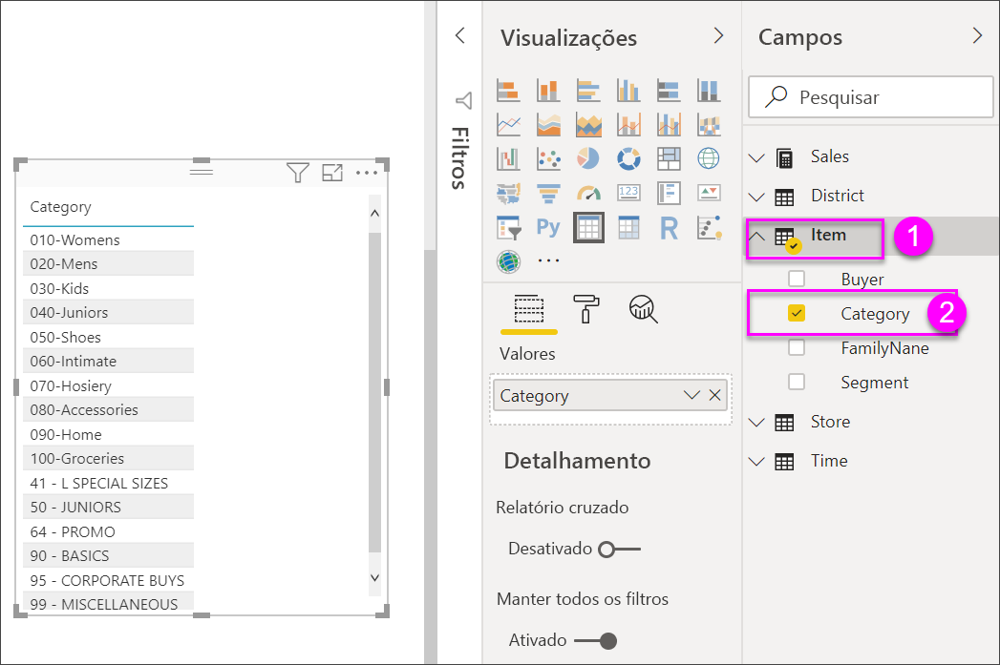
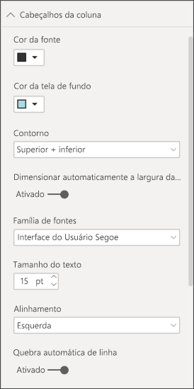
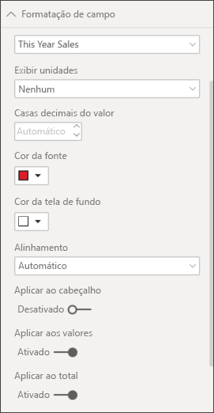
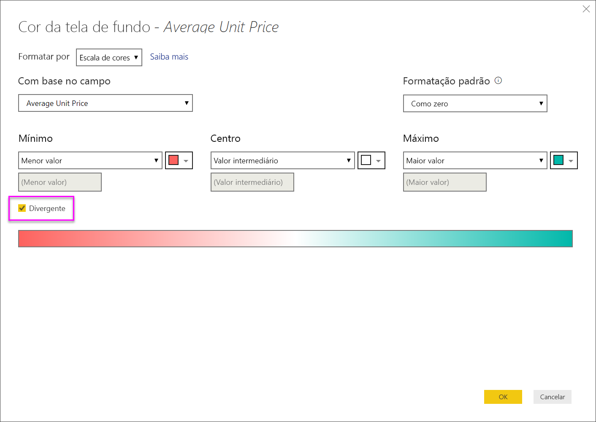
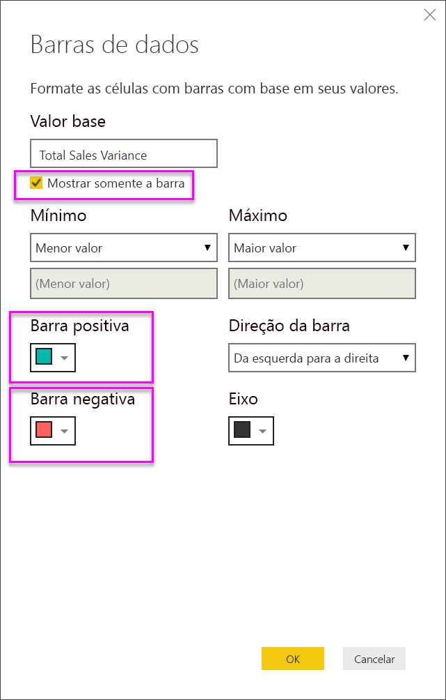

# Tabelas em relatórios e dashboards do Power BI
Uma tabela é uma grade que contém dados relacionados em uma série de lógica de linhas e colunas. Ela também pode conter cabeçalhos e linhas de totais. As tabelas funcionam bem com comparações quantitativas em que você observa muitos valores de uma única categoria. Por exemplo, esta tabela exibe 5 medidas diferentes para a **Categoria**.

Crie tabelas em relatórios e elementos com realce cruzado dentro da tabela com outros visuais na mesma página de relatório.  Além disso, você pode selecionar linhas, colunas e até mesmo células individuais e realce cruzado. As células individuais e várias seleções de célula podem ser copiadas e coladas em outros aplicativos.

## Quando usar uma tabela
As tabelas são uma ótima opção:

* para ver e comparar dados detalhados e valores exatos (em vez de representações visuais)
* para exibir dados em um formato tabular
* para exibir dados numéricos por categorias   

> [!NOTE]
> Se uma tabela tiver muitos valores, considere a possibilidade de convertê-la em uma matriz e/ou utilizar a análise detalhada. O máximo de pontos de dados que uma tabela exibirá é de 3.500.

## Pré-requisitos
- Serviço do Power BI ou Power BI Desktop
- Exemplo de análise de varejo

## Criar uma tabela
Vamos criar a tabela mostrada acima para exibir valores de vendas por categoria de item. Para acompanhar, entre no serviço Power BI e selecione **Obter Dados \> Exemplos \> Exemplo de Análise de Varejo > Conectar** e escolha **Ir para o dashboard**. Criar uma visualização requer permissões de edição para o conjunto de dados e o relatório. Felizmente, os exemplos do Power BI são todos editáveis. Se um relatório tiver sido compartilhado com você, você não poderá criar visualizações em relatórios.

1. No painel de navegação esquerdo, selecione **Workspaces &gt; Meu workspace**.    
2. Selecione a guia Conjuntos de dados e role para baixo até o conjunto de dados Exemplo de Análise de Varejo recém-criado.  Selecione o ícone **Criar relatório**.

    
2. No editor de relatórios, selecione **Item** > **Categoria**.  O Power BI cria automaticamente uma tabela que lista todas as categorias.

    
3. Selecione **Vendas > Preço da unidade médio**, **Vendas > Vendas do último ano** e **Vendas > Vendas deste ano** e escolha todas as três opções (Valor, Meta, Status).   
4. No painel de Visualizações, localize a seção **Valores** e arraste e solte os valores até que a ordem das colunas do gráfico correspondam à primeira imagem nesta página.  A seção Valores deve ficar com esta aparência.

    
5. Fixe a tabela ao painel, selecionando o ícone de fixar  

     

## Formatar a tabela
Há muitas maneiras de formatar uma tabela e nós só abordaremos algumas delas. Uma ótima maneira de conhecer outras opções de formatação é abrir o painel Formatação (ícone de ) e explorar.

* Experimente formatar a grade de tabela. Aqui nós adicionamos uma grade vertical azul, adicionamos espaço às linhas, aumentamos a estrutura de tópicos e o tamanho do texto um pouco.

    

    
* Para os cabeçalhos da coluna, alteramos a cor da tela de fundo, adicionamos uma estrutura de tópicos e aumentamos o tamanho da fonte. 

    

    

* Você pode até mesmo aplicar formatação a colunas individuais e cabeçalhos de coluna. Comece expandindo **Formatação de campo** e selecionando a coluna para formatar na lista suspensa. Dependendo dos valores de coluna, a formatação de campo permite definir coisas como: unidades de exibição, cor da fonte, o número de casas decimais, plano de fundo, alinhamento e muito mais. Depois que você tiver ajustado as configurações, decida se deseja aplicar essas configurações também para o cabeçalho e a linha de totais.

    

* E depois de uma formatação adicional, veja nossa tabela definitiva. Como há muitas opções de formatação, a melhor maneira de aprender é começar com a formatação padrão, abrir o painel de formatação  e começar a explorar. 

    

### Formatação condicional
Um tipo de formatação é conhecido como *formatação condicional* e aplica-se a campos em **Valores** no painel **Visualizações** no serviço do Power BI ou Desktop. 

Com a formatação condicional para tabelas, você pode especificar as cores da tela de fundo de células personalizadas e as cores das fontes com base nos valores da célula, inclusive usando cores de gradiente. 

1. No painel **Visualizações** no serviço do Power BI ou Desktop, selecione a seta para baixo ao lado do valor em **Valores** que você deseja formatar (ou clique com o botão direito do mouse no campo). Você pode gerenciar somente a formatação condicional para campos na área **Valores** também em **Campos**.

    
2. Selecione **Escalas de cores da tela de fundo**. Na caixa de diálogo que aparece, você pode definir a cor, bem como os valores *Mínimo* e *Máximo*. Se selecionar a caixa **Divergente**, você também poderá configurar um valor opcional para o *Centro*.

    

    Vamos aplicar uma formatação personalizada aos valores de Preço unitário médio. Selecione **Divergente**, adicione algumas cores e escolha **OK**. 

    
3. Adicione um novo campo à tabela que tem valores positivos e negativos.  Selecione **Campos > Variação do Total de Vendas**. 

    
4. Adicione formatação condicional de barra de dados selecionando a seta para baixo ao lado de **Variação do Total de Vendas** e escolhendo **Formatação condicional > Barras de dados**.

    
5. Na caixa de diálogo exibida, defina cores para **barra positiva**, **barra negativa**, marque a caixa de seleção ao lado de **Mostrar apenas a barra** e faça outras alterações desejadas.

    

    Quando você seleciona **OK**, as barras de dados substituem os valores numéricos na tabela, facilitando a verificação.

    
6. Para remover a formatação condicional de uma visualização, basta clicar com o botão direito do mouse no campo novamente e selecionar **Remover formatação condicional**.

> [!TIP]
> A formatação condicional também está disponível no painel Formatação (ícone de rolo de tinta). Selecione o valor a ser formatado e, em seguida, defina **Escalas de cores** ou **Barras de dados** como **Ativado** para aplicar as configurações padrão ou, para personalizar as configurações, selecione **Controles avançados**.
> 
## Copiar valores de tabelas do Power BI para uso em outros aplicativos

Sua tabela ou matriz pode ter conteúdo que você gostaria de usar em outros aplicativos, como Dynamics CRM, Excel e até mesmo outros relatórios do Power BI. Clicando com o botão direito do mouse no Power BI, é possível copiar uma única célula ou uma seleção de células em sua área de transferência e colar em outro aplicativo.

* Para copiar o valor de uma única célula, selecione-a, clique com o botão direito do mouse e escolha **Copiar valor**. Com o valor de célula não formatado em sua área de transferência, agora é possível colá-lo em outro aplicativo.

    

* Para copiar mais de uma única célula, selecione uma variedade de células ou use CTRL para selecionar uma ou mais células. A cópia incluirá os cabeçalhos da coluna e da linha.

    

    A cópia inclui os cabeçalhos da coluna e da linha.

    

## Ajustar a largura da coluna de uma tabela
Às vezes, o Power BI vai truncar um título de coluna em um relatório e em um painel. Para mostrar todo o nome da coluna, passe o mouse sobre o espaço à direita do título para revelar as setas duplas, selecionar e arrastar.

## Considerações e solução de problemas
* Ao aplicar a formatação de coluna, só é possível escolher uma opção de alinhamento por coluna: Automático, Esquerda, Centro, Direita. Normalmente, uma coluna contém todo o texto ou todos os números, e não uma combinação. Nos casos em que uma coluna contiver números e texto, **Auto** será alinhado à esquerda para texto e à direita para números. Esse comportamento dá suporte a idiomas em que a leitura ocorre da esquerda para a direita.   

## Próximas etapas

[Mapas de árvore no Power BI](power-bi-visualization-treemaps.md)

[Tipos de visualização no Power BI](power-bi-visualization-types-for-reports-and-q-and-a.md)