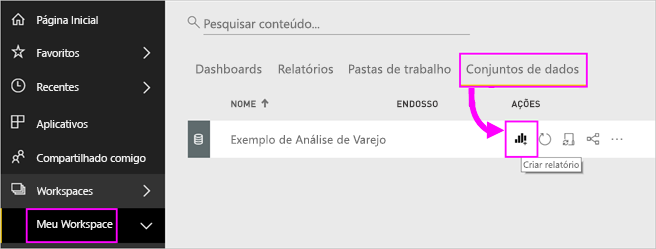
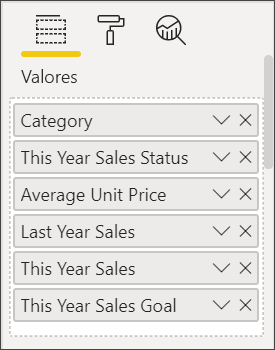
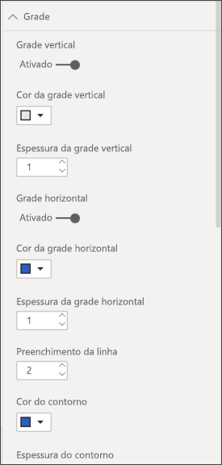
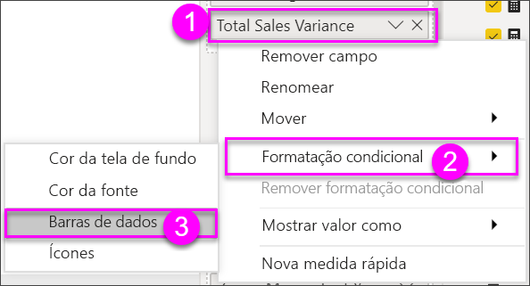
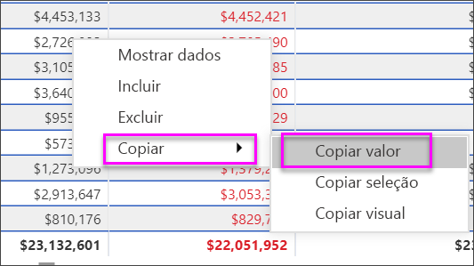
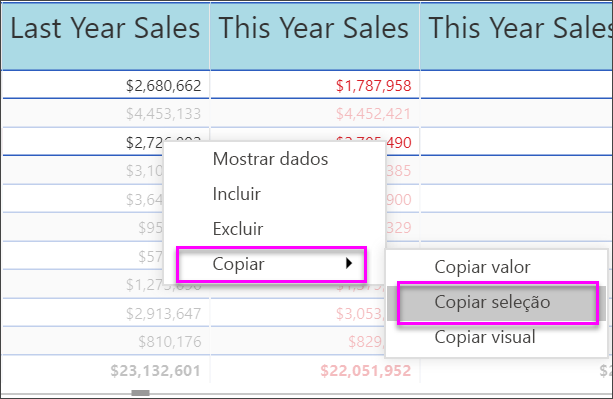

# Tabelas em relatórios e dashboards do Power BI

Uma tabela é uma grade que contém dados relacionados em uma série de lógica de linhas e colunas. Ela também pode conter cabeçalhos e linhas de totais. As tabelas funcionam bem com comparações quantitativas em que você observa muitos valores de uma única categoria. Por exemplo, esta tabela exibe cinco medidas diferentes para a **Categoria**.

Crie tabelas em relatórios e elementos com realce cruzado dentro da tabela com outros visuais na mesma página de relatório. Você pode selecionar linhas, colunas e até mesmo células individuais e realce cruzado. Além disso, é possível copiar e colar a células individuais e várias seleções de célula em outros aplicativos.

## Quando usar uma tabela

As tabelas são uma ótima opção:

* Para ver e comparar dados detalhados e valores exatos (em vez de representações visuais).

* Para exibir dados em um formato tabular.

* Para exibir dados numéricos por categorias.

## Pré-requisitos

* O serviço do Power BI ou o Power BI Desktop

* Relatório Exemplo de Análise de Varejo

## Obter o relatório de exemplo de Análise de Varejo

Essas instruções usam o exemplo de análise de varejo. Criar uma visualização requer permissões de edição para o conjunto de dados e o relatório. Felizmente, os exemplos do Power BI são todos editáveis. Se alguém compartilhar um relatório com você, é possível criar visualizações em relatórios. Para acompanhar, obtenha o [Relatório de exemplo de Análise de Varejo](../sample-datasets.md).

Após obter o conjunto de dados do **Exemplo de Análise de Varejo**, você pode começar a usar.

## Criar uma tabela

Crie a tabela mostrada no início do artigo para exibir valores de vendas por categoria de item.

1. No **Meu Espaço de Trabalho**, selecione **Conjuntos de dados** > **Criar um relatório**.

    

1. No painel **Campos**, selecione **Item** > **Categoria**.

    O Power BI cria automaticamente uma tabela que lista todas as categorias.

    

1. Selecione **Vendas > Preço da unidade médio** e **Vendas > Vendas do ano passado**

1. Em seguida, selecione **Vendas > Vendas deste ano** e selecione todas as três opções: **Valor**, **Meta** e **Status**.

1. No painel de **Visualizações**, localize a caixa **Valore** e solte os valores até que a ordem das colunas do gráfico correspondam à primeira imagem nesta página. A caixa **Valores** deve ficar com esta aparência:

    

1. Fixe a tabela ao painel, selecionando o ícone de fixar  no canto superior direito do visual.

## Formatar a tabela

Há muitas maneiras de formatar uma tabela. Apenas algumas são abordadas aqui. Uma ótima maneira de conhecer outras opções de formatação é abrir o painel **Formato** (ícone de rolo de pintura ) e explorar.

* Experimente formatar a grade de tabela. Aqui você adicionará uma grade vertical azul, espaço às linhas, aumentará a estrutura de tópicos e o tamanho do texto.

    

    

* Para os cabeçalhos da coluna, altere a cor da tela de fundo, adicione uma estrutura de tópicos e aumente o tamanho da fonte.

    

    

* Você pode até mesmo aplicar formatação a colunas individuais e cabeçalhos de coluna. Comece expandindo **Formatação de campo** e selecionando a coluna para formatar na lista suspensa. Dependendo dos valores de coluna, a **Formatação de campo** permite definir coisas como: unidades de exibição, cor da fonte, o número de casas decimais, plano de fundo, alinhamento e muito mais. Depois que você tiver ajustado as configurações, decida se deseja aplicar essas configurações também para o cabeçalho e a linha de totais.

    

    

* Depois de uma formatação adicional, veja nossa tabela definitiva.

    

### Formatação condicional

*Formatação condicional* é um tipo de formatação. O Power BI aplica formatação condicional a campos na caixa **Valores** do painel **Visualizações**.

Com a formatação condicional para tabelas, você pode especificar as cores da tela de fundo de células personalizadas e as cores das fontes com base nos valores da célula, inclusive usando cores de gradiente.

1. No painel **Visualizações**, selecione o ícone **Campos** .

1. Selecione a seta para baixo ao lado do valor na caixa **Valores** que você deseja formatar (ou clique com o botão direito do mouse no campo).

    > [!NOTE]
    > Você pode gerenciar somente a formatação condicional para campos na área **Valores** também em **Campos**.

    

1. Selecione **Cor da tela de fundo**.

1. Na caixa de diálogo que aparece, você pode configurar a cor, e os valores **Mínimo** e **Máximo**. Se selecionar a opção **Divergente**, você também poderá configurar um valor opcional para o **Centro**.

    

    Vamos aplicar uma formatação personalizada aos valores de Preço unitário médio. Selecione **Divergente**, adicione algumas cores e selecione **OK**.

    
1. Adicione um novo campo à tabela que tem valores positivos e negativos. Selecione **Campos > Variação do Total de Vendas**.

    

1. Adicione formatação condicional de barra de dados selecionando a seta para baixo ao lado de **Variação do Total de Vendas** e escolhendo **Formatação condicional > Barras de dados**.

    

1. Na caixa de diálogo exibida, defina cores para **Barra positiva**, **Barra negativa**, selecione a opção **Mostrar apenas a barra** e faça outras alterações desejadas.

    

1. Selecione **OK**.

    As barras de dados substituem os valores numéricos na tabela, facilitando a verificação.

    

Se desejar remover a formatação condicional de uma visualização, clique com o botão direito do mouse no campo novamente e selecione **Remover formatação condicional**.

> [!TIP]
> A formatação condicional também está disponível no painel **Formato**. Selecione o valor a ser formatado e, em seguida, defina **Escalas de cores** ou **Barras de dados** como **Ativado** para aplicar as configurações padrão ou, para personalizar as configurações, selecione **Controles avançados**.

## Copiar valores de tabelas do Power BI para uso em outros aplicativos

Sua tabela ou matriz pode ter conteúdo que você gostaria de usar em outros aplicativos, como Dynamics CRM, Excel e até mesmo outros relatórios do Power BI. No Power BI, ao clicar com o botão direito do mouse em uma célula, é possível copiar os dados em uma única célula ou uma seleção de células em sua área de transferência e colar em outros aplicativos.

Para copiar o valor de uma única célula:

1. Selecione a célula que você deseja copiar.

1. Clique com o botão direito do mouse na célula.

1. Selecione **Copiar** > **Copiar valor**.

    

    Com o valor de célula não formatado em sua área de transferência, é possível colá-lo em outro aplicativo.

Para copiar mais de uma única célula:

1. Selecione uma variedade de células ou use **Ctrl** para selecionar uma ou mais células.

1. Clique com botão direito do mouse em uma das células selecionadas.

1. Selecione **Copiar** > **Copiar seleção**.

    

    A cópia inclui os cabeçalhos da coluna e da linha.

    

## Ajustar a largura da coluna de uma tabela

Às vezes, o Power BI vai truncar um título de coluna em um relatório e em um painel. Para mostrar todo o nome da coluna, passe o mouse sobre o espaço à direita do título para revelar as setas duplas, selecionar e arrastar.

## Considerações e solução de problemas

Ao aplicar a formatação de coluna, só é possível escolher uma opção de alinhamento por coluna: **Automático**, **Esquerda**, **Centro**, **Direita**. Normalmente, uma coluna contém todo o texto ou todos os números, e não uma combinação. Nos casos em que uma coluna contiver números e texto, **Auto** será alinhado à esquerda para texto e à direita para números. Esse comportamento dá suporte a idiomas em que a leitura ocorre da esquerda para a direita.

## Próximas etapas

* [Mapas de árvore no Power BI](power-bi-visualization-treemaps.md)

* [Tipos de visualização no Power BI](power-bi-visualization-types-for-reports-and-q-and-a.md)
