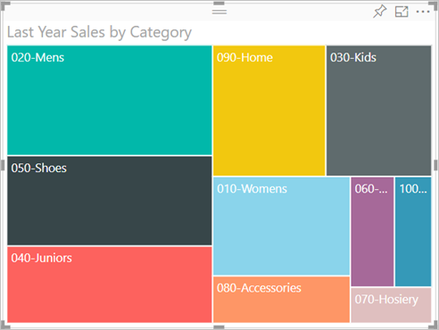
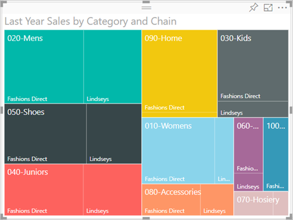
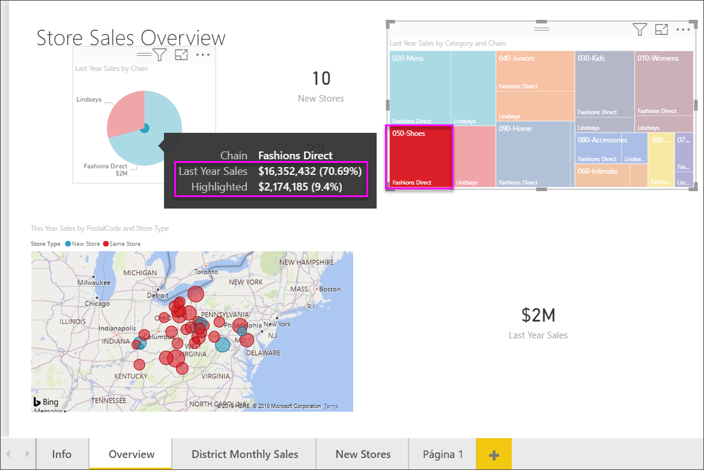

# Mapas de árvore no Power BI
O treemaps exibe dados hierárquicos, como um conjunto de retângulos aninhados.  Cada nível da hierarquia é representado por um retângulo colorido (muitas vezes chamado uma "ramificação") que contém outros retângulos ("folhas").  O espaço dentro de cada retângulo é alocado com base no valor que está sendo medido. E os retângulos são organizados no tamanho da parte superior esquerda (maior) à parte inferior direita (menor).

Por exemplo, se eu estou analisando as minhas vendas, posso ter retângulos de nível superior, também chamados de *ramificações*, para as categorias de vestuário: **Urbano**, **Rural**, **Jovem** e **Misto**.  Meus retângulos de categoria devem ser divididos em retângulos menores, também chamados de *folhas*, para os fabricantes de roupas nessa categoria. E esses retângulos menores seriam dimensionados e sombreados com base no número de itens vendidos.  

Na ramificação **Urbana** acima, muitas roupas `Maximus` foram vendidas, menos `Natura` e `Fama` e alguns `Leo`.  Portanto, a ramificação **Urbana** do meu Mapa de árvore teria:
* o maior retângulo para `Maximus` no canto superior esquerdo
* retângulos levemente menores para `Natura` e `Fama`
* muitos outros retângulos para todas as outras roupas vendidas e 
* um pequeno retângulo para `Leo`.  

E eu poderia comparar o número de itens vendidos em outras categorias de roupas comparando o tamanho e o sombreamento de cada nó folha; retângulos maiores e mais escuros indicam valor mais alto.

## Quando usar um mapa de árvore
Os treemps são uma ótima opção:

* para exibir grandes quantidades de dados hierárquicos.
* Quando um gráfico de barras não puder lidar efetivamente com grande número de valores.
* para mostrar as proporções entre cada parte e o todo.
* para mostrar o padrão da distribuição da medida em cada nível das categorias na hierarquia.
* para mostrar atributos usando a codificação de cor e tamanho.
* para identificar padrões, exceções, colaboradores mais importantes e exceções.

### Pré-requisitos
 - Serviço do Power BI ou Power BI Desktop
 - Exemplo de análise de varejo

## Criar um mapa de árvore básico
Deseja ver alguém criar um mapa de árvore primeiro?  Pule para 2:10 neste vídeo para assistir Amanda criar um mapa de árvore.

<iframe width="560" height="315" src="https://www.youtube.com/embed/IkJda4O7oGs" frameborder="0" allowfullscreen></iframe>

Se preferir, crie seu próprio mapa de árvore. Essas instruções usam o exemplo de análise de varejo. Para acompanhar, entre no serviço Power BI e selecione **Obter Dados \> Exemplos \> Exemplo de Análise de Varejo \> Conectar \> Ir para o dashboard**. Criar uma visualização em um relatório requer permissões de edição para o conjunto de dados e o relatório. Felizmente, os exemplos do Power BI são editáveis. No entanto, você não pode adicionar visualizações a um relatório que alguém compartilhou com você.  

1. Selecione o bloco "Armazenamentos Totais" para abrir o relatório Exemplo de Análise de Varejo.    
2. Abra o [Modo de Exibição de Edição](../service-interact-with-a-report-in-editing-view.md) e selecione a medida **Vendas** > **Vendas do Ano Passado**.   
      
3. Converta o gráfico em um mapa de árvore.  
      
4. Arraste **Item** > **Categoria** para a seção **Grupo**. O Power BI cria um mapa de árvore no qual o tamanho dos retângulos se baseia no total de vendas e a cor representa a categoria.  Na essência que você criou uma hierarquia que descreve visualmente o tamanho relativo do total de vendas por categoria.  A categoria **Masculino** tem as maiores vendas e categoria **Meias e Roupa Íntima** tem as vendas mais baixas.   
      
5. Arraste **Repositório** > **Cadeia** para a seção **Detalhes** para concluir o mapa de árvore. Agora você pode comparar as vendas do ano passado por categoria e cadeia.   
   
   
   > [!NOTE]
   > Saturação da cor e os Detalhes não podem ser usados ao mesmo tempo.
   > 
   > 
5. Focalize uma área **Rede** para revelar a dica de ferramenta para essa parte da **Categoria**.  Por exemplo, focalizando **Fashions Direct** no retângulo **090-Home** revela a dica de ferramenta para a parte Fashion Direct da categoria de Home.  
   
6. [Adicione o mapa de árvore como um bloco do dashboard (fixe o visual)](../service-dashboard-tiles.md). 
7. [Salve o relatório](../service-report-save.md).

## Realce e filtragem cruzada
Para obter informações sobre como usar o painel Filtros, veja [Adicionar um filtro a um relatório](../power-bi-report-add-filter.md).

Realçar uma Categoria ou Detalhe em um mapa de árvore filtra e destaca de forma cruzada as outras visualizações na página do relatório e vice-versa. Para acompanhar, adicione alguns elementos visuais para esta página de relatório ou copie o mapa de árvore para uma das outras páginas que não está em branco neste relatório.

1. No mapa de árvore, selecione uma categoria ou uma cadeia de dentro de uma categoria.  Isso destaca de forma cruzada as outras visualizações na página. Selecionando **050-Shoes**, por exemplo, mostra que as vendas do ano passado de sapatos foram $3.640,471 com US $2.174.185 disso proveniente de Fashions Direct.  
   

2. No gráfico de pizza das **Últimas vendas do ano por cadeia**, selecionar a fatia **Fashions Direct** realiza a filtragem cruzada de um mapa de árvore.  
       

3. Para gerenciar como os gráficos são filtrados e realçados de forma cruzada entre si, veja [Interações de visualização em um relatório do Power BI](../service-reports-visual-interactions.md)

## Próximas etapas

[Gráficos de cascata no Power BI](power-bi-visualization-waterfall-charts.md)

[Tipos de visualização no Power BI](power-bi-visualization-types-for-reports-and-q-and-a.md)