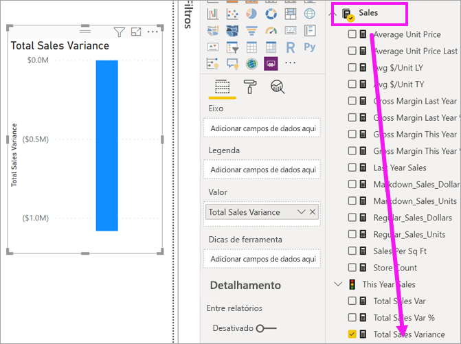
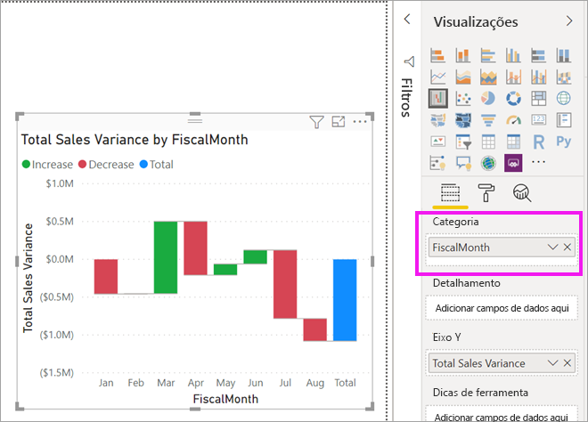
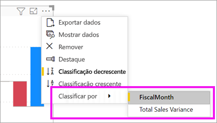
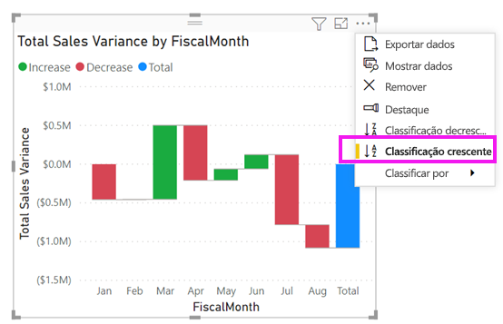
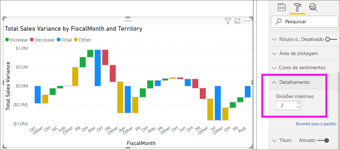

# Gráficos de cascata no Power BI

[!INCLUDE[consumer-appliesto-nyyn](../includes/consumer-appliesto-nyyn.md)]

[!INCLUDE [power-bi-visuals-desktop-banner](../includes/power-bi-visuals-desktop-banner.md)]

Os gráficos de cascata mostram o total em execução à medida que o Power BI adiciona ou subtrai valores. São úteis para entender como um valor inicial (como a receita líquida) é afetado por uma série de alterações positivas e negativas.

As colunas são codificadas por cores para que você possa notar rapidamente aumentos e diminuições. As colunas dos valores inicial e final às vezes [começam no eixo horizontal](https://support.office.com/article/Create-a-waterfall-chart-in-Office-2016-for-Windows-8de1ece4-ff21-4d37-acd7-546f5527f185#BKMK_Float "iniciar no eixo horizontal"), enquanto os valores intermediários são colunas flutuantes. Devido a esse estilo, os gráficos de cascata também são chamados de gráficos de ponte.

## Quando usar um gráfico de cascata

Os gráficos de cascata são uma ótima opção:

* Quando houver alterações para a medida ao longo do tempo, uma série ou categorias diferentes.

* Para auditar as principais alterações que contribuem para o valor total.

* Para traçar o lucro anual da empresa, mostrando várias fontes de receita e chegar ao lucro total (ou perda).

* Para ilustrar o início e final do número de funcionários de sua empresa em um ano.

* Para visualizar a quantidade de dinheiro produzida e gasta todo mês, e o balanço de sua conta.

## Pré-requisito

Este tutorial usa o [arquivo PBIX de exemplo de Análise de Varejo](https://download.microsoft.com/download/9/6/D/96DDC2FF-2568-491D-AAFA-AFDD6F763AE3/Retail%20Analysis%20Sample%20PBIX.pbix).

1. Na seção superior esquerda da barra de menus, selecione **Arquivo** > **Abrir**
   
2. Encontre sua cópia do **arquivo PBIX de exemplo de Análise de Varejo**

1. Abra o **arquivo PBIX de exemplo de Análise de Varejo** na exibição de relatório .

1. Selecionar  para adicionar uma nova página.

> [!NOTE]
> Compartilhar seu relatório com um colega do Power BI exige que você tenha licenças de Power BI Pro individuais ou que o relatório seja salvo na capacidade Premium.    

## Criar um gráfico de cascata

Crie um gráfico de cascata que exibe a variação de vendas (vendas estimadas versus vendas reais) por mês.

### Criar o gráfico de cascata

1. No painel **Campos**, selecione **Vendas** > **Variação do Total de Vendas**.

   

1. Selecione o ícone de cascata 

    

1. Selecione **Hora** > **FiscalMonth** para adicioná-la à caixa **Categoria**.

    

### Classificar o gráfico de cascata

1. Certifique-se de que o Power BI classifique o gráfico de cascata em ordem cronológica por mês. No canto superior direito do gráfico, selecione **Mais opções** (...).

    Para este exemplo, selecione **Classificar por** e escolha **FiscalMonth**. Um indicador amarelo ao lado de sua seleção indica quando a opção de seleção está sendo aplicada.

    
    
    Para exibir os meses em ordem cronológica, selecione **Classificação crescente**. Assim como na etapa anterior, verifique se há um indicador amarelo ao lado esquerdo de **Classificação crescente**. Isso indica que a opção selecionada está sendo aplicada.

    

    

    Observe que seu gráfico está classificado de janeiro a agosto com relação ao FiscalMonth.  

### Explorar o gráfico de cascata

Aprofunde-se um pouco mais para ver o que está contribuindo mais para as alterações a cada mês.

1.  Selecione **Repositório** > **Território**, que adicionará **Território** ao bucket **Divisão**.

    

    O Power BI usa o valor em **Divisão** para adicionar mais dados à visualização. Ele adiciona os cinco principais colaboradores dos aumentos ou diminuições para cada mês fiscal. Isso significa que fevereiro, por exemplo, agora tem seis pontos de dados, em vez de apenas um.  

    

    Digamos que você esteja interessado apenas nos dois colaboradores principais.

1. No painel **Formato**, selecione **Divisão** e defina **Divisões máximas** para **2**.

    

    Uma rápida análise revela que as regiões de Ohio e Pensilvânia são os maiores colaboradores para a movimentação, negativa e positiva, em nosso gráfico de cascata.

    

## Próximas etapas

* [Alterar como os visuais interagem em um relatório do Power BI](../service-reports-visual-interactions.md)

* [Tipos de visualização no Power BI](power-bi-visualization-types-for-reports-and-q-and-a.md)
