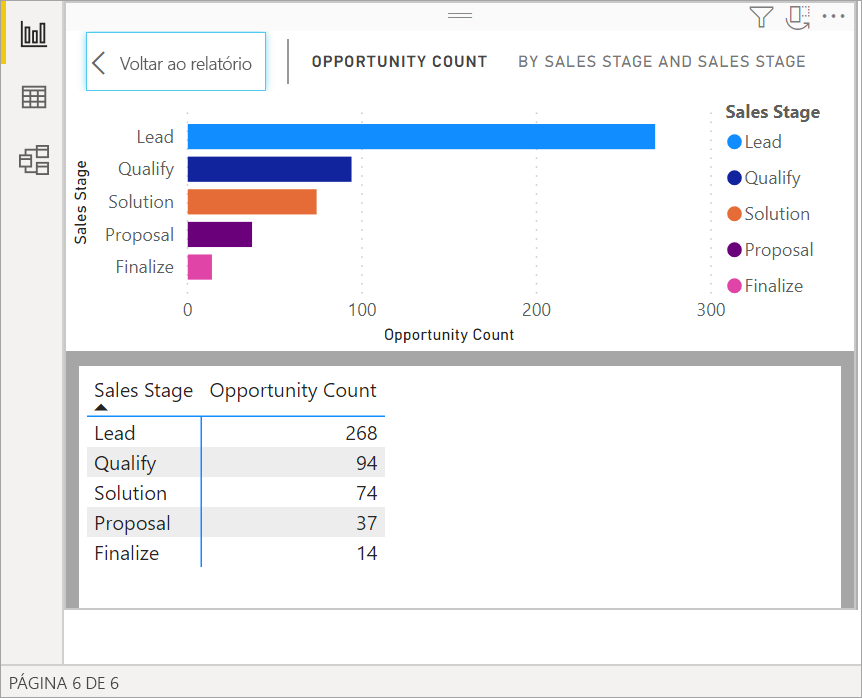
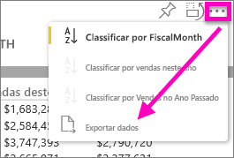
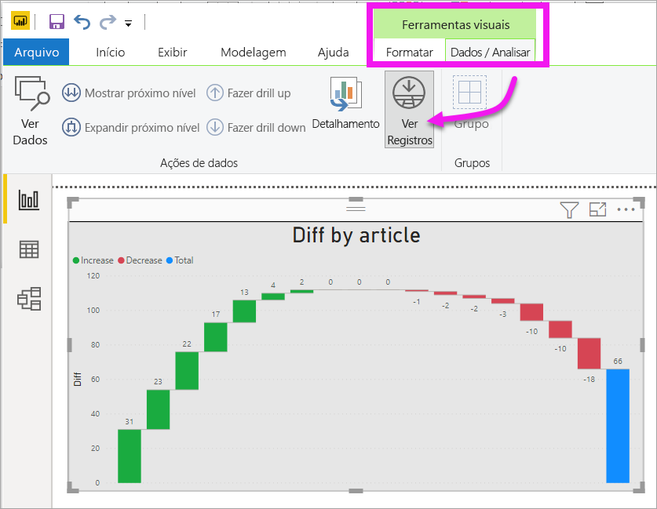

# Exibir os dados subjacentes de uma visualização

## Mostrar dados
Uma visualização do Power BI é construída usando dados dos conjuntos de dados. Se você estiver interessado em ver o que acontece nos bastidores, o Power BI permitirá *exibir* os dados usados para criar o visual. Ao selecionar **Mostrar Dados**, o Power BI exibirá os dados abaixo (ou ao lado) da visualização.

Você também pode exportar os dados usados para criar a visualização como um arquivo .xlsx ou .csv e exibi-los no Excel. Para obter mais informações, consulte [Exportar dados de visualizações do Power BI](power-bi-visualization-export-data.md).

> [!NOTE]
> As opções *Mostrar Dados* e *Exportar Dados* estão disponíveis no serviço do Power BI e no Power BI Desktop. No entanto, o Power BI Desktop fornece uma camada adicional de detalhes; [*Mostrar Registros* exibe as linhas reais do conjunto de dados](../desktop-see-data-see-records.md).
> 
> 

## Como usar *Mostrar Dados* 
1. No Power BI Desktop, selecione uma visualização para torná-la ativa.

2. Selecione **Mais ações** (...) e escolha **Mostrar dados**. 
    

3. Por padrão, os dados são exibidos abaixo do visual.
   
   

4. Para alterar a orientação, selecione o layout vertical  no canto superior direito da visualização.
   
   
5. Para exportar os dados para um arquivo .csv, selecione as elipses e escolha **Exportar dados**.
   
    
   
    Para obter mais informações sobre como exportar os dados para o Excel, consulte [Exportar dados de visualizações do Power BI](power-bi-visualization-export-data.md).
6. Para ocultar os dados, desmarque **Explorar** > **Mostrar dados**.

## Como usar Mostrar registros
Também é possível enfocar um registro de dados em uma visualização e detalhar os dados atrás dele. 

1. Para usar **Ver registros**, selecione uma visualização para torná-la ativa. 

2. Na faixa de opções Área de Trabalho, selecione a guia para **Ferramentas visuais** > **Dados/Análise** > **Ver registros**. 

    

3. Selecione um ponto de dados ou linha na visualização. Neste exemplo, selecionamos a quarta coluna da esquerda. O Power BI nos mostra o registro do conjunto de dados para esse ponto de dados.

    

4. Selecione **Voltar para o relatório** para retornar à tela de relatório da Área de Trabalho. 

## Considerações e solução de problemas

- Se o botão **Ver registros** na faixa de opções estiver desabilitado e esmaecido, isso significará que a visualização selecionada não oferece suporte a Ver Registros.
- Você não pode alterar os dados na exibição Ver Registros e salvá-los novamente no relatório.
- Não é possível usar Ver Registros quando seu visual usa uma medida calculada.
- Não é possível usar Ver Registros quando você está conectado a um modelo MD (multidimensional) dinâmico.  

## Próximas etapas
[Exportar dados de visualizações do Power BI](power-bi-visualization-export-data.md)    

Mais perguntas? [Experimente a Comunidade do Power BI](https://community.powerbi.com/)

