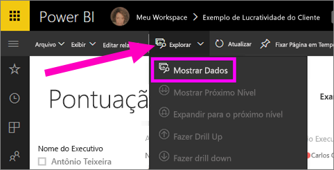
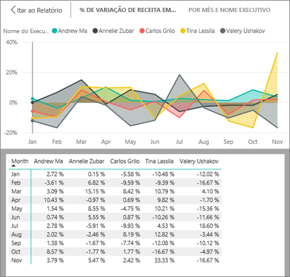

# Mostrar dados que foram usados para criar a visualização
## Mostrar dados
Uma visualização do Power BI é construída usando dados dos conjuntos de dados. Se você estiver interessado em ver o que acontece nos bastidores, o Power BI permitirá *exibir* os dados usados para criar o visual. Ao selecionar **Mostrar Dados**, o Power BI exibirá os dados abaixo (ou ao lado) da visualização.

Você também pode exportar os dados usados para criar a visualização como um arquivo .xlsx ou .csv e exibi-los no Excel. Para obter mais informações, consulte [Exportar dados de visualizações do Power BI](power-bi-visualization-export-data.md).

> [!NOTE]
> As opções *Mostrar Dados* e *Exportar Dados* estão disponíveis no serviço do Power BI e no Power BI Desktop. No entanto, o Power BI Desktop fornece uma camada adicional de detalhes; [*Mostrar Registros* exibe as linhas reais do conjunto de dados](../desktop-see-data-see-records.md).
> 
> 

## Usando *Mostrar Dados* no serviço do Power BI
1. No serviço do Power BI, abra um relatório no [modo de exibição de Leitura ou no modo de exibição de Edição](../service-interact-with-a-report-in-editing-view.md) e selecione um visual.  No Power BI Desktop, abra a Exibição de Relatório.
2. Para exibir os dados por trás do visual, selecione **Explorar** > **Mostrar dados**.
   
   
3. Por padrão, os dados são exibidos abaixo do visual.
   
   
4. Para alterar a orientação, selecione o layout vertical  do canto superior direito da visualização.
   
   
5. Para exportar os dados para um arquivo .csv, selecione as elipses e escolha **Exportar dados**.
   
    
   
    Para obter mais informações sobre como exportar os dados para o Excel, consulte [Exportar dados de visualizações do Power BI](power-bi-visualization-export-data.md).
6. Para ocultar os dados, desmarque **Explorar** > **Mostrar dados**.

## Próximas etapas
[Exportar dados de visualizações do Power BI](power-bi-visualization-export-data.md)    
[Visualizações em relatórios do Power BI](power-bi-report-visualizations.md)    
[Relatórios do Power BI](../consumer/end-user-reports.md)    
Mais perguntas? [Experimente a Comunidade do Power BI](http://community.powerbi.com/)

